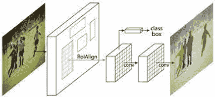
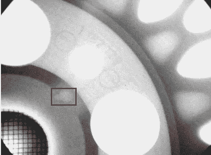
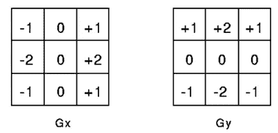
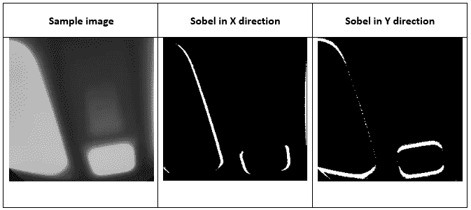
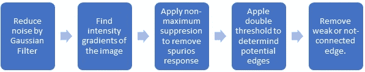
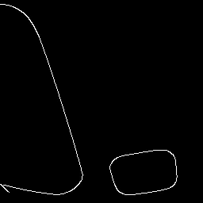
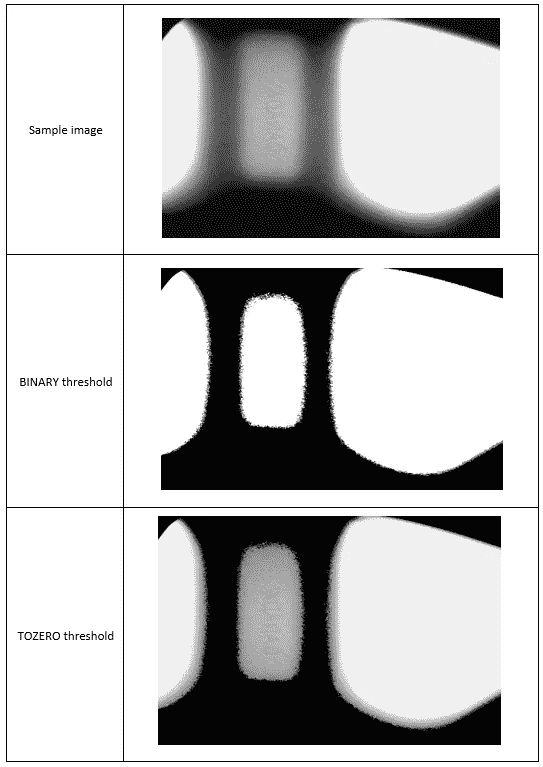

# 这些设备内部出了什么问题？X 射线图像中的缺陷检测

> 原文：<https://medium.com/nerd-for-tech/whats-wrong-inside-these-devices-defect-detection-in-x-ray-images-f5e50b354afd?source=collection_archive---------1----------------------->

缺陷检测已经成为生产线检验产品是否符合标准的基本要求。虽然我们通过图像处理来考虑这个问题，但我们总是有不同的方法来检测不同工业领域中每种产品的需求。

在这篇博文中，我们将介绍一些利用 X 射线图像进行缺陷检测的技术——这是许多工厂中常见且受欢迎的一种情况。

# 掩模 RCNN 神经网络

近年来，掩模 RCNN 已经证明了其在解决对象检测和对象分割问题中的效率、性能和准确性。

屏蔽 RCNN

当从 X 射线图像中考虑物体的缺陷时，我们将它们分为两种情况:

*   可以使用掩模 RCNN 的情况:物体的缺陷需要是可见的，足够大，具有几乎相同的特定图案，并且不需要预处理。如果我们有足够的对象数据集，我们可以标记这些案例并用掩码 RCNN 训练它们。
*   无法使用掩模 RCNN 的情况:在某些情况下，缺陷可能很难确定，它们是否太小、不可见、图案不清晰或需要图像预处理。

例如，在 x 光下有一个铸造轮有缺陷。如果缺陷是可见的，并且具有特定的模式，我们可以用掩模 RCNN 训练它来检测该缺陷。

缺陷的图像，看起来是独特的，适合掩蔽。

# 边缘检测

边缘检测包括各种数学方法，旨在识别图像亮度急剧变化的边缘和曲线。在我们的项目中，我们关注两种算法:

*   **Sobel 边缘检测:**这是一种非常常见的边缘提取滤波器，是对一幅图像的导数的近似。我们可以对 x 和 y 两个方向使用 Sobel 滤波器。在图像处理领域，使用 Sobel 边缘检测方法，我们对 x 方向和 y 方向的两个矩阵进行卷积。

以下是在水平和垂直方向使用 Sobel 边缘检测的示例:

当我们寻找黑到白和白到黑的区域时，索贝尔滤波器发挥了优势

*   **Canny 边缘检测:**这是 Sobel 边缘检测的升级，通过提高计算的复杂性，显示出更好的结果。该过滤器在整个过程中包括 5 个步骤。

这是一个使用 Canny 边缘检测的例子。我们可以很容易地看到，任何部分的边缘都比使用 Sobel 边缘更好，更薄。

# 阈值

在 OpenCV 库中，有两种阈值处理:**简单**和**自适应**。

**简单阈值**:如果像素值小于阈值，则设置为 0，否则设置为最大值。阈值至少有 5 种算法。对于 X 射线图像，我们将使用二进制和零阈值来检测产品中的故障。

*   **二进制:**这个滤镜会检查像素是超过还是低于一个阈值。如果该值较大，像素将变为白色。否则就是黑。
*   **TOZERO:** 这个滤镜和二进制有着相同的比较机制，但是对于超过阈值的像素的规则是不同的。低于此值的任何像素将变为黑色，其他像素保持不变。

下面是一个应用这些阈值的示例，使用相同的参数来控制输出图像的质量(记住在使用阈值之前将图像转换为灰色)。

在这个例子中，两个过滤器都帮助我们检查对象的基本细节。然而，我们发现，如果我们想检测灰色像素中的任何缺陷，零阈值将比二进制更有用。

**自适应阈值处理**用于处理不同的光照条件，这是普通阈值处理的棘手情况。对于自适应阈值处理，该算法基于像素周围的小区域来确定像素的阈值。因此，我们对同一幅图像的不同区域采用不同的阈值，这样可以得到更好的结果。

自适应阈值有两种: **THRESH MEAN** (一个区域内像素的平均值)和 **THRESH GAUSSIAN** (高斯加权和)。让我们来看一个例子，我们使用相同的参数对上面的样本图像应用自适应阈值。

# 结论

如前所述，每个产品都有多种方法来处理图像领域的缺陷检查问题。我们所做的就是对这种 X 射线样品的处理。为了适应项目的要求，我们应该结合不同的技术，调整参数，直到获得更好的检测结果。我们希望这篇文章为您提供了有用的技术来处理从 X 射线图像检测设备故障。

# 参考

mask RCNN Lib:[ayoolaolafenwa/PixelLib:访问 PixelLib 的官方文档 https://pixellib.readthedocs.io/en/latest/(github.com)](https://github.com/ayoolaolafenwa/PixelLib)

图像增强:[https://towards data science . com/measuring-enhancing-image-quality-attributes-234 b0f 250 e 10](https://towardsdatascience.com/measuring-enhancing-image-quality-attributes-234b0f250e10)

线检测:[https://www . geeks forgeeks . org/line-detection-python-opencv-houghline-method/](https://www.geeksforgeeks.org/line-detection-python-opencv-houghline-method/)

图像阈值: [OpenCV:图像阈值](https://docs.opencv.org/4.x/d7/d4d/tutorial_py_thresholding.html)

边缘检测:[使用 OpenCV | LearnOpenCV #](https://learnopencv.com/edge-detection-using-opencv/) 进行边缘检测

撇除过滤器:[阈值-撇除 v0.19.2 文档(scikit-image.org)](https://scikit-image.org/docs/stable/auto_examples/applications/plot_thresholding.html)

样本图片:[http://dmery.ing.puc.cl/index.php/material/gdxray/](http://dmery.ing.puc.cl/index.php/material/gdxray/)

阅读我们的原始文章:[https://www . neuro nd . com/blog/defect-detection-in-x ray-images](https://www.neurond.com/blog/defect-detection-in-xray-images)

NeurondAI 是转型业务。请联系我们:

*网站*:[https://www.neurond.com/](https://www.neurond.com/)