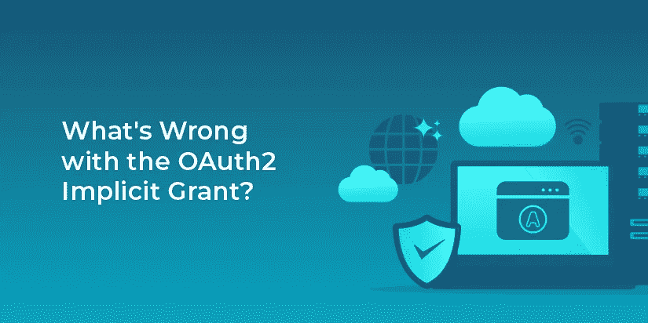

# OAuth2 隐式授予有什么问题？

> 原文：<https://medium.com/nerd-for-tech/whats-wrong-with-the-oauth2-implicit-grant-6e9de71f2bca?source=collection_archive---------8----------------------->

隐式授权是 OAuth 2 RFC 的一部分，但[是 OAuth 2.1 规范](https://fusionauth.io/learn/expert-advice/oauth/differences-between-oauth-2-oauth-2-1/)中省略的特性之一。有了这笔拨款，你就不用写服务器端代码了。您不必用授权码来交换访问令牌，而是在重定向时获得一个访问令牌。

如果您在 JAMstack 中工作，或者在其他不想运行服务器的情况下，这是很方便的。

然而，它非常不安全、不可靠、被弃用，并且永远不应该使用。好吧，也许这有点夸张，但请不要用这笔拨款。OAuth 2.1 草案的支持者同意这一点，这也是为什么他们在新规范中没有提到它。

> *根据 OAuth 2.0 安全最佳实践的第 2.1.2 节，本规范中省略了隐式授权(“response_type=token”)*

# 逃跑

与其告诉你如何使用这笔赠款，不如让我们讨论一下为什么你应该避免它。

之所以删除它，是因为它跳过了一个重要的步骤，这个步骤允许您保护从 OAuth 服务器收到的令牌。当您的应用程序后端调用令牌端点来检索令牌时，就会发生这一步。

与[授权码授权](https://fusionauth.io/docs/v1/tech/oauth/#example-authorization-code-grant)不同，隐式授权不会使用授权码将浏览器重定向回您的应用程序后端。相反，它将访问令牌作为重定向的一部分直接放在 URL 上。这些 URL 看起来像这样:

`[https://piedpiper.com/#token-goes-here](https://piedpiper.com/#token-goes-here)`

令牌被添加到重定向 URL 中的`#`符号之后。这将它放在 URL 的片段部分。这意味着无论 OAuth 服务器将浏览器重定向到哪里，浏览器中运行的任何代码都可以访问访问令牌。换句话说，基本上对每个人。

更准确地说，浏览器中运行的任何和所有 JavaScript 都可以访问访问令牌(包括第三方库)。由于该令牌允许浏览器代表用户进行 API 调用和 web 请求，因此让第三方代码可以访问该令牌是极其危险的。

让我们举一个使用隐式授权的单页面 web 应用程序的虚拟例子:

这个 HTML 包括两个 JavaScript 库:

*   应用程序本身的代码(`my-spa-code-1.0.0.js`)。
*   我们在网上找到了一个库，它做了一些很酷的事情，我们只是把它拉了进来。

让我们假设我们的代码是 100%安全的，我们不必担心它。然而，我们拉进的库是一个未知数。

该库也可能包括其他库。记住，DOM 是动态的。任何 JavaScript 都可以简单地通过用`<script>`标签更新 DOM 来加载任何其他 JavaScript 库。因此，我们很难确保第三方库中的每一行代码都是安全的。

毕竟，**每次部署应用程序时，你会审计每个 JavaScript 库和每个库的每个依赖项吗？**

如果一个第三方库想要从我们的虚拟应用程序中窃取一个访问令牌，它需要做的就是运行下面的代码:

三行代码和访问令牌被盗。如您所见，泄漏令牌的风险太高，以至于无法考虑使用隐式授权。这就是为什么我们建议任何人都不要使用这笔赠款。

# 如何在 SPA 中正确使用 OAuth

那么，如果你正在构建一个很棒的 React、Angular、Vue 或其他单页应用程序，你应该用什么来代替隐式授权呢？

使用授权码授权！它是安全的、可靠的、经过良好测试的、标准化的，并且将令牌排除在 URL 之外。

除了使用该拨款，请采取以下步骤来保护您的 SPA OAuth 流程:

*   在您的 SPA 中使用 [PKCE](https://tools.ietf.org/html/rfc7636) 来确保您的应用程序不会受到授权代码拦截攻击，因为它不能维护安全的客户端秘密。
*   运行服务器。不必复杂。事实上，用几行节点的授权码交换一个访问令牌可能很简单。下面是一个节点应用的例子。这也称为 BFF，即前端模式的后端。
*   将访问令牌存储在浏览器中 JavaScript 无法触及的地方。您可以将它们存储在服务器端会话中，或者存储在`secure`、`HttpOnly`cookie 中。

想了解更多关于不同 OAuth 授权的信息吗？查看 OAuth 现代指南，深入了解所有不同的 OAuth 授权，以及如何在现实世界中使用它们。

编码快乐！

*最初发布于*[*https://fusion auth . io*](https://fusionauth.io/blog/2021/04/29/whats-wrong-with-implicit-grant/)*。*