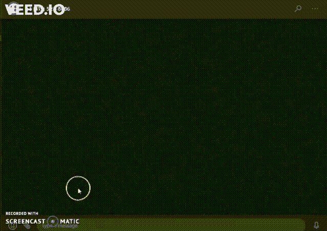
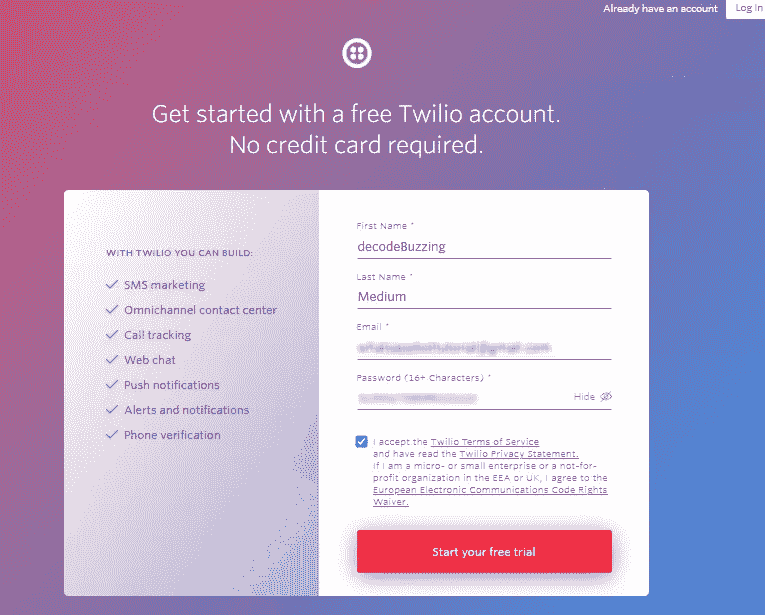
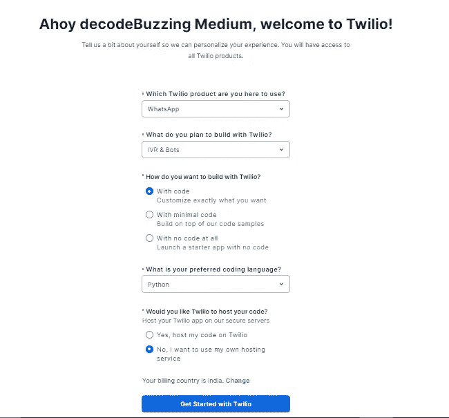
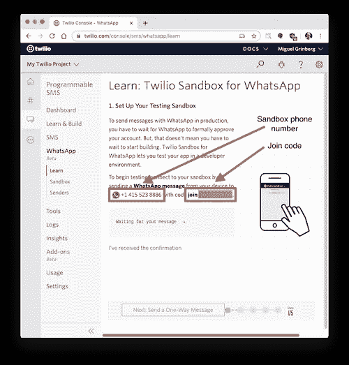
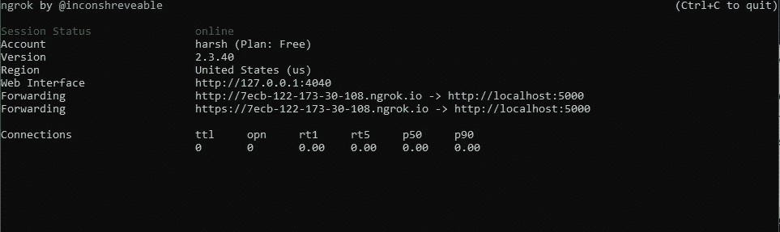
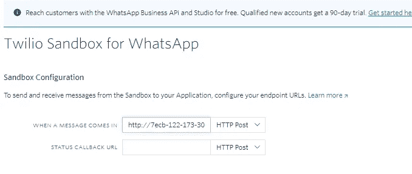
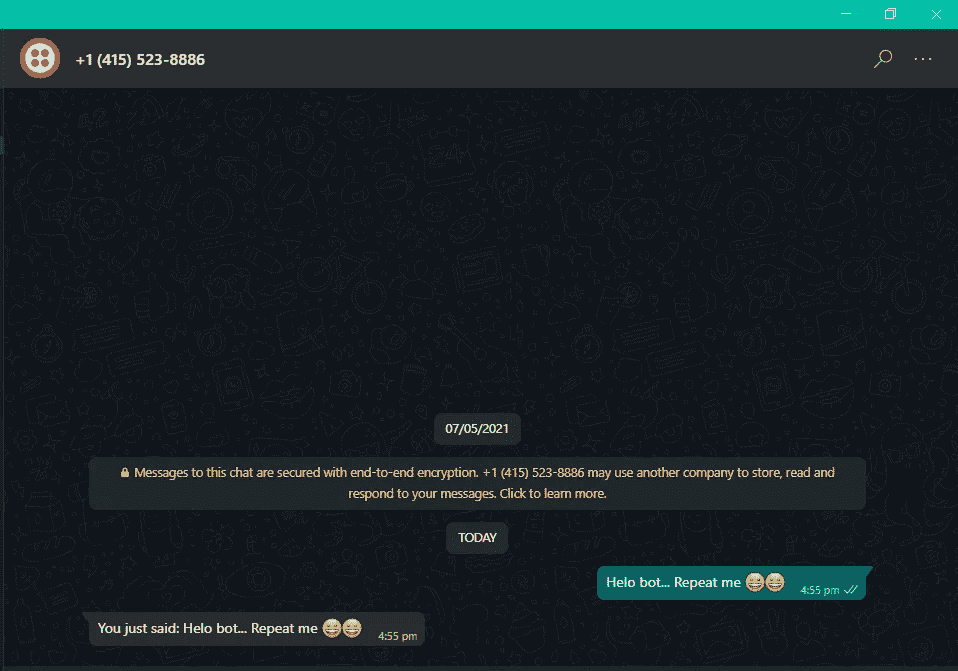

# Whatsapp Bot 可以检测聊天消息并加入您的 Zoom 会议

> 原文：<https://medium.com/nerd-for-tech/whatsapp-bot-that-detects-chat-messages-and-joins-your-zoom-meetings-2b035776f9c7?source=collection_archive---------4----------------------->

像我一样懒又讨厌复制粘贴缩放会议 id/密码？那么，你真的需要这个 bot！


大家好。！我想我已经很久没有写信了。事实上，我的考试很快就要开始了，而且我正在做一个新的 React-native 项目，一旦完成我会马上发布。最近在浏览我的 [Github](https://github.com/harsh317) 时，我发现了一个非常有用的程序和一个非常基本的 python 程序，这是我在疫情期间做的。如果你熟悉 python 中的一些“机器人的东西”，你肯定猜对了！我们将使用 *Twilio* (使用它我们将与 WhatsApp 交互)和 *Pyautogui(用于点击、拖动、滚动、移动*的* Python 自动化库)。*所以，在开始使用**模块解释和安装部分**之前，我们先来看看 App 是如何工作的。



有趣吧？这是一个非常小而容易的小程序，如果你是初学者，你可以很容易理解。这可能非常简单明了，但在你连续开会的情况下非常有用。因此，没有任何进一步的延误，让我们安装所有的模块，我们需要的。

# 模块说明和安装

*   **PyautoGui**

如果你只是打破了名称，你将能够理解——‘Py’+‘Auto’+‘Gui’(图形用户界面)。所以，基本上，这是一个 python GUI 自动化库，用来控制鼠标和键盘做各种事情。没什么复杂的

```
pip install pyautogui
```

*   **烧瓶**

所以，基本上`flask`是一个用 python 编写的微型网络框架，我们将在我们的机器人中使用它作为‘服务器’。你也可以使用‘Django ’,但是由于它的轻量级和简单性，通常推荐使用它

现在，“**我们为什么需要烧瓶？** "
通常，当我们发送消息时，我们会从“用户 1”向 WhatsApp 服务器发送一条消息，然后这条消息会被发送给“用户 2”。因此，在我们的机器人中，我们希望用我们的机器人替换“用户 2”。所以，它会自动回复给我们。现在我们该怎么做呢？我们提供了一个 Twilio Rest API 的回调 URL。“回调 URL”基本上是告诉我们不要将消息发送给“用户 2 ”,而是发送给我们提供的那个 URL。该 URL 将是我们 flask 应用程序的 Url。我们的 flask 应用程序或服务器将是真正的机器人，它将响应消息并将其发送回我们。哦，那是一口。现在，让我们安装它。

```
pip install flask
```

*   **Twilio**

我们还需要 Twilio 包来与 API 交互。所以，我们来装吧。

```
pip install twilio
```

我想我们现在不需要别的了。当然，我们需要“ngrok ”,但我们会在以后安装它。现在，让我们开始，首先让我们配置 Twilio WhatsApp 沙盒

# 配置 Twilio WhatsApp 沙盒

因此，让我们首先将我们的智能手机连接到 Twilio 沙盒。为此，我们需要创建一个新的 Twilio 帐户，我们可以在[这里](https://www.twilio.com/try-twilio)创建。



现在，请按“开始免费试用”,然后通过发送到您邮件中的链接进行验证。单击该链接后，它会将您带到登录页面，在这里您可以使用刚才创建的凭据登录。然后你会被要求验证你的电话号码。在下一页，输入以下信息开始。



现在，我们正处于将智能手机连接到 twilio sanbox 的最后一步。进入下一步后，我们将看到以下屏幕。



这个沙盒页面将显示分配给你的帐户的沙盒号码，以及一个加入代码。要为您的智能手机启用 WhatsApp 沙盒，请向分配给您的帐户的号码发送带有给定代码的 WhatsApp 消息


现在，我们准备开始制作我们的机器人。因此，现在让我们首先创建我们的基本 flask 应用程序，然后将它连接到 ngrok，这样我们就可以通过 WAN(也可以是我们网络之外的任何地方)访问它，并将其提供给 twilio 回调 url(如上所述)

# 创建我们的基本 Flask 应用程序并将其连接到 ngrok

> 遵循 Python 的最佳实践，我们将为我们的聊天机器人项目创建一个单独的目录，并在其中创建一个[虚拟环境](https://docs.python.org/3/tutorial/venv.html)。然后，我们将在上面安装我们的聊天机器人所需的 Python 包。
> 
> 如果您使用的是 Unix 或 Mac OS 系统，请打开终端并输入以下命令来执行上述任务:
> 
> `*$ mkdir whatsapp-bot
> $ cd whatsapp-bot
> $ python3 -m venv whatsapp-bot-venv
> $ source whatsapp-bot-venv/bin/activate*`
> 
> 对于那些学习 Windows 教程的人，请在命令提示符窗口中输入以下命令:
> 
> `*$ mkdir whatsapp-bot
> $ cd whatsapp-bot
> $ python3 -m venv whatsapp-bot-venv
> $ whatsapp-bot-venvScripts\activate*`
> 来自 Twilio 博客

现在，在这个文件夹中创建一个名为“app.py”的文件，并用一个 [webhook](https://sendgrid.com/blog/whats-webhook/) 定义在其中添加这个基本的 flask 代码。我希望你熟悉 flask 框架，但如果不只是谷歌它。下面是我们 app.py 的基本代码，在评论中有解释:

所以，简单吧？现在，让我们尝试在 ngrok 上运行这个简单的应用程序，然后将它连接到我们的回调 URL，然后我们就可以实现实际的打开和关闭缩放。

在将它连接到 ngrok 之前，让我们简单地运行它:

```
python3 -m flask run
```

它将在我们系统的端口 5000 上的本地主机上运行我们的应用程序，但我们无法在网络外部访问它。因此，我们将使用名为“ngrok”的服务，你可以从[这里](https://ngrok.com/download)安装。下载并解压后，打开一个新的命令提示符或终端，进入 exe 文件所在的目录。并运行命令

```
./ngrok.exe http 5000
```



“forwarding”后面的 Url 是我们的公共 Url，它会将请求重定向到我们的本地主机。现在，这将是我们的回调 Url，但是如果你记得我们实际的 bot 是在'/bot '端点，所以我们将把`/bot`附加到我们原来的 ngrok Url。因此，在我的例子中，URL 将是:

" http://7 ECB-122-173-30-108 . ngrok . io/bot "

现在，让我们添加这个网址作为我们的回拨网址[这里](https://console.twilio.com/us1/develop/sms/settings/whatsapp-sandbox?frameUrl=%2Fconsole%2Fsms%2Fwhatsapp%2Fsandbox%3Fx-target-region%3Dus1)像这样:



然后按底部的保存。现在让我们检查一下我们的基本 Whatsapp bot！



好，现在，让我们添加逻辑来检测缩放链接消息，并为我们打开缩放应用程序。下面是它的代码，我想你现在已经知道了，解释将会在 __________ ✅Yes，“评论”:

如果有任何疑问，请查看评论。最后，我们的 WhatsApp-Zoom-Bot 已经准备好了！！！！！！现在让我们来测试一下


从上面的 gif 中，你可能已经看到，在我发送缩放会议的链接之前，我将鼠标移到了加入按钮的位置，这是因为 Pyautogui 在录制时无法找到加入按钮。但是没有“SCREENCAST-O-MATIC”记录我的屏幕，它也能很好地工作。所以，现在我们的 zoom meeting joiner 机器人完成了！当然，你可以通过使用一些对话引擎，如“对话流”等，来增强这个机器人或简单地将其转换为“WhatsApp 聊天机器人”。

我希望你喜欢这个小教程，下次我会带着一个正在进行的新项目与你见面。

## 在那之前保持安全，保持健康

## 谢谢你