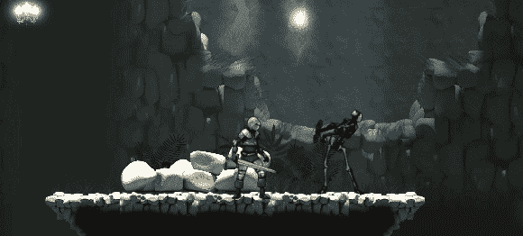

# 敌人进攻的时候！(第一部分)

> 原文：<https://medium.com/nerd-for-tech/when-enemies-attack-part-1-36a5169c3675?source=collection_archive---------10----------------------->

## 开始 Unity 游戏开发

## //给予敌人团结反击的力量

Bones 先生学会了如何保护自己

很明显，如果敌人不构成威胁，地牢爬虫和老派平台就没什么意思了。因此，我们需要让他们有能力保护自己，抵御我们将他们从游戏中清除的可疑意图…