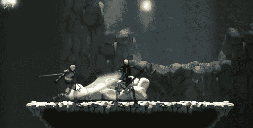

# 敌人进攻的时候！(第二部分)

> 原文：<https://medium.com/nerd-for-tech/when-enemies-attack-part-2-de4465f3830?source=collection_archive---------17----------------------->

## 基本 Unity 游戏开发

## //在战斗系统中受到伤害

好的战斗是双向的

昨天我们回顾了敌人的战斗逻辑，深入了解了敌人攻击玩家的能力。今天我们将看看当玩家攻击敌人时会发生什么。

# 受到损害