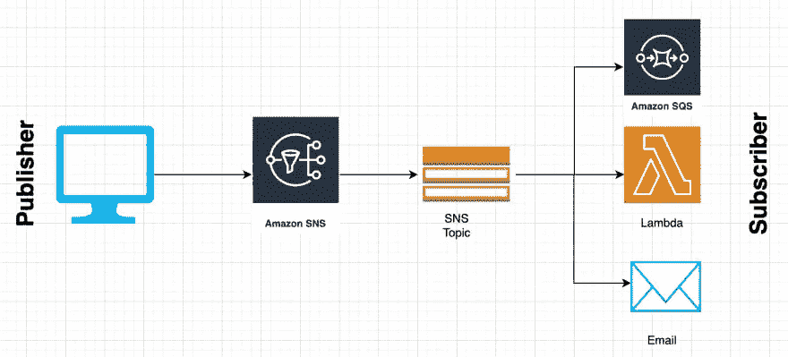
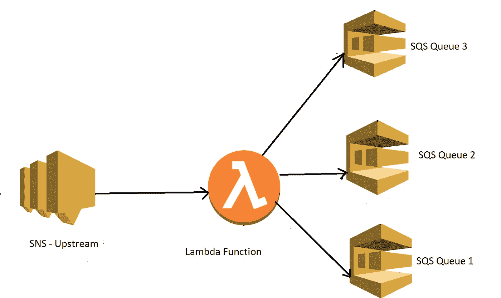
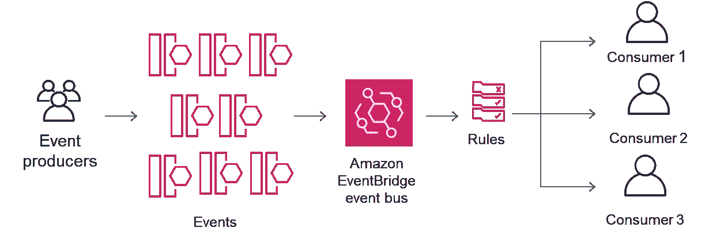

# 社交网站、SQS 和 EventBridge

> 原文：<https://medium.com/nerd-for-tech/when-to-use-sns-sqs-and-eventbridge-36074a331131?source=collection_archive---------1----------------------->

在本指南中，我们将了解何时使用社交网站、SQS 和 EventBridge

## 议程

*   什么是 SQS、SNS 和 EventBridge
*   何时使用什么**资源**

**SNS 代表简单通知服务，SQS 代表简单排队服务。**

# 社交网站（Social Network Site 的缩写）

*   它使用发布者/订阅者系统。您可能拥有一个主题，发布到该主题，订阅者会收到关于该主题的事件通知。

话题都是 SNS 的一等公民。它们类似于队列，只是主题不为消息传递进行投票。它们本质上被创建为具有特定的主题，如订单主题、交易主题、日志主题。每当应用程序中发生事件时，拥有该数据的应用程序将向主题发布一条消息，该主题将向该主题的所有不同订阅者交付该消息的相同副本。

因此，如果我们有一个订单主题，并且许多服务对接收订单更新感兴趣，我们将订阅该主题的所有服务，以便在事件发生时通知他们，并以他们自己的速度处理该事件。

消息确实有大小限制，

*   发布一条关于某个主题的消息可以传递给许多不同类型(SQS、Lambda、电子邮件)的订阅者(扇出)
*   **其他系统关心事件吗？**如果你的答案是肯定的，那么你应该使用社交网络，因为你想在你的话题上发布一条消息，并潜在地告诉其他人某个特定的事件发生了。

# SQS

*   这是一种用于消息处理的排队服务。SQS 可以是社交网络的订户。每当有人向 SNS 发布消息时，您的 SQS 队列都会收到一条消息，可以在以后进行处理。
*   SQS 允许应用程序所有者将消息发布到一个队列中，这样可以将他们的应用程序彼此分离。

队列是 SQS 的一等公民。它是您将通过控制台、CLI 或基础设施以代码形式创建的内容。队列是应用程序所有者发布消息的目的地。这是一个临时的存放池，您可以在其中发布消息。

轮询是订阅者或希望接收消息的人处理消息的机制，因此希望从队列中检索消息的应用程序将轮询该队列，以便能够成功地处理它们。

*   必须轮询队列以发现新事件的系统。
*   队列中的消息通常由单个消费者或单个服务负责处理。如果他们都关心相同的事件，他们可以有自己单独的队列。
*   您的系统关心某个事件吗？你关心什么时候发生了什么，所以你是这个数据的接收者，如果它是真的，SQS 对你来说是正确的选择。

# 事件桥

EventBridge 类似于 SNS，在 SNS 上有一些改进，做的事情略有不同。EventBrdige 的主要概念是:

*   消息总线
*   事件
*   规则
*   目标

消息总线与主题相同，您向事件总线发布一条消息，并且这些消息有不同的接收者。

事件可以由订单服务等应用程序构建。它也可以像 EC2 一样由 AWS 服务本身发出。每当实例启动时，您可以将 EC2 与您的事件总线集成在一起，以便事件在发生时自动生成。

你也可以将其与其他第三方 saas 或软件集成为服务提供商，如 Datadog、PagerDuty 和 Shopify。由于无缝集成，他们将为您提供功能，而不是编写您自己的自定义功能代码。

规则匹配传入的事件，并将它们发送到相应的目标进行处理。

目标是您的目的地端点。它们是一天结束时将被调用的内容。

它们还有其他有趣的功能，比如邮件过滤(允许你过滤邮件)

# 谢谢

喜欢阅读吗？在下面留下一些“掌声”,以便其他人可以找到这篇文章。🙂

查看我的其他帖子:)

[https://medium.com/@thecraftman](/@thecraftman)