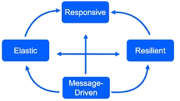
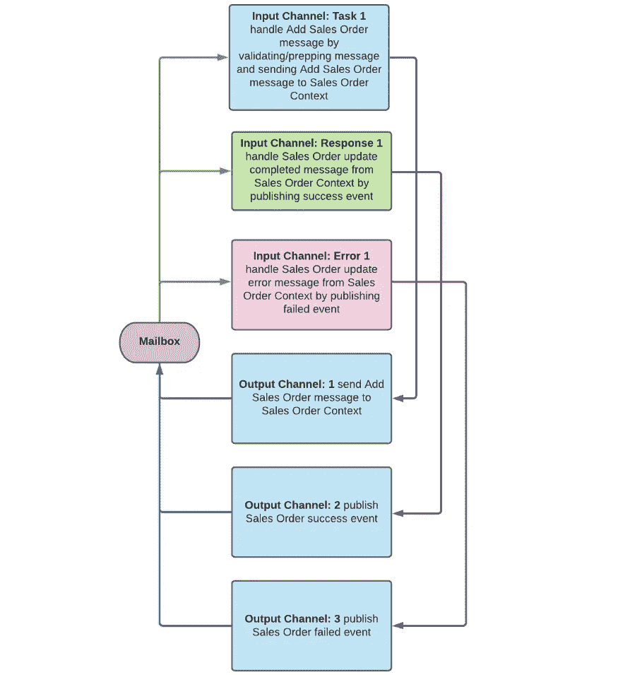

# 当服务需要速度时…

> 原文：<https://medium.com/nerd-for-tech/when-you-have-a-need-for-speed-ea810fcecea4?source=collection_archive---------4----------------------->

## 反应式微服务可以是答案！

***当您需要高性能、低延迟、可靠性和可扩展性时，反应式微服务是 21 世纪解决您问题的答案。为什么不花几分钟看看为什么呢？***

多年来，我们一直在使用流行的 SOA 技术(如 Spring Boot 和 Jakarta RESTful Web 服务)构建同步的请求-响应应用程序。但是在 21 世纪的今天，当谈到高性能、低延迟、可靠性和可扩展性时，这些 20 世纪的技术正在耗尽。我们需要找到更好的方法。

## 微服务

像你们中的许多人一样，我们转向微服务架构模式来克服这些问题。我们发现模式本身只能解决一些问题——直到我们发现了拼图中缺少的那一块。问题是我们用 SOA 的方式做微服务——使用同步请求-响应 API。

## 同步的问题是

因为微服务是松散耦合的，并通过消息传递进行通信——如果消息传递是同步的，所使用的处理线程将花费大量时间等待，而不是工作。现代计算机速度如此之快，以至于我们往往会忘记操作系统管理线程需要多少处理周期。上下文切换是一项相当繁重的工作，有时会占用超过 50%的 CPU 周期——这些周期不执行应用程序的工作。这让我们想到了拼图中缺失的一块， ***反应式微服务*** 。

## 反应系统

如 [***反应式宣言***](https://www.reactivemanifesto.org/) 中所述，构建为*反应式系统*的应用更加灵活、松散耦合并且[可扩展](https://www.reactivemanifesto.org/glossary#Scalability)。这使得它们更容易开发和修改。他们对失败的容忍度明显更高，当失败真的发生时，他们优雅地面对，而不是灾难。反应式系统反应灵敏，给用户有效的互动反馈。

**图 1:无功系统属性**

反应式系统依靠[异步](https://www.reactivemanifesto.org/glossary#Asynchronous) [消息传递](https://www.reactivemanifesto.org/glossary#Message-Driven)来建立组件之间的边界，确保松耦合、隔离和[位置透明](https://www.reactivemanifesto.org/glossary#Location-Transparency)。异步消息传递是现代高性能和高吞吐量系统中的关键和常见属性。

如果你想知道更多为什么反应式系统这么快，这个 17 分钟的 YouTube 视频， [***什么是反应式系统？***](https://youtu.be/eRxLfUIMJwk) ，很好的解释了无功系统的优点。

## 反应式行动者模型微服务

反应式微服务因素的形状由其主要目的决定。微服务参与者的核心是一个*反应式*异步消息处理器。它被设计和优化为使用单线程一次处理一条消息，尽可能地快速高效。很像[***node . js***](https://www.peerbits.com/blog/why-nodejs-fast-and-its-best-use-cases.html)*它是一个高性能的、异步的消息处理器。*

*微服务优化处理的消息属于 [*表述性状态转移*](https://docs.google.com/document/d/16bSPSb-_gzi3QZADhdU4NceHSoXjuldXfPldfCBLbCA/edit?usp=sharing) 架构风格。有三种基本的消息类别:任务(请求)、响应和错误。这些信息可以通过以下两种方式之一传递:*

1.  *作为异步 REST 消息。*
2.  *作为 [*事件承载的状态转移*](https://prateek-ashtikar512.medium.com/microservices-design-patterns-event-carried-state-transfer-c4b66a58df00) 或 ECST 事件。*

**消息总是异步发送或作为事件发布。没有同步消息传递。每条消息都被发送到微服务逻辑地址或发布到事件主题。每个微服务参与者都有一个附属的* **邮箱** *为其缓冲输入输出消息。**

**

***图 2:微服演员解剖***

## *包扎*

*异步反应式角色模型微服务是满足 21 世纪需求的 21 世纪技术。如果没有 API 网关、负载平衡器和其他占用 CPU 周期的附加组件的附加层，传统的请求-响应 SOA APIs 无法满足现代云部署应用程序的性能、可伸缩性和可靠性要求。如果这个想法对你有意义，我们推荐阅读:*

*   *[**设计微服务**](/nerd-for-tech/designing-microservices-4130bc41c046)*
*   *[T5【解剖微服】T6](/nerd-for-tech/anatomy-of-a-microservice-c52b3cb30d30)*