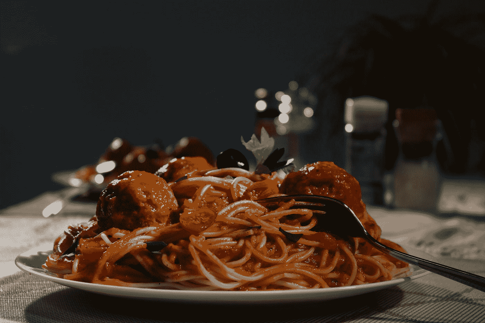
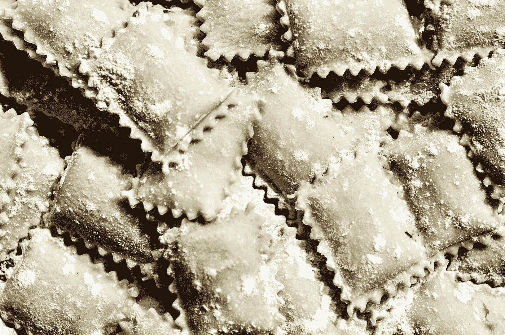

# 意大利面和编程相遇的地方

> 原文：<https://medium.com/nerd-for-tech/where-pasta-and-programming-meet-244e609106e4?source=collection_archive---------3----------------------->

## 当有人把你的代码和一种面食联系在一起时，这是一个好现象吗？

Emile Perron 在 [Unsplash](https://unsplash.com?utm_source=medium&utm_medium=referral) 上的照片

完成一项任务花费的时间是否比预期的要长？你是否为满足项目的最后期限而过于努力？考虑一下你的代码结构，看看它是否有逻辑结构。**如果不容易阅读和理解，你的代码可能是反模式的。**按[DevIQ.com](https://deviq.com/antipatterns/antipatterns-overview)，

> 反模式只是简单的设计模式，在很多情况下，它们引入的问题比解决的问题更多。有时这些是编码模式，而其他的描述团队或组织内部的问题。

**意大利面理论是一个流行的比喻，用来描述几种流行的意大利面菜肴类型的反模式。**在烹饪界，没有“不良类型的面食”这回事。但是在编程世界里，你应该让你的代码远离 pasta。

伟大的代码不仅仅是让程序工作。成功的软件开发是关于确保你的程序将继续工作。虽然**创建可维护的代码**是程序员工作中最难的部分之一，但这也是一个人应该关注的最重要的目标之一。因此，如果你的代码不可维护，你可以把它和一种面食联系起来。你菜单上最受欢迎的菜肴可能是:意大利面条、千层面、馄饨。

# **意大利面条代码**

意大利面条式代码是非结构化的，维护起来很复杂。由于每一行代码都可能引用位于程序中任何地方的几乎任何变量，维护它就像是不可能完成的任务。在其他地方引入病毒的风险高得惊人。意大利面条式代码的一个完美例子是当一个程序有许多 GOTO 语句而不是结构化的编程结构时。但是，多亏了这个 Reddit 线程,我们有了一个解决意大利面条式代码的方法:使用积极主动的重构努力，专注于保持程序小、有效、源代码干净和连贯应该有所帮助。

卡罗琳娜·科西奥在 [Unsplash](https://unsplash.com?utm_source=medium&utm_medium=referral) 上的照片

# 千层面代码

我现在不介意吃点千层面，但是你的程序会介意用千层面结构来开发。这一个被定义为有太多的层，并且有点太抽象。你的程序有许多小的、不必要的类，而不是小范围的大类。这是怎么发生的？作为开发人员，您可能倾向于将它写成好像每个子组件都需要自己的对象。如果你的类很小，是时候退一步检查你是否过度抽象了你的代码。即使你的结构是可以理解的，它有一个清晰的流程，但它不是一个容易接受变化的结构。要修改某些东西，你必须通过所有其他层，以确保在代码的其他地方没有对你的程序造成损害。这里的一个例子是具有许多小类的面向对象代码。

照片由 [Mateusz Feliksik](https://unsplash.com/@mateusz_feliksik?utm_source=medium&utm_medium=referral) 在 [Unsplash](https://unsplash.com?utm_source=medium&utm_medium=referral) 拍摄

# 意大利饺子法典

如果你的代码是馄饨，那么你可能就在正确的道路上。正如这里提到的，“馄饨代码是一种有正确想法的设计模式，但它可能很快失控。”。与馄饨的相似之处来自于您的代码如何拥有小型的、自包含的类，就像馄饨的单个部分一样。而且，由于每个组件都与外部依赖项隔离开来，代码测试和验证的过程变得更加容易。然而，这种模式也有它的缺点，因为它不是一种容易接受变化的模式。让代码过于抽象的风险也在这里，就像上面的千层面案例一样。在这种情况下，过度抽象可以决定个性化的组件，从而显著增加您的代码库的调用堆栈。".最终，在这种情况下，您的代码也很难维护。

由[大卫·拉古萨](https://unsplash.com/@davideragusa?utm_source=medium&utm_medium=referral)在 [Unsplash](https://unsplash.com?utm_source=medium&utm_medium=referral) 上拍摄的照片

# 最后的想法

不要把烹饪世界和编程世界混为一谈。开发可维护的、可重用的和持久的代码说起来容易做起来难，但是你会感谢自己优先考虑它。有一个开发持久代码的诀窍是很好的，但是它会因语言、框架或团队而异。重要的是要记住，今天的最佳编码实践可能很快成为明天的反模式。只要你注意保持你的代码新鲜，易于理解，可读，并有良好的文档记录，你就在正确的道路上。

菜单上还有几道菜，但上面提到的是最受欢迎的。然而，**你的代码也可以是** **通心粉**(在单个文档中混合使用编程语言的代码)、**比萨**(架构扁平化的代码)、**巴克拉瓦**(架构或抽象层过多的代码库，类似于千层面)等等。要查看更多反模式的例子(不一定与食物有关)和避免它们的方法，请查看 [这篇文章](https://www.geeksforgeeks.org/6-types-of-anti-patterns-to-avoid-in-software-development/)，或[这篇文章](https://sahandsaba.com/nine-anti-patterns-every-programmer-should-be-aware-of-with-examples.html)，或 [这篇文章](https://www.freecodecamp.org/news/antipatterns-to-avoid-in-code/)。哦，祝国际面食日(10 月 25 日)快乐！