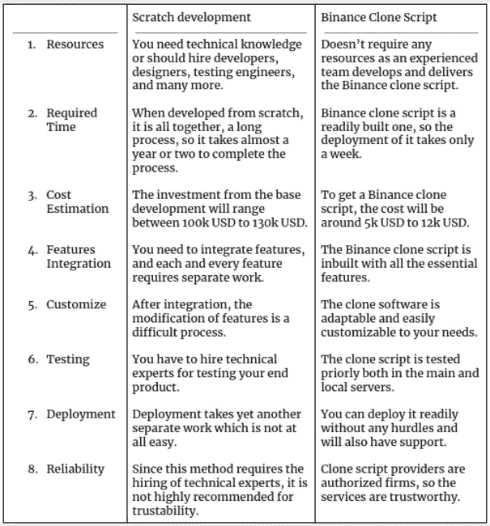

# 像币安这样开始一项加密交易业务的最佳方式是什么？

> 原文：<https://medium.com/nerd-for-tech/which-is-the-best-way-to-start-a-crypto-exchange-business-like-binance-ffa0602bed1?source=collection_archive---------3----------------------->

币安作为区块链行业的加密大亨正在进行变革，不仅是在加密领域，而且还涉足了区块链领域的所有其他创新和进步。币安加密货币交易所、币安 NFT 市场、自己的加密货币、自己的区块链、币安学院等等。币安在区块链的各个领域都显示出巨大的增长和受欢迎程度。其中，币安加密交易所以其***的名字成为全球交易量最大的加密货币交易所*** 。无论谁想开始一项加密交易业务，显然都会梦想成为像币安交易所那样的交易所。这样做的第一步是让它得到正确的发展，这也是我们在这篇博客中将要探讨的。

**像币安一样创建加密交易所的方法**

创建一个类似币安的加密交易所并不是一件容易的事情。如果你用一种特殊的方法来开发一个加密交换平台。现在，币安式密码交换机的所有开发方法是什么？

*   **从无到有的发展**
*   **使用币安克隆脚本**

在 scratch 中，你可以雇佣区块链的开发者自己开发，而在币安克隆脚本中，你可以从币安的克隆脚本提供商那里获得。每种方法都有不同的方式来开发像币安这样的加密交换平台。大多数企业家更喜欢币安的克隆脚本，让我们通过区分这两种方法来看看更喜欢它的原因。

**Scratch 开发 Vs 币安克隆脚本**

**收尾思路**

通过上面的比较，我希望你能清楚地了解为什么企业家更喜欢币安的克隆脚本而不是 scratch 开发。起初，当区块链是一个新课题时，开发一个密码交换机是很困难的，开发它的唯一方法是从头开始。现在，随着技术的进步和各种加密交换克隆脚本提供商的出现，为什么仍然坚持过时和困难的方法呢？企业家们足够聪明，能够选择快速、有效、经济的方法来发展像币安这样的密码交易所。对于一个企业家来说，这里涉及的唯一一步是选择可靠和合适的 [**币安克隆脚本**](https://www.coinsqueens.com/binance-clone-script/?utm_source=BinanceCloneScript?&utm_medium=medium&utm_campaign=aju) 供应商来满足业务需求。

如果你打算接触克隆脚本提供商，你可以根据他们的评级、评论、投资组合、服务成本以及他们在提供币安克隆脚本方面的经验来选择他们。一旦你找到了合适的提供商，你就可以像币安一样立即开展你的加密交易业务。