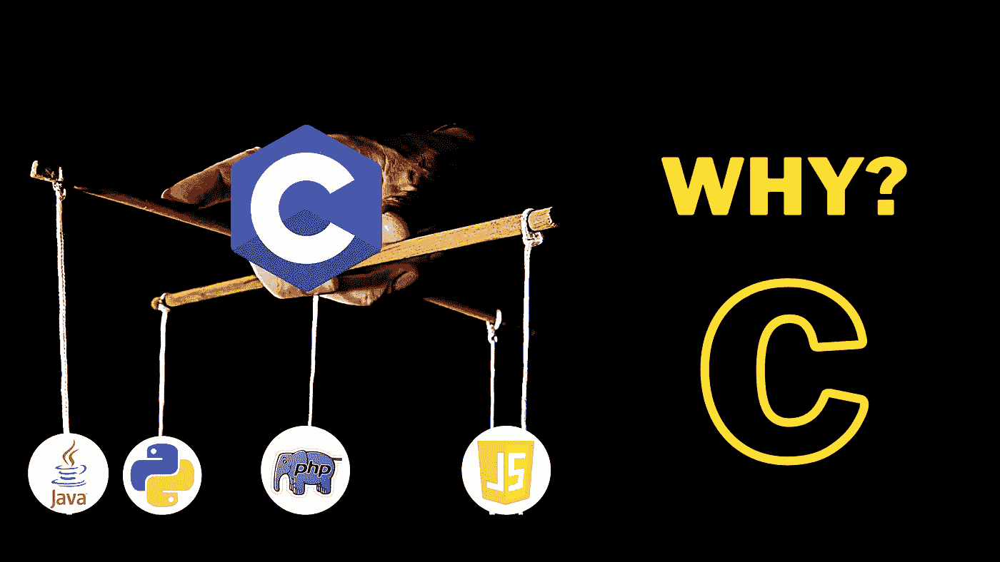

# 学习哪种编程语言，为什么？—典型回答！

> 原文：<https://medium.com/nerd-for-tech/which-pogramming-language-to-learn-and-why-typical-answer-d6ef116086f6?source=collection_archive---------3----------------------->

当谈到选择第一种编程语言时，大多数人认为这是他们做过的最艰巨的工作之一。这就是为什么我们在 youtube 上有很多关于这个话题的视频。

但答案相当简单:

# C 编程语言

不管你是初学者还是有经验的开发人员，每个程序员都需要学习 C。

很难反驳这种说法，为什么不。所有的传奇程序员，如 Linus Torvald(LINUX 的创始人)或比雅尼·斯特劳斯特鲁普(C++的创始人)都鼓励学习这种强大的语言。

所以让我们来看看你为什么需要学习 C 语言的一些原因:

## 1.要理解计算机的工作原理:

作为一名程序员，你需要从底层了解计算机是如何工作的；而 C 可以帮助你把一个计算机系统的内部工作机制形象化。

因为 C 是一种低级语言，非常接近机器:所以当用 C 编程时，你需要自己管理内存分配和内存管理。

这些概念对于程序员来说是非常重要:这是你无法从任何其他语言中学到的。用 C 语言编程，你也能写出高效的代码。

## 2.影响其他编程语言:

很难否认 C 是所有现存高级语言之母的说法。在主要的高级语言背后，无论是 java、python、php、javascript 还是 perl:只要你能说出来，都有 C 语言在幕后支持它们。

所以在我看来，这是你需要学习 c 语言的最重要的原因之一。

相信我，学完 C 语言后，你就能学会世界上任何一种编程语言。

## 3.协作帮助:

作为一名程序员，协作是最重要的技能。

当你和一个团队一起工作时，你需要让人们理解你关于特定代码如何工作的逻辑。这是您可以使用 C 概念来表示您的逻辑的地方。

因为 C 非常接近于机器，它非常类似于伪代码:因此每个程序员都可以很容易地理解你的代码，不管他们来自什么背景。

这就是程序员需要学习 c 的一些原因。

以下是用 C 语言编写的流行程序:

1.  主要操作系统:Window、Mac 或 Linux
2.  谷歌应用
3.  Adobe 应用程序
4.  Mozilla Firefox
5.  雷鸟
6.  关系型数据库
7.  饭桶
8.  这样的例子不胜枚举…

# 判决结果是:

不管你是新手还是有经验的开发人员，你都会偶尔碰到 C 语言:现在和他们，所以你最好拥有它。

感谢阅读。再见:)

