# 哪个网络浏览器最适合你？

> 原文：<https://medium.com/nerd-for-tech/which-web-browser-is-best-for-you-3d447f21c663?source=collection_archive---------9----------------------->

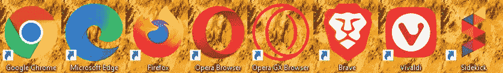

一些流行的网络浏览器

## 浏览器大战

## 第一部分:Chrome、Edge 和 Firefox

在当今世界，随着互联网的广泛使用，用户的数字隐私至关重要。不仅仅是隐私，用户的需求也在增加。虽然 Chrome 统治着浏览器市场，但谷歌拒绝增加其浏览器提供的隐私，这让人们怀疑 Chrome 是否真的是他们的最佳选择。在这三篇文章中，我们将看看一些常见的 web 浏览器，以及它们有哪些独特的功能。

# 谷歌浏览器

谷歌 Chrome 甚至不需要介绍。自 2008 年推出以来，Chrome 一直统治着浏览器市场。Chrome 凭借其时尚的用户界面和超快的速度迅速超越了竞争对手。截至 2020 年 10 月，Chrome 拥有 64%的浏览器市场份额，甚至远不及其他任何浏览器。几乎每个用户都应该熟悉 Chrome 界面——这就是它变得如此流行的原因。

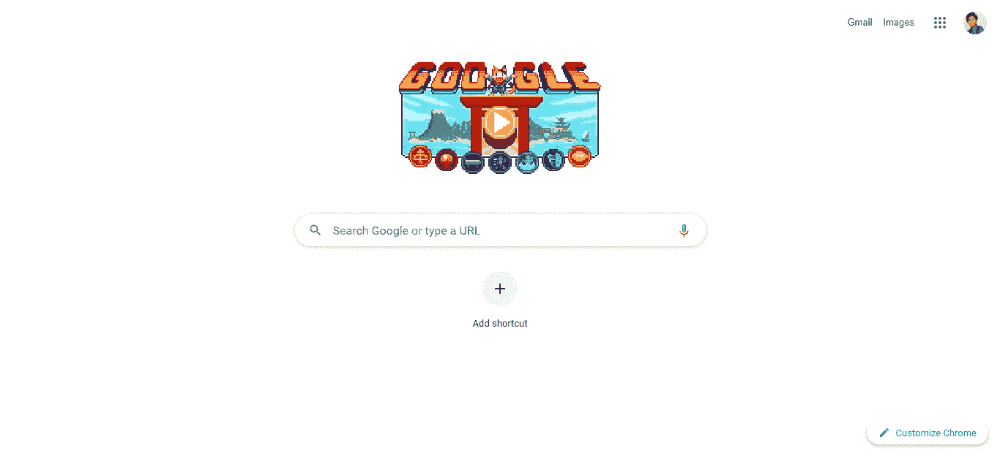

虽然我不会深入探讨 Chrome 的功能，但我觉得我应该提一下谷歌最近推出的这一新功能。Chrome 现在有一个名为“标签组”的功能。右键单击选项卡并选择“将选项卡添加到新组”选项。这将把选项卡添加到一个特定的组中，该组可以被赋予名称和颜色。这有助于在一个窗口中组织所有选项卡，使工作变得更加容易。这一辉煌的特点也被带到了边缘和勇敢。它们可以通过相同的方式访问，并且具有几乎相同的外观。

最近一段时间以来，人们一直在呼吁让 Chrome 拥有更多隐私。然而，谷歌从 Chrome 获得的大部分收入来自广告，所以他们不想移除广告。Chrome 有一个选项可以阻止所有侵入性的应用程序，尽管该功能默认设置为允许。如果你想改变这一点，点击右上角的 3 个点，进入 Chrome 的设置，选择“设置”，然后按照下面的 GIF:

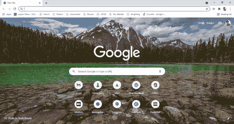

虽然这不能屏蔽所有广告，但这是一个开始。Chrome 也有很多选项来增强浏览器上的隐私。你可以从 Chrome 网络商店向 Chrome 添加多个扩展，以保持你在 Chrome 上的活动私密。像 AdGuard、AdBlock 和 AdBlock Plus 这样的广告拦截器在用户中非常常见。他们中的一些人喜欢 AdGuard，也有一些人有能力阻止网站上的追踪器。随着互联网上大多数网站跟踪你的活动，这些扩展在 Chrome 用户中变得非常流行。

一旦你使用这些扩展来保证你在 Chrome 上的活动安全，就没有什么能让你想离开这样一个简单而多功能的浏览器。就我个人而言，我使用 Chrome 和 AdGuard 来阻止广告和追踪器，我对浏览器的性能非常满意。

像所有的浏览器一样，Chrome 也有一个隐名模式，你可以通过右击任务栏上的 Chrome 图标并选择“新隐名窗口”来进入。这将阻止您在浏览器上的大部分活动。

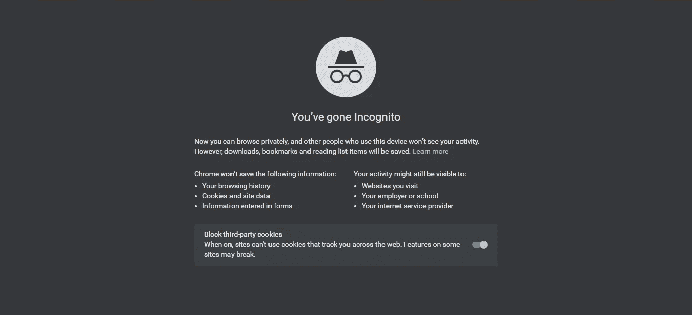

老实说，让我一直坚持使用 Chrome 的是我亲切地称之为“九个点”的东西。这指的是主屏幕右上角的按钮，显示所有的谷歌应用程序。虽然这看起来像是坚持使用 Chrome 的幼稚理由，但这就是我所做的，而且我对此很满意。既然我们已经完成了最大、最受欢迎的浏览器，让我们转到其他浏览器，如果你对 Chrome 不满意，你可能想转到这些浏览器。

**这里下载谷歌 Chrome******。****

# **微软 Edge(Internet Explorer 的继任者)**

****

**在 20 世纪 90 年代末，当互联网首次向用户开放时，浏览器之战只发生在两种浏览器之间:Internet Explorer 和 Netscape Navigator。在我将在本文中讨论的浏览器中，Internet Explorer，现在是新的和改进的 Microsoft Edge，是最老的。在与 Netscape 的早期竞争中，后者占据优势，拥有 86%的浏览器市场份额，而 Internet Explorer 只有 10%。但是，当微软开始默认将 Internet Explorer 集成到他们的计算机中时，网景慢慢耗尽了能量，并在 2008 年关闭了所有的应用程序。Internet Explorer 几乎立刻就被谷歌 Chrome 占领了，从那以后就再也没能赶上 Chrome。现在，Internet Explorer 已经发展成为 Microsoft Edge，这是现在微软推荐所有运行 Windows 的系统使用的浏览器。截至 2020 年 10 月，Edge 是接近 Chrome 的浏览器，拥有近 10%的浏览器市场份额。微软仍在努力游说让用户使用 Edge，随着 Windows 11 的推出，他们将让用户更难改变他们的默认浏览器。现在，让我们把所有的戏剧放在一边，看看微软 Edge 的功能。**

**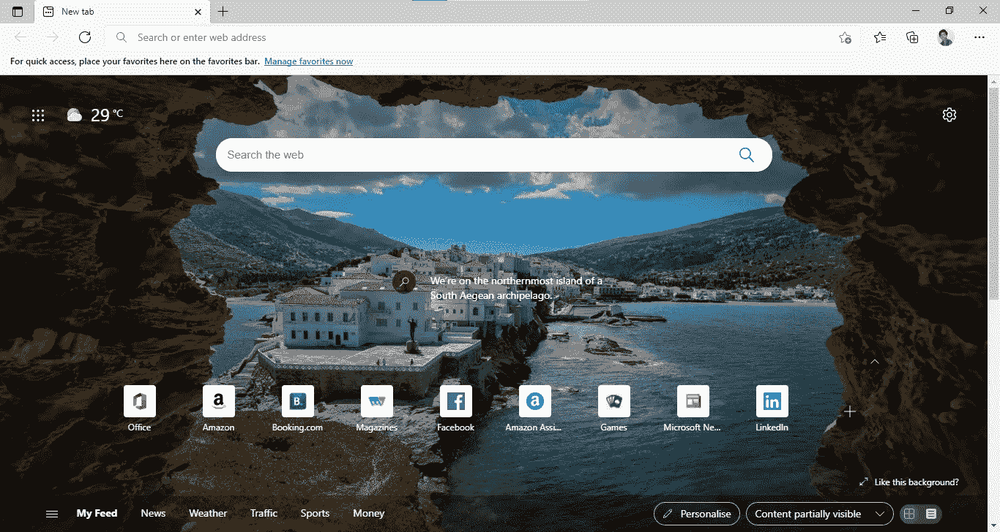**

**正如你在这张图片中看到的，Edge 也有“九个点”，尽管它们显示的是微软的应用程序，而不是谷歌的(咄)。如果你看右上角，在“新标签”旁边，你可以看到一个按钮。该按钮将选项卡变为垂直排列，这样当您打开许多选项卡时，您就可以看到选项卡的名称，而不会失去对它们的跟踪。Edge 还允许您在主页上查看根据您的喜好定制的最新订阅源。**

**与 Chrome 不同，Edge 允许你选择是否要屏蔽追踪器。它有三个安全级别:基本、平衡和严格。**

**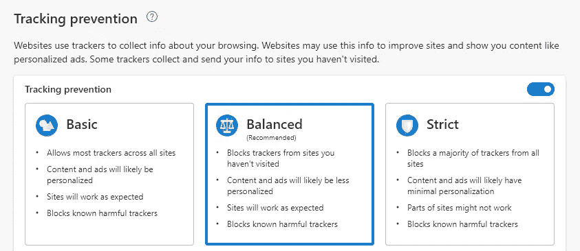**

**选择这些选项中的一个，基本的被推荐，将允许你或多或少地保持你的活动在边缘。这是 Chrome 不允许的一个功能，它把人们拉到了边缘。要进入此页面，请通过点击右上角的 3 个点进入 Edge 的设置，然后选择“设置”。看看下面的 GIF，看看下一步该怎么做:**

**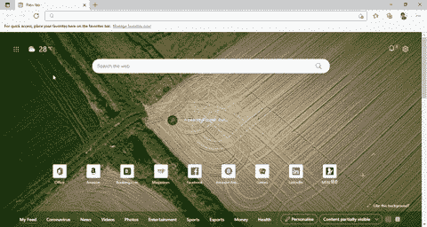**

**和 Chrome 一样，Edge 也有匿名窗口，他们称之为 InPrivate 窗口，你可以通过点击窗口右上角的三个点并选择“新 InPrivate 窗口”选项来访问它。**

**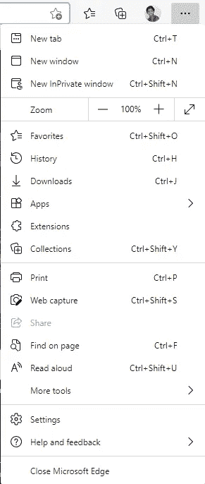**

**之后，你会看到一个这样的窗口:**

**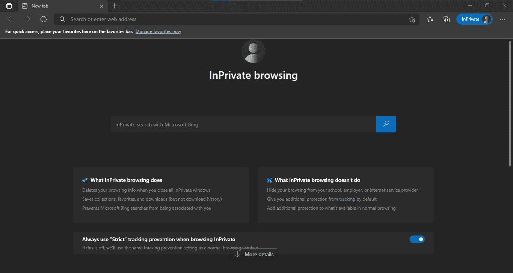**

**Edge 是一款非常出色的浏览器，是 Chrome 的不错替代品。微软在这款浏览器上取得了很大的进步，如果将来有很多用户转向这款浏览器，这并不奇怪。**

****这里下载微软 Edge******。******

# ****Mozilla Firefox****

********

****不错的老火狐。作为 Mozilla 浏览器(2002 年推出)的继任者，Firefox 于 2004 年推出，是该列表中唯一一个不基于 Chromium 代码库的浏览器。经过重新设计后，Firefox 获得了广泛的欢迎，是 Chrome 最受欢迎的私人替代品之一。由于 Firefox 完全以隐私为导向，它最近获得了大量粉丝。浏览器的外观相当不错:****

****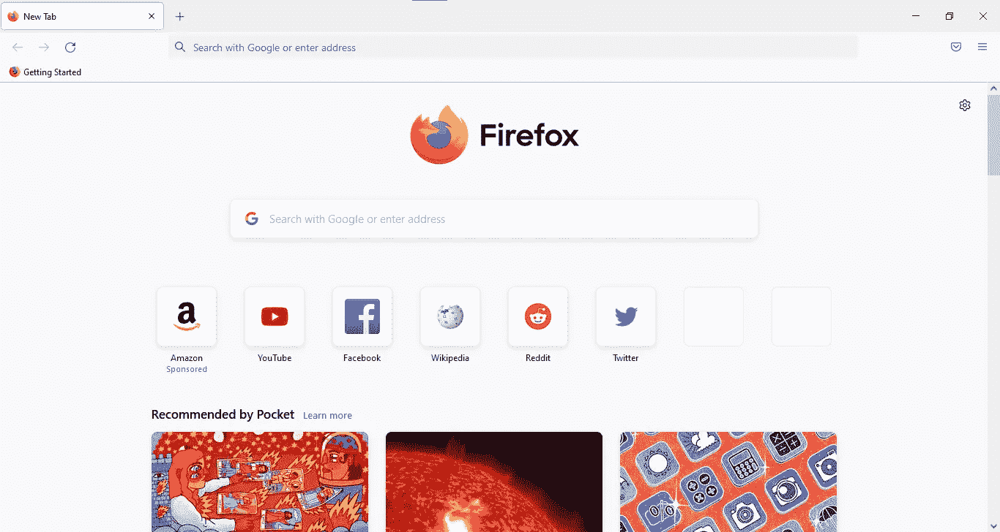****

****圆滑和简约，火狐有着和 Chrome 相似的外观。然而，由于它不是基于 Chrome，Firefox 不支持某些 Chrome 扩展。然而，它支持自己的 Firefox 扩展。除了这个小问题，Firefox 是一个非常出色的浏览器替代品。和 Edge 一样，Firefox 也允许你选择你想要的追踪器保护。它有三个选项:标准(推荐)、严格和自定义。点击右上角的三个栏，然后选择“设置”，进入火狐的设置。跟着下面的 GIF 看看之后的去向:****

****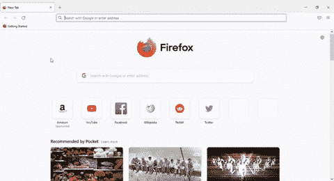****

****选择最适合你的选项，你就可以开始了。和其他浏览器一样，Firefox 也有私人窗口，这更加注重隐私。右击任务栏上的图标，选择“新建私人窗口”选项。私人窗口看起来简单，但很有效。Mozilla 还在测试一种新的 Mozilla VPN，为 Firefox 用户提供更多隐私。Mozilla 对 Firefox 做了很多改动，现在这款浏览器已经相当出色了。****

****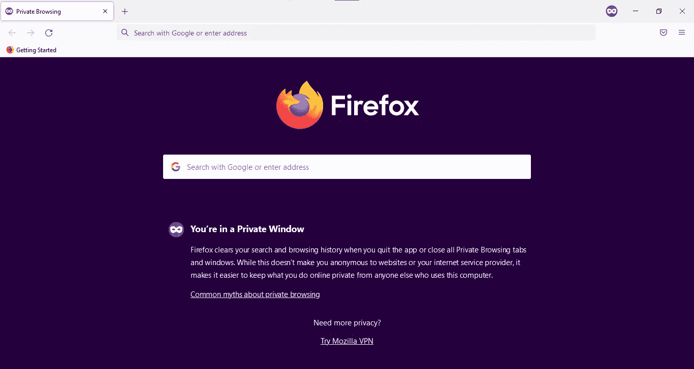****

******此处** **下载 Mozilla Firefox** [**。**](https://www.mozilla.org/firefox/)****

****这是目前统治市场的三大浏览器。在下一篇文章中，我将会看看歌剧、GX 歌剧和维瓦尔第。****

# ****链接:****

****第二篇:[https://srivishnuvusirikala . medium . com/which-web-browser-is-best-for-you-66569792119d](https://srivishnuvusirikala.medium.com/which-web-browser-is-best-for-you-66569792119d)
第三篇:[https://srivishnuvusirikala . medium . com/which-web-browser-is-best-for-you-aba3b 66 a 7029](https://srivishnuvusirikala.medium.com/which-web-browser-is-best-for-you-aba3b66a7029)****

********

****Philipp Katzenberger 在 Unsplash 上拍摄的照片****