# 哪个网络浏览器最适合你？

> 原文：<https://medium.com/nerd-for-tech/which-web-browser-is-best-for-you-66569792119d?source=collection_archive---------6----------------------->

一些流行的网络浏览器

## 浏览器大战

## 第二部分:歌剧，歌剧 GX 和维瓦尔第

好了，伙计们，欢迎回来！我希望你读过我的前一篇文章,我们谈到了谷歌浏览器、微软 Edge 和 Mozilla Firefox。我希望你对看到下一代浏览器感到兴奋。所以，事不宜迟，我们开始吧！

# 歌剧和 GX 歌剧院

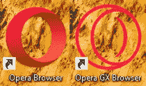

啊歌剧。这些年来，那个红色的戒指已经变得很熟悉了。它的第一个公共浏览器是在 1996 年发布的 Opera 2.0 (1.0 当时被称为 MultiTorg Opera)，甚至在 Mozilla 发布之前。浏览器在满足客户需求方面已经走得很远了。然而，最近一段时间，它的第二个浏览器——Opera GX——获得了非常庞大的消费者基础。被誉为第一款为游戏玩家打造的浏览器，Opera GX 的卓越性能吸引了全球各地的粉丝。

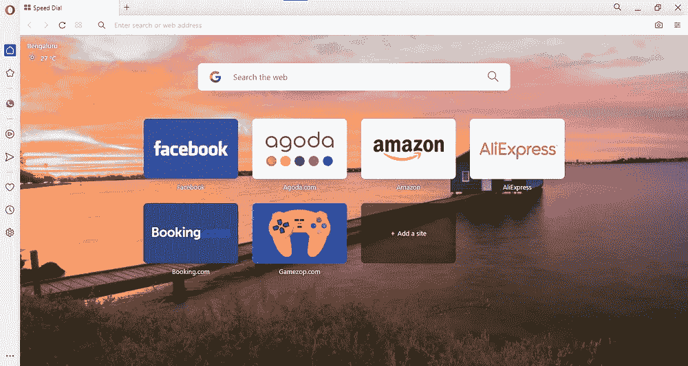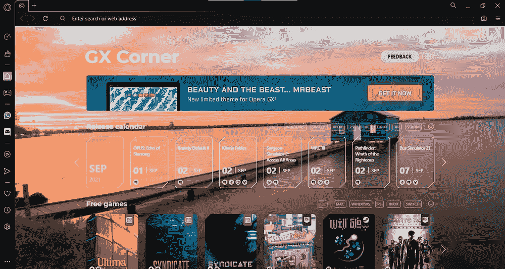

正如你在上面的图片中看到的，两种 Opera 浏览器都有侧边栏，这是浏览器最吸引人的特性之一。在侧边栏上，你可以钉像 WhatsApp，Facebook Messenger，Telegram，Instagram，Twitter 等应用程序！在 Opera GX 上，除了一些流行的游戏应用程序如 Discord 和 Twitch 之外，这些应用程序也受到支持。这两种浏览器都有内置的快照功能，您可以用它来捕捉浏览器屏幕。您可以通过点击地址栏右侧的摄像头按钮来使用该功能。Opera 也有这个叫做工作区的特性——你可以把浏览器分成不同的工作区来实现不同的功能。你可以为学校、家庭、朋友等保留一个工作空间。此功能类似于 Windows 多桌面功能，但仅限于浏览器。

这两种浏览器都有一个被称为“我的流程”的功能。与其他浏览器不同，您可以使用“我的流”功能在多个设备之间同步您的信息。单击侧边栏上的箭头，您应该会看到这样的图像:

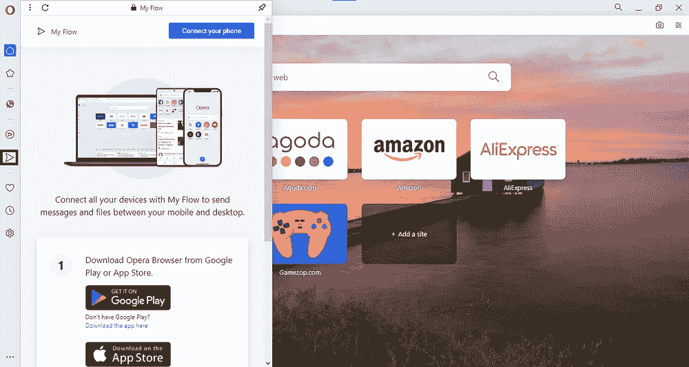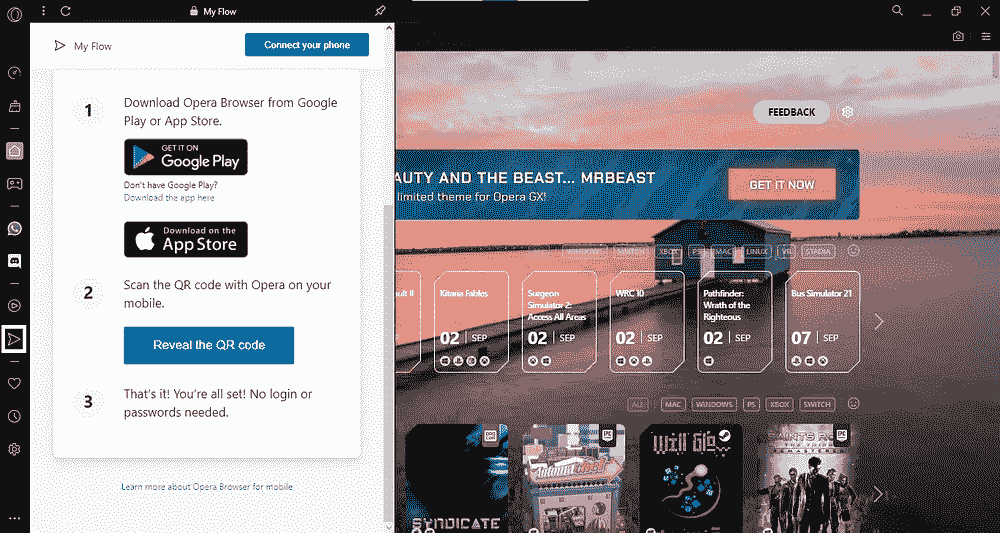

如您所见，这就像扫描二维码一样简单，您可以在不同设备之间同步您的工作！这两种浏览器都有内置的音乐播放器，可以播放 Apple Music、Gaana、Spotify 和 YouTube 音乐中的歌曲。这真的很棒。

这是两种浏览器都有的功能。然而，GX 歌剧院还有更多特色！为了满足游戏玩家的需求，Opera GX 在其主页上展示了将在所有游戏平台上发布的最新游戏。它还具有这些被称为 GX 控制和 GX 清洁的特殊功能。这两者都是为了提高浏览器的性能而引入的。在 GX 控制上，你可以监视和控制浏览器占用多少内存和 CPU。这是之前任何其他浏览器都没有过的功能。你可以通过点击工具条上的定时器按钮来打开 GX 控制。

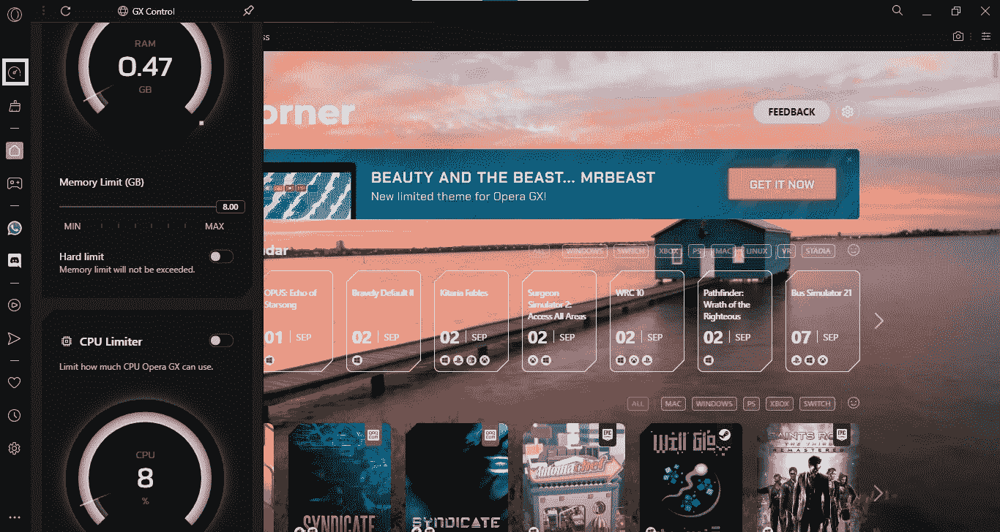

GX 清洁器可以通过清除浏览器上的许多东西来加快浏览器的速度。这有三个级别:最小、中等和最大。GX 清洁器可以清除您的缓存，cookies，标签，浏览历史，下载和未使用的侧边栏图标。这将有助于加快浏览器的性能很多。你可以通过点击工具条上的扫帚图标来访问 GX 清洁器。

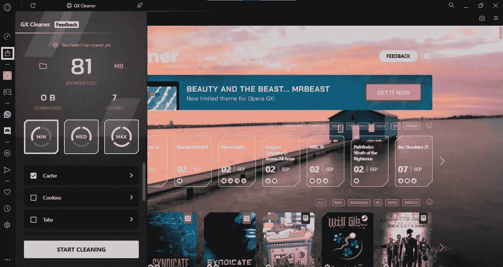

像所有的浏览器一样，Opera 和 Opera GX 都有私人窗口，你可以通过右击任务栏上的图标并选择“新建私人窗口”来访问它们。

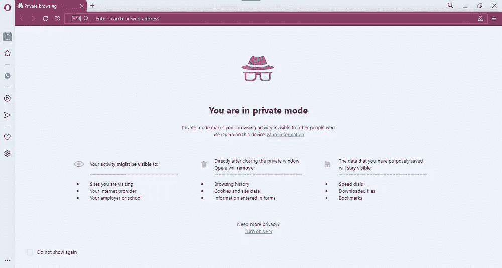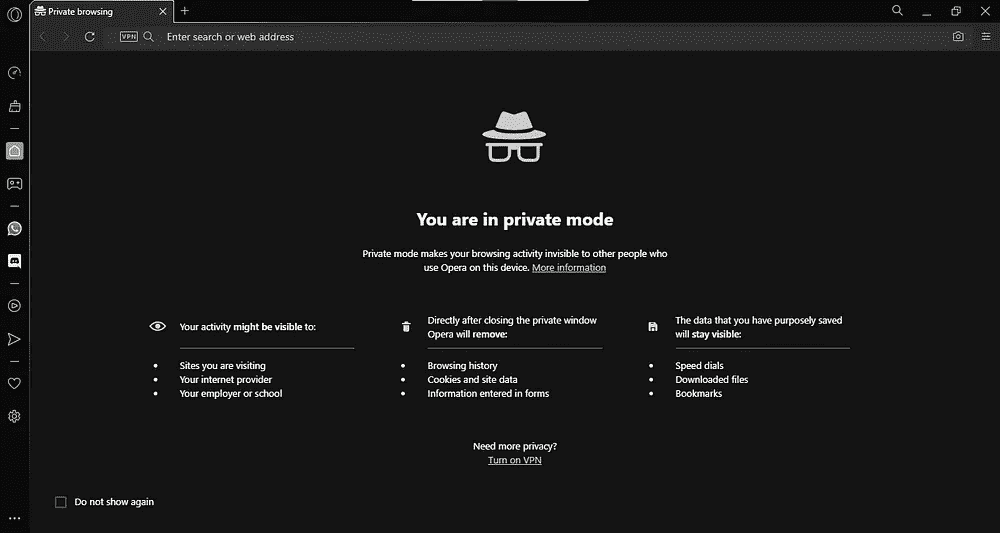

这两种浏览器还内置了 Opera VPN(虚拟专用网络)，以防止第三方跟踪你。您可以通过单击右上角的三个栏并选择 VPN 来启用 VPN。它会将你重定向到 Opera 或 Opera GX 的设置页面，在那里你可以打开 VPN。

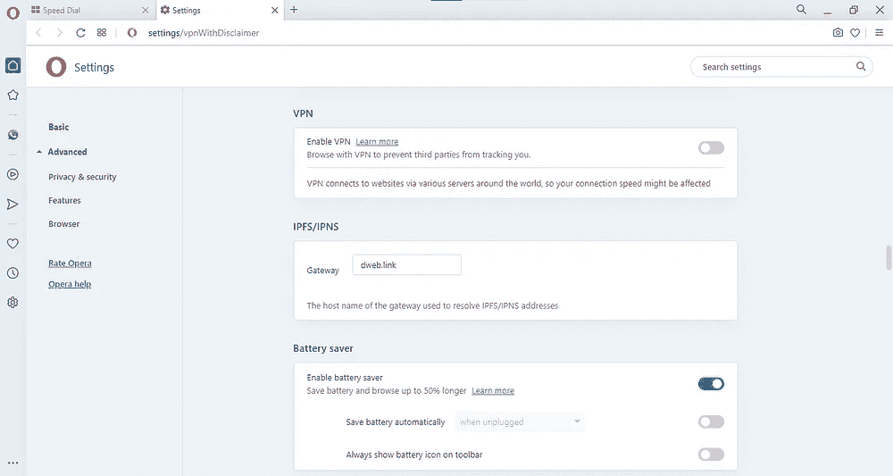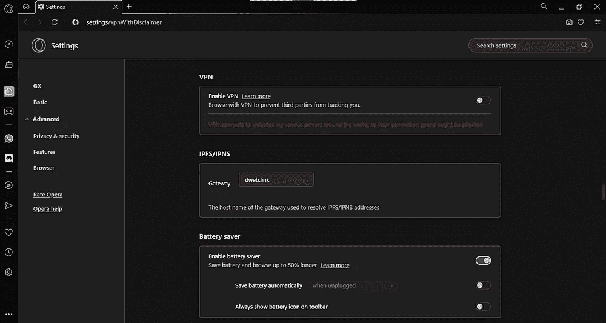

这两种浏览器都有内置的广告拦截器和跟踪拦截器，可以保护你在网上的活动隐私。这与 Opera VPN 相结合，使得 Opera 浏览器成为有史以来最私密的浏览器。这两个默认情况下是启用的，但你可以通过设置来启用或禁用它们。单击右上角的三个栏，向下滚动到“转到完整浏览器设置”。一旦你到达那里，首先你会看到的是广告和跟踪拦截器，你可以打开或关闭。

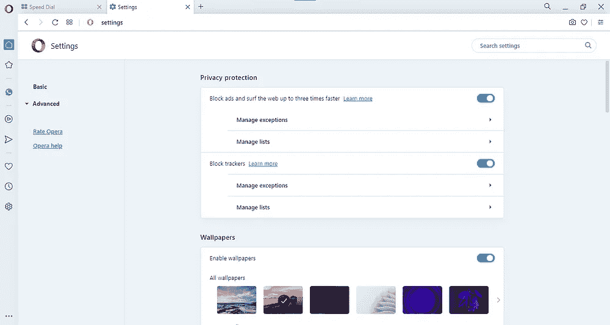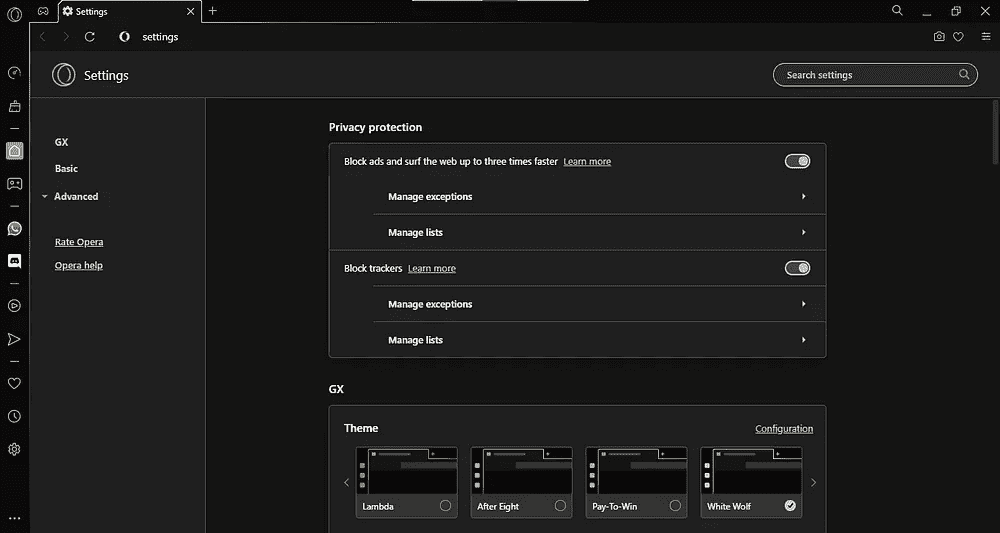

Opera 浏览器有很多特性，但是还有一个主要的特性！这两种浏览器都有一个他们称之为加密钱包的功能。这款钱包允许您使用加密货币进行支付。它连接到你的手机来验证每一笔交易。您已经启用加密钱包，方法是转到设置并键入“加密钱包”，然后打开正确的选项。

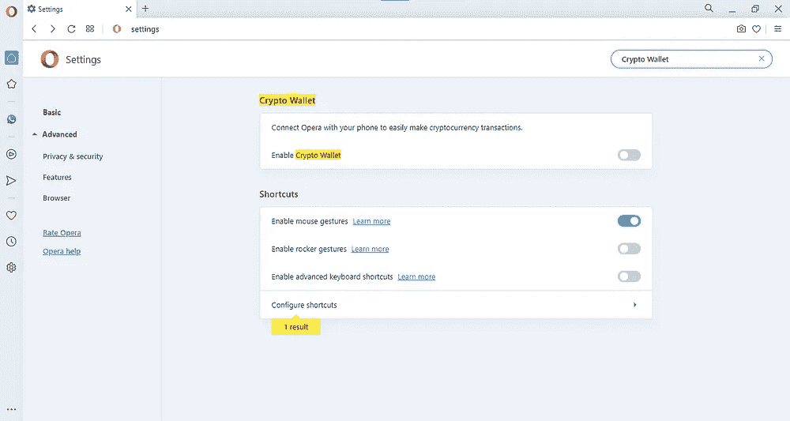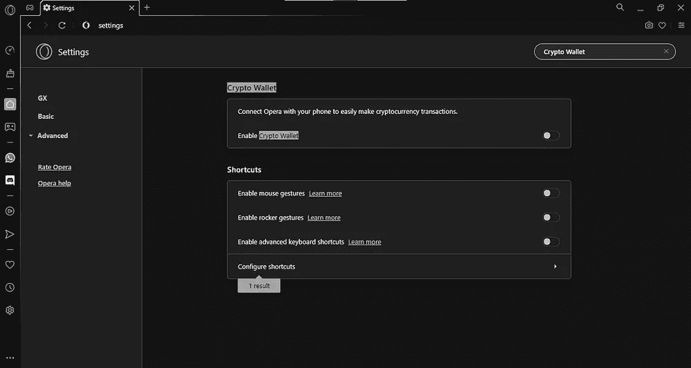

Opera 和 Opera GX 的功能是无穷无尽的，它们可以作为 Chrome 的优秀替代品。这两种浏览器，尤其是 Opera GX，吸引了全球各地的许多用户使用它们。Opera VPN 功能是广受欢迎的功能之一，因为它提供了广泛的隐私保护。如果这些浏览器中的一个在未来引领浏览器排行榜，这并不奇怪。

**这里下载歌剧******。
下载歌剧 GX** [**这里**](https://www.opera.com/download#opera-gx) **。****

# **Vivaldi**

**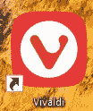**

**Vivaldi 是慢慢流行起来的大型浏览器之一。它发展如此之快，以至于最近取代了 Firefox，成为 Monjaro Linux Cinnamon 上的默认浏览器。**

**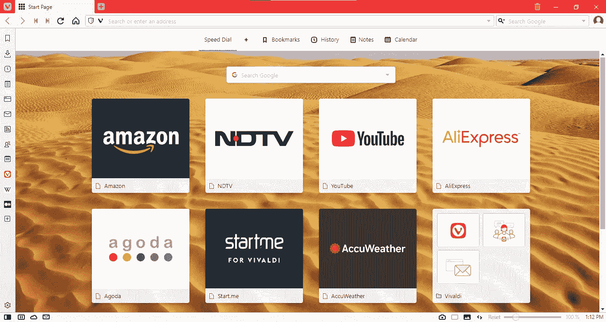**

**维瓦尔第给你选择。它允许你选择你想要多少浏览器:基本，经典，或完全加载。像 Opera 一样，Vivaldi 也有侧边栏，但功能更多。您可以将任何网站添加到侧边栏，只需单击侧边栏上的添加图标并输入该网站的网址。维瓦尔第称之为网络面板。下面的 GIF 向您展示了如何添加 web 面板:**

****

**如您所见，任何网站都可以作为 web 面板添加到侧边栏中。这是一个出色的特性，正如你将在后面看到的，它构成了 Sidekick 浏览器的基础。像除 Chrome 之外的所有其他浏览器一样，Vivaldi 也有一个内置的广告和跟踪拦截器。单击地址栏上的盾形图标，然后选择“管理默认设置”。您将被重定向到一个页面，在那里您可以选择您想要的隐私类型。**

**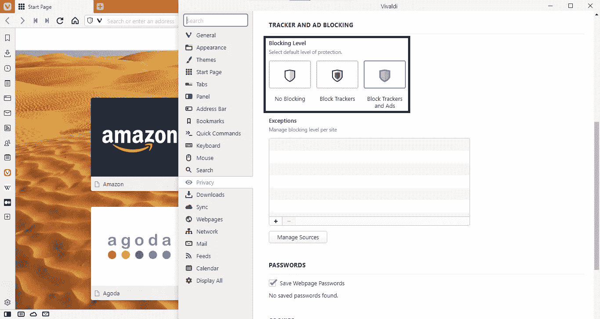**

**像 Opera 一样，Vivaldi 也有内置的快照功能，您可以通过单击屏幕底部的相机图标来使用它。真正有趣的是，维瓦尔第和 Opera 极其相似，只是 Opera 内置了 VPN。Vivaldi 还具有页面平铺功能，您可以使用它在同一窗口中同时查看多个标签。这是一个非常有用的特点，是维瓦尔第独有的。Sidekick 也有这个页面平铺功能，但是就像我说的，Vivaldi 给了你选择。你可以选择你想要平铺标签的方式！**

**当多个选项卡打开时，单击屏幕底部摄像机图标旁边的矩形图标，选择您想要平铺选项卡的方式。这是关于维瓦尔第的精彩特写。正如我在谷歌浏览器中提到的，维瓦尔第也有标签组。然而，与 Chrome 相比，它们有着不同的外观。这是因为 Vivaldi 在 Chrome 之前已经引入了这个功能，所以他们没有使用 Chrome 使用的相同框架。他们甚至不称之为标签组！相反，他们称之为“堆叠标签”。右键单击选项卡并选择“按主机堆叠选项卡”选项。你也可以把标签拖到另一个标签上来堆叠它们。您也可以通过点击屏幕顶部的回收站按钮来访问最近关闭的标签。**

**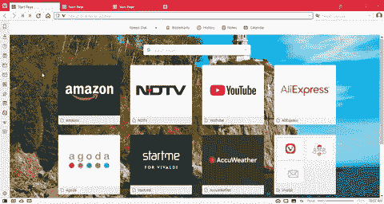**

**Vivaldi 侧边栏有许多应用程序，如邮件、日历和联系人。这些都是非常有用的应用程序，有助于提高生产力，因为它们就在你需要的时候。将任何网站添加为网络面板的能力也使 Vivaldi 真正与众不同。此外，如果你需要休息一下，但你经常被浏览器上发生的事情打扰，Vivaldi 可以让你暂停工作，专注于其他地方。点击左下角的暂停按钮，你的工作将会暂停。**

**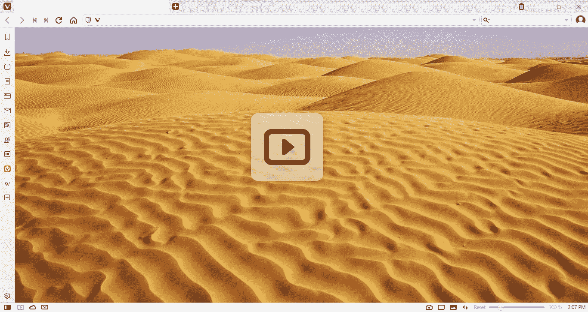**

**像往常一样，维瓦尔第也有一个隐身窗口。右键单击任务栏上的图标，然后选择“新建私人窗口”。您将看到如下所示的窗口:**

**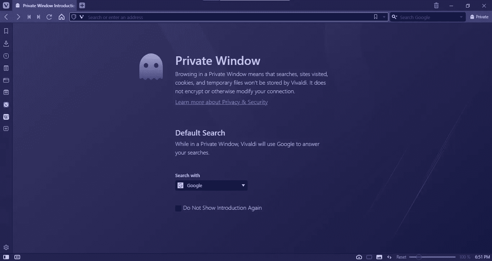**

**嗯，那是维瓦尔第！在一个漂亮的浏览器中装载了许多出色的功能。这是 Chrome 的一个很好的替代品，我建议你看看它。**

****下载维瓦尔第**[T3 这里](https://vivaldi.com/) **。****

**本文到此为止！在下一篇文章中，我们将会看到一些新的优秀的浏览器:Brave 和 Sidekick。**

# **链接:**

**第一篇:[https://srivishnuvusirikala . medium . com/which-web-browser-is-best-for-you-3d 447 f 21 c 663](https://srivishnuvusirikala.medium.com/which-web-browser-is-best-for-you-3d447f21c663)
第三篇:[https://srivishnuvusirikala . medium . com/which-web-browser-is-best-for-you-aba3b 66 a 7029](https://srivishnuvusirikala.medium.com/which-web-browser-is-best-for-you-aba3b66a7029)**

****

**Philipp Katzenberger 在 [Unsplash](https://unsplash.com?utm_source=medium&utm_medium=referral) 上的照片**