# 哪个网络浏览器最适合你？

> 原文：<https://medium.com/nerd-for-tech/which-web-browser-is-best-for-you-aba3b66a7029?source=collection_archive---------4----------------------->

一些流行的网络浏览器

## 浏览器大战

## 第三部分:勇敢和伙伴

欢迎阅读本系列的最后一篇文章！我希望你已经看了第一篇文章，这篇文章介绍了三大浏览器:谷歌 Chrome、微软 Edge 和 Mozilla Firefox。[的第二篇文章](https://srivishnuvusirikala.medium.com/which-web-browser-is-best-for-you-66569792119d)关注了一些成长中的浏览器:Opera、Opera GX 和 Vivaldi。在这篇文章中，我们将看看 Brave 和 Sidekick，Brave 可以说是最私密的浏览器，Sidekick 是一款发展迅速的优秀浏览器。我们走吧！

# 勇敢的

Brave 是列表中较新的浏览器之一，但它是有史以来最隐私的浏览器之一，如果不是最隐私的话。Brave 的整个理念都围绕着隐私的理念，并得到了用户的大力支持。Brave 有一个名为 Brave Shields 的功能，用于阻止网络上的追踪器和广告。除了更私密之外，Brave 的构建与 Chrome 类似，它在实现这一点方面表现出色。

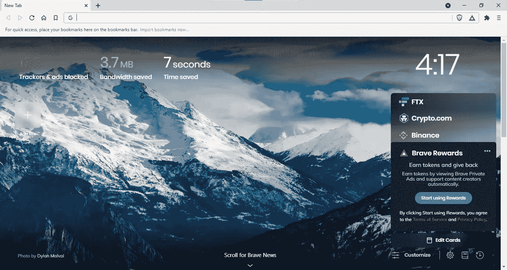

勇敢的主屏幕显示了它阻止了多少追踪器和广告，以及它节省的带宽和时间的统计数据。Brave 还有一个名为 Brave Rewards 的功能，如果客户选择允许他们的数据被跟踪，它会以加密货币支付给客户。这些勇敢的奖励可以被用户用来在线支持他们喜欢的内容制作者。这是由 Brave 发起的一个非常好的倡议。

除了带有跟踪器和广告拦截器的普通窗口外，Brave 还具有 2 个独立的私人窗口。第一个叫做“私人窗口”,虽然它确实会在网上泄露你的 IP 地址，但它相当隐私。这意味着你不会在网上完全匿名。你可以通过右击任务栏上的勇敢图标并选择“新建私人窗口”来访问它。

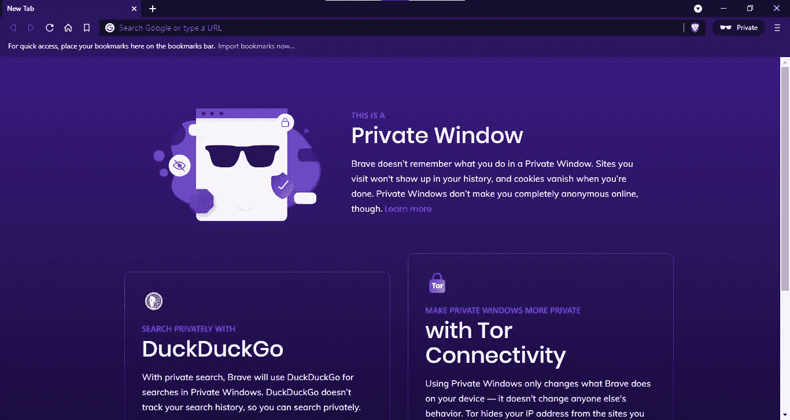

Brave 也有一个暴露你 IP 地址的解决方案。Brave 推出了一种叫做“Tor 连接的私人窗口”的东西。这个窗口甚至不会显示你的 IP 地址。这是 Brave 的一个绝妙的解决方案——将 Tor 与其私有窗口集成在一起，使其完全私有。

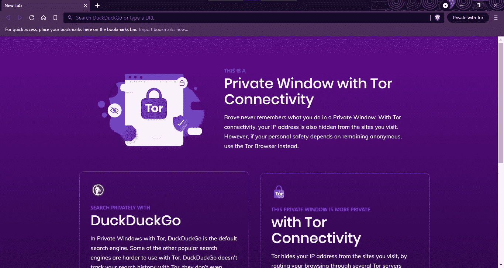

如你所见，Brave 是你能找到的最私密的浏览器之一。不幸的是，唯一玷污这个干净的浏览器的是，它已经卷入了多次争议。其中，有两个是最突出的。显然，Brave 正在收集勇敢的奖励，并发给其他内容创作者。在一些反弹之后，Brave 道歉并做了一些改变。下一次更危险。尽管 Brave 坚持保护隐私，但它显然没有通过 Tor 窗口向用户的 ISP 发送 DNS 请求，尽管会话是在 Tor 的私人窗口上进行的。Brave 已经纠正了所有这些错误，但这些争议仍然让用户怀疑 Brave 到底有多隐私。

**下载勇敢的** [**这里**](https://brave.com/) **。**

# 助手

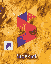

最后一个浏览器！Sidekick 是我最近才开始了解的一款浏览器。Sidekick 看起来有点像 Chrome，但是有一个非常特别的侧边栏。Sidekick 的侧边栏居然给它起了名字！Sidekick 相信 web 应用程序的重要性，所以它有大量的应用程序可以添加到侧边栏中。这些应用程序将在不打开新标签的情况下打开，这实际上更类似于 Vivaldi web 面板。您可以通过点击边栏上的“+”按钮将应用添加到边栏:

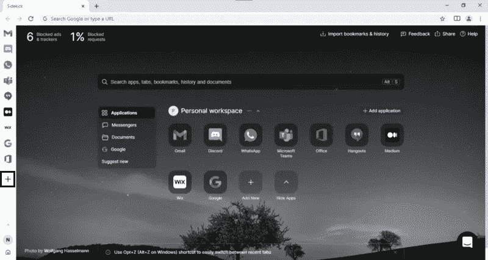

然后，您将能够看到一个小窗口，您可以在其中选择要添加的应用程序。如果没有该应用程序，您可以通过从现有选项卡或从 URL 创建应用程序来自己添加应用程序:

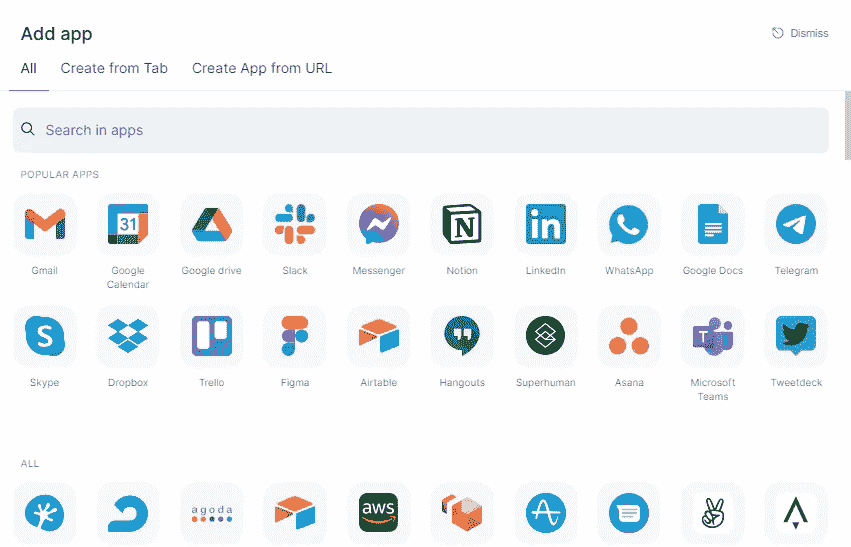

Sidekick 不是最大的浏览器之一，但它有一些自己的好功能。它有一个内置的广告和跟踪拦截器，可以删除所有 Chrome 不能删除的广告。您可以通过单击边栏上“N”上方的箭头并选择齿轮图标来启用或禁用广告拦截器。转到“广告拦截器”并打开或关闭它。

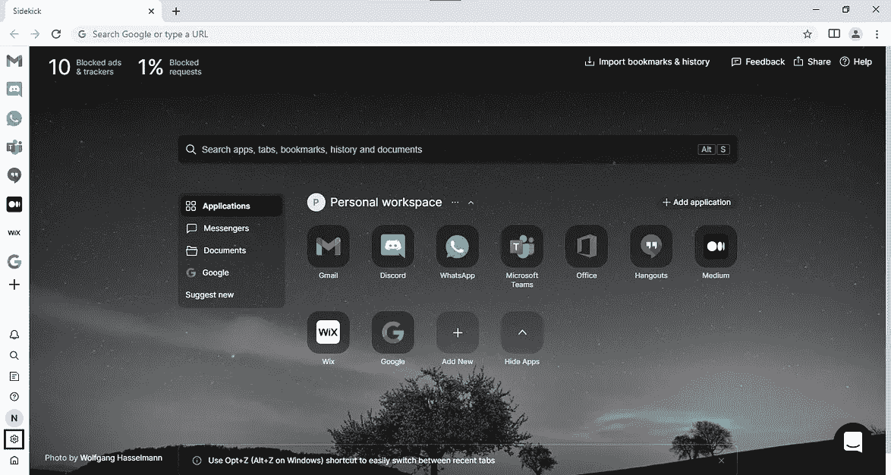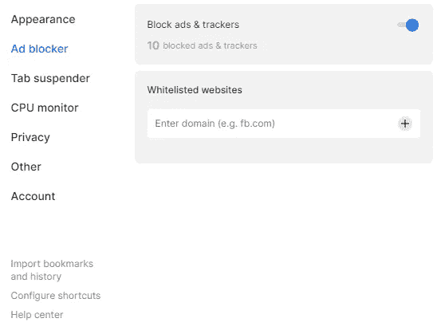

Sidekick 也有这个功能，称为“会话”。会话的工作方式基本上与选项卡组相同，但具有更好的 UI。点击侧边栏上的“N”按钮，您将能够查看您的会话。Sidekick 也试图节省你的内存使用。他们使用这种独特的功能被称为“标签吊杆”。所有在一段时间内不使用的标签都会被挂起，以节省一些内存空间并加快您的体验。点击齿轮图标，进入“标签悬挂器”,在这里你可以选择是否悬挂标签，以及在多长时间后标签应该被悬挂。

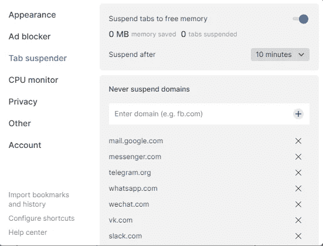

Sidekick 还允许你挂起 CPU 使用率高的非活动标签。您可以打开或关闭此功能，方法是转到“CPU monitor”并打开或关闭正确的开关。

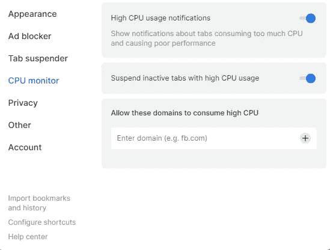

像维瓦尔第一样，Sidekick 也有一个拆分视图选项，你可以通过点击地址栏旁边的书图标来使用。它们也有一个隐姓埋名的窗口，就像 Chrome 一样，你可以通过右击任务栏上的图标并选择“新隐名窗口”来访问它。

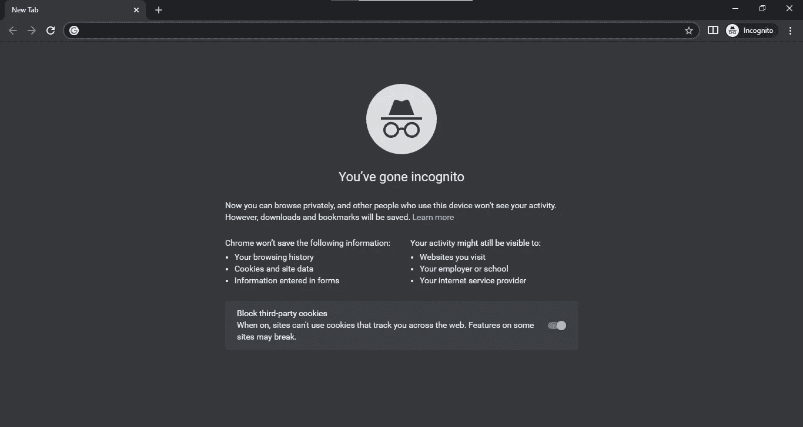

虽然 Sidekick 没有 Chrome 或其他任何浏览器的所有功能，但 Sidekick 从未打算成为一个独立的浏览器。它旨在补充其他浏览器，同时为完成工作创造完美的工作环境。它非常重视网络应用程序，甚至允许你添加菜单上没有的应用程序。

Sidekick 是一款新的浏览器，并且每天都在持续增长。作为吸引更多用户的一种方式，他们已经要求他们的第一批用户，包括我，向人们发送邀请链接，让他们下载 Sidekick。如果我们能获得足够的用户，他们将免费提供 Sidekick Pro。我在下面放了邀请链接，所以请从那里下载 Sidekick！

**这里下载死党******。****

**哇，有很多浏览器。虽然我肯定没有展示浏览器的每一个功能，但我希望我能展示出最重要的功能。下面是我粘贴在每个浏览器上的下载链接。谢谢你陪我看完这两篇文章，我希望你已经明白什么样的浏览器最适合你的需要！**

# **下载:**

**谷歌 Chrome:[https://www.google.com/chrome/](https://www.google.com/chrome/)
微软 Edge:[https://www.microsoft.com/edge](https://www.microsoft.com/en-us/edge)
Mozilla Firefox:[https://www.mozilla.org/firefox/](https://www.mozilla.org/en-US/firefox/)
Opera:[https://www.opera.com/download#opera-browser](https://www.opera.com/download#opera-browser)
Opera GX:[https://www.opera.com/download#opera-gx](https://www.opera.com/download#opera-gx)
勇者:[https://brave.com/](https://brave.com/)
维瓦尔第:[https://vivaldi.com/](https://vivaldi.com/)
死党:[https://join.meetsidekick.com/mmgcz](https://join.meetsidekick.com/mmgcz)**

# **链接:**

**第一篇:[https://srivishnuvusirikala . medium . com/which-web-browser-is-best-for-you-3d 447 f 21 c 663](https://srivishnuvusirikala.medium.com/which-web-browser-is-best-for-you-3d447f21c663)
第二篇:[https://srivishnuvusirikala . medium . com/which-web-browser-is-best-for-you-66569792119d](https://srivishnuvusirikala.medium.com/which-web-browser-is-best-for-you-66569792119d)**

****

**菲利普·卡岑伯格在 [Unsplash](https://unsplash.com?utm_source=medium&utm_medium=referral) 上的照片**