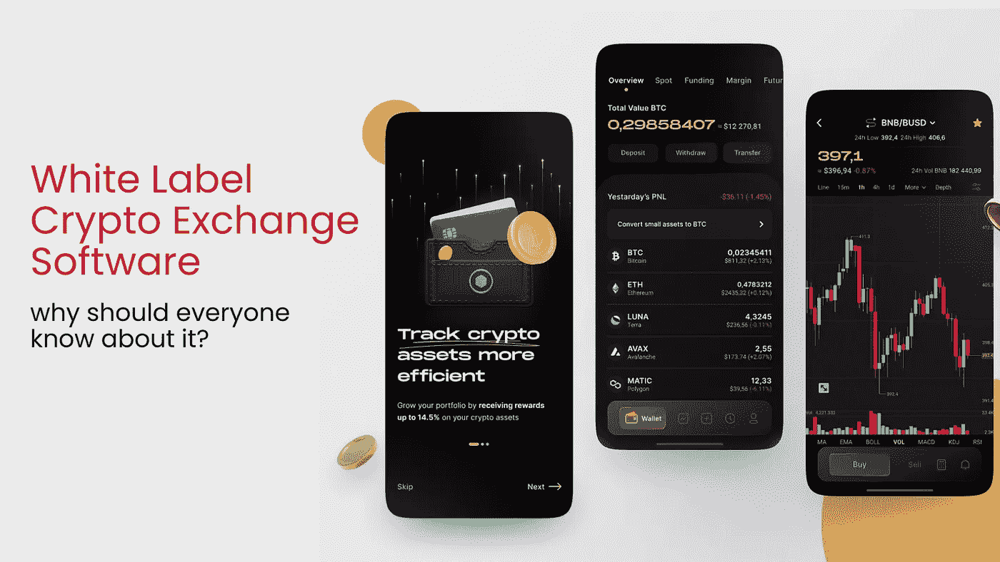

# 白标加密交换软件—为什么每个人都应该知道它？

> 原文：<https://medium.com/nerd-for-tech/white-label-crypto-exchange-software-why-should-everyone-know-about-it-377def8dfde1?source=collection_archive---------6----------------------->

你有没有想过开办一家加密交易所？尽管目前经济低迷，密码行业在未来几年仍将继续增长。如果我们看一下统计数据，很明显数字资产的受欢迎程度正在逐渐增加。

密码行业是全球增长最快的行业之一，密码交易业务吸引了许多初创公司/企业家。其资产价值约为 3 万亿美元。你可以通过开始自己的加密货币交易业务在短时间内获得高收入。

## **简介**

一个白标加密货币交换软件准备推出加密交换软件，可能会创建与先进的功能和特点。任何人都可以购买、出售和持有任何类型的密码，以换取密码货币。有了这款现成的 whitelabel 加密货币交易所软件，企业家可以在短时间内推出自己的加密货币交易所，而无需费力。

这种类型的软件通常使用高效安全的机制进行加密，以提供防黑客的工作场所。根据需要，这款白标加密货币交换软件可以配置为运行点对点加密交换、点对点管理交换或集中式交换。

## **为什么白标加密交换软件？**

White label crypto exchange 软件是一个现成的加密交易平台，允许您在短短七天内构建一个功能丰富的加密交易平台，具有高级交易和安全功能。您可以调整和添加所需的交易模块，以满足您自己的业务需求。

首先，你需要一个 [**白标加密交换软件**](https://www.clarisco.com/white-label-crypto-exchange) 。这种组合提供了独特的加密交换体验和不同的后端选项。白标平台允许多种加密资产的实时交易，并简化取款和存款。

为了推动金融市场向前发展，你还应该考虑尖端技术。交易中最重要的是你用来买卖的软件。我们提供最好的交易软件，既高效又广泛，让你完全控制你的交易。

## **商业利益:**

*   开展加密货币兑换业务的最快方式
*   提高你的品牌知名度
*   耗时的一个
*   性价比高
*   易于部署
*   高级交易和安全功能
*   免费服务器部署
*   无 Bug 白标加密货币兑换软件

## **白标加密交易所交易功能:**

**钱包整合**

我们集成了支持多种货币的加密钱包。这存储和保护用多层安全协议加密的资金。

**流动性整合**

白标软件集成了高容量流动性。这使得有效的交换过程不受价格波动的影响。

**自动化 KYC/反洗钱**

交易所的整合通过 KYC/反洗钱验证自动完成。这确保了只有合法用户可以访问它，并防止纠纷。

**支付网关**

我们的平台接受多种支付方式，包括法定货币。这使得用户很容易进行即时交易。

**多币支持**

多币钱包，顾名思义，就是支持多种加密资产的**钱包**。单一的钱包允许用户存储他们的硬币，并使他们在分散的交易所交易变得容易。这也简化了跟踪他们所有投资组合的过程。

**可定制的用户界面/UX**

我们的交易所功能包括完全可定制的网站用户界面和网络应用程序、iOS 和 Android 的移动应用程序、专业交易终端和视图。

*   快速注册和入职流程
*   许多加密货币和法定货币的存款和取款功能。
*   进入交易账户是不受限制的。
*   预订历史和所有交易的回顾
*   统计监督
*   全天候客户支持
*   生动的图表和分析功能

## **白标加密交换安全特性**

**HTTP 认证**

对于用户认证，我们使用高度安全的 HTTP 认证令牌，比如 OAuth。

**数据加密**

用户凭证和机密信息受到数据传输加密的保护。

**反拒绝服务**

此功能可防止将大型请求发送到服务器。

**反分布式拒绝服务攻击**

它可以防止来自多个来源的过多流量影响交换。

**注册表锁**

注册表锁通过在注册表级别锁定域来提供额外的安全性。

**服务器端防伪**

SSRF 保护保护内部系统免受易受攻击的应用程序的攻击。

**HTTP 参数污染预防**

它可以阻止创建 HTTP 请求来检索机密信息的 web 攻击者。

**跨站请求防伪**

防止来自用户端的不需要的请求和状态改变请求。

## **白色标签加密交换的类型**

**集中交易发展**

您的潜在客户需要一个中央加密交换平台。该平台结合了强大的交易引擎和安全的交易平台，可实现快速订单匹配和交易处理。

**分散交易所发展**

分散交易平台拥有以太坊智能合约，为加密货币交易平台的用户提供高科技功能。由于精心规划的加密货币交易平台战略，用户可以通过分散平台智能、轻松、安全地进行交易。

**比特币交易所发展**

可以开发一个比特币交换平台。这是一个数字市场，允许交易者使用法定货币或其他替代货币买卖比特币。业界领先的解决方案将通过加密交换平台帮助您发展业务和增加收入。

**P2P 交易所发展**

交易者可以选择创建一个对等加密货币交换平台，无需中间人即可轻松转移加密资产。

**衍生品交易所开发**

创建衍生品交易平台，允许交易者在 CEX 和 DEX 平台上交易。为了吸引更多投资者，交易所所有者可以利用加密货币衍生品平台的潜力。

**融资融券交易所发展**

保证金交易是加密货币市场最显著的趋势之一。为了增加加密货币销售或购买的潜在回报，交易者可以借入资金。

**混合交易所开发**

混合交易所结合了集中交易所和分散交易所的优点。它们提供高流动性、快速交易和匿名性，同时保护和保障分散的交易所。这些好处是为什么混合交易所在寻求开办加密交易所的交易商和企业中受到欢迎的原因。

**托管交易所开发**

托管协议监视器公式化，一个非凡的密码交换平台。它为您的商业企业需求提供快速交易、多货币配对和无限加密令牌支持。

**NFT 交易所发展**

为一系列 NFT 代币的安全交易提供广泛的不可替代的交易所开发服务。该平台是可扩展的，可以无缝集成任何 NFT 令牌。它还具有市场领先的功能，这将使它在市场上表现出色。

**场外交易平台开发**

通过选择场外交易平台，您可以创建一个顶级的平台来进行大量的加密货币交易。

**结论**

密码爱好者现在可以实现他们的梦想，创造一个理想的交易所，分析各种代币和风险投资的表现是关键。如果你对项目有很好的理解，你可以很容易地计划和执行你的项目。与行业专业人士合作，有可能释放加密空间的所有潜力。

这是一个解决方案，以帮助初学者进入市场，避免潜在的陷阱。与可靠且经验丰富的 [**加密货币交易开发公司**](https://www.clarisco.com/cryptocurrency-exchange-development) 合作，你可以在加密方面取得成功。