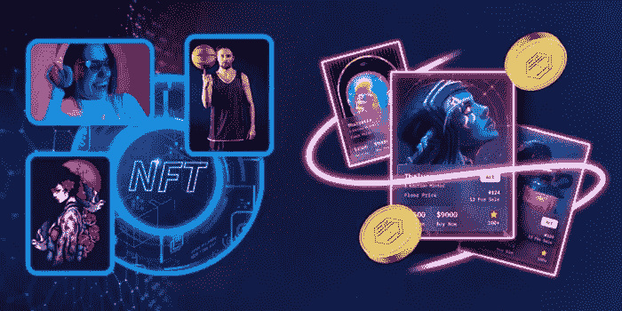

# 白牌 NFT 市场开发

> 原文：<https://medium.com/nerd-for-tech/white-label-nft-marketplace-development-697acda1cb17?source=collection_archive---------4----------------------->

随着密码世界见证了区块链、web 3、NFTs 等的许多飞跃；如今，干预 NFTs 已经成为加密企业家和商业人士的一个有利可图的商业目标。NFT 市场作为一个单一的平台，促进了非金融债券的发行和交易。也就是说，NFT 市场的发展已经成为密码商业世界的一个热闹的商业舞台。因此，在这篇博文中，让我们来了解一下 NFT 的白标市场及其发展。

## 什么是 NFT 市场？

NFT 市场是一个交易平台，NFT 爱好者和人们在这里交易和寻找独特的 NFT。从艺术品、音乐文件和图像文件到虚拟土地，我们可以在 NFT 市场上找到任何具有 NFT 价值的东西，并使用加密货币出售或购买。

用户进入 NFT 市场进行非功能性交易的三个关键因素包括:

*   加密钱包(与支持市场的区块链兼容)
*   加密货币(它们是 NFT 市场上买卖非加密货币所必需的)
*   NFT 市场平台上的用户帐户(用于访问交易非功能性交易)

也就是说，开发一个具有多种特性和功能的 NFT 市场需要资源和时间。此外，NFT 企业和初创公司可以通过两种不同的方式进入 NFT 市场发展:

*   从零开始发展 NFT 市场
*   使用白色标签解决方案建立 NFT 市场

现在，让我们详细探索一下 NFT 白牌市场的发展

## 什么是白标 NFT 市场发展解决方案？

许多 NFT 市场开发公司为企业家和初创公司提供可定制的白标解决方案，以进军 NFT 市场开发。也就是说，

一个 [**白标 NFT 市场**](https://www.inoru.com/white-label-nft-marketplace) 开发解决方案是一个预建的、随时可部署的 NFT 市场，可根据业务需求定制其特性和功能。

## 为什么白牌 NFT 市场发展是一个明智的选择？

现在，选择白标 NFT 市场开发解决方案是一个明智的选择，因为它涉及一种安全、经济高效且耗时较少的 NFT 市场开发方法。它帮助 NFT 商业公司无缝推出 NFT 市场。选择白标 NFT 市场开发解决方案的一些额外好处如下:

**高度安全的平台**

由于附加功能可以添加到白标 NFT 市场，市场的安全性可以通过 2FA、防火墙集成、加密等功能来提升，因此有助于防止黑客和攻击者从 NFT 市场窃取用户数据。

**成本效益高，耗时少**

建立一个具有复杂特性和功能的 NFT 市场将需要更长的时间和巨大的资本。但是，当白标解决方案用于 NFT 市场开发时，它将巨额预算转化为预算友好型资本，并缩短了构建 NFT 市场所需的时间。

**定制**

如前所述，白标 NFT 市场开发解决方案提供了根据业务需求定制 NFT 市场的特权。因此，选择白色标签的 NFT 市场发展将允许 NFT 市场显示更多的用户友好性和独特性。

**即插即用选择**

由于白标 NFT 市场易于操作，它们涉及简单和容易的配置，因此在启动 NFT 市场时不太复杂。

**UX/用户界面功能的灵活性**

白标 NFT 市场解决方案提供了设置 UX/用户界面功能的灵活性。

**钱包整合**

由于白标 NFT 市场对 NFT 钱包的整合很灵活，用户可以将多个 NFT 钱包与 NFT 交易平台整合。

## 白色标签 NFT 市场的特点

现在，NFT 市场的特点决定了该平台的用户基础和受欢迎程度。因此，一个建设良好的白牌 NFT 市场的一些特征如下:

**1。店面**

店面是帮助向用户展示在 [**白标 NFT 市场平台**](https://www.inoru.com/white-label-nft-marketplace) 上交易的 NFT 以及所有相关细节和信息的特征。这是每一个 NFT 市场的重要特征，并且作为市场的门面，帮助用户形成对市场的用户体验的意见。从店主的详细信息到市场上展示的 NFT 的价格历史，所有的东西都展示在店面上。

**2。高级过滤器**

高级过滤器选项将帮助用户浏览 NFT 市场的内容，并从 NFT 市场上呈现的广泛的 NFTs 类别中缩小他们需要的 NFTs，这些类别包括音乐文件、图像文件、游戏配件、艺术品等。

**3。拍卖和销售**

该功能将帮助用户为在 NFT 白标市场上出售的 NFT 设定最低投标价格。这个特征是最重要的特征之一，因为它促进了市场上呈现的 NFT 的投标和拍卖。

**4。多钱包和多支付网关**

多钱包功能将允许用户将不同的钱包整合到 NFT 交易平台，因此将使用不同的加密货币购买 NFT。多支付网关将帮助用户使用不同的支付网关进行 NFTs 购买，从而为用户带来多样化的支付选择。

**5。智能合同和增强的安全功能**

由于 NFT 交易是通过智能合约和区块链技术启动的，用户进行的交易是高度安全的，构建良好的 NFT 市场将具有 DDOS、SSRF 等额外的安全功能(同样，白标 NFT 市场的额外安全功能将取决于所选择的白标解决方案)

**6。钱包兼容性和多链互操作性**

这些功能帮助用户集成他们选择的加密钱包，多链互操作性是白标 NFT 市场的高级功能。

**7。仪表板**

仪表板功能将允许 NFT 市场的用户和管理员随时编辑用户数据和 NFT 交易历史，从而帮助他们有效地使用它。

## 白牌 NFT 市场开发的相关步骤

NFT 市场发展的一些关键步骤如下:

☛ **选择利基**

由于各种各样的非功能性食物可以在 NFT 的白标市场上出售，因此为市场选择一个合适的位置将决定目标受众和必要的定制。

☛ **雇佣一个白标 NFT 市场开发团队**

白标 NFT 市场开发最重要的一步是雇佣一个高度专业的开发团队。由于开发团队在不同的项目中拥有顶尖的专业知识，并且了解 NFT 市场开发市场的当前需求，雇佣他们可以使开发过程变得更加容易。

☛ **设计用户界面/用户体验特性**

用户界面/UX 功能决定了 NFT 市场的用户基础。因此，拥有用户友好和无缝的用户界面/UX 功能对于白标 NFT 市场的发展至关重要。

☛ **开发智能合同**

由于 NFT 市场是基于智能合约运行的，因此白牌 NFT 市场的关键步骤之一就是开发智能合约。

☛ **集成 IPFS 存储**

由于 NFT 市场上展示的 NFT 存储在 IPFS 内存中，因此将 IPFS 内存与 NFT 市场的系统架构集成至关重要。

☛ **测试和部署成品市场**

现在，集成存储后，开发的白牌 NFT 市场经过技术错误测试，最终部署完毕。

## 白色标签 NFT 市场的关键属性

一个构建良好、用户友好的白标 NFT 市场的一些关键属性包括:

➊.**透明度**

一个建设良好的白牌 NFT 市场将为市场内发生的交易提供透明度。因此，用户将有机会看到在 NFTs 交易期间发生的交易的细节。

➋.**流动性**

NFT 市场的流动性为用户提供了交易 NFT 的特权，并通过使用 NFT 作为抵押品来获得流动现金或加密货币。

➌.**放权**

一个高度分散的白标 NFT 市场将允许交易以独立的方式发生。

➍.**可追溯性**

由于白标 NFT 市场通过区块链技术工作，NFT 市场上呈现的 NFT 的所有权细节和真实性可以被追踪和验证。

## 结论

现在，我们已经看到许多大型 NFT 市场在加密领域蓬勃发展，越来越受欢迎，拥有广泛的用户基础。也就是说，冒险进入 [**白牌 NFT 市场发展**](https://www.inoru.com/white-label-nft-marketplace) 对每个人来说都是最佳商机之一。然而，要抓住 NFT 市场业务的焦点，关键是要满足于一个开发良好的白牌 NFT 市场解决方案和一个开发团队，以开发一个用户友好的白牌 NFT 市场。