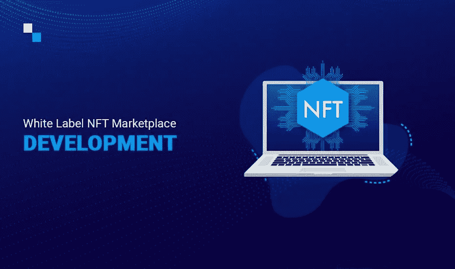
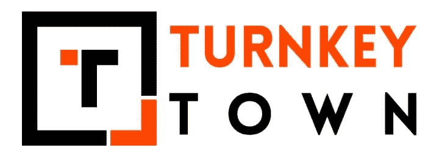
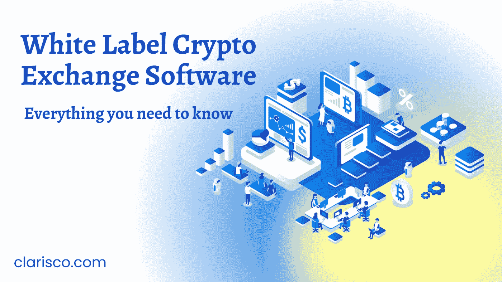

# 白标 NFT 市场发展公司(最佳前 6 名)

> 原文：<https://medium.com/nerd-for-tech/white-label-nft-marketplace-development-company-best-top-6-a1728a14d28d?source=collection_archive---------12----------------------->

白标 NFT 解决方案是一个现成的 NFT 平台，您可以从白标 NFT 市场开发公司购买。这样一个平台提供的功能包括购买、销售和投标非功能性交易。虽然它是一个预制的平台，但可以根据客户的业务需求进行定制。一般来说，可以通过从零开始建立 NFT 市场或选择经过多次测试的白标 NFT 市场来产生白标 NFT 解决方案。正如在以前的文章中所讨论的，从零开始构建一个 NFT 平台是非常耗时的，并且比购买一个 NFT 市场软件花费更多。几家公司正在这一领域开展工作，并提供白色标签 NFT 解决方案。这篇文章致力于回顾提供白标解决方案的顶级公司，帮助你找到最好的供应商。

# 2022 年 NFT 市场发展公司白标排行榜

为了建立一个优秀的 NFT 市场来实现你的特定业务目标，你必须雇佣一个值得信赖的 [**白标 NFT 市场发展公司**](https://radindev.com/nft-marketplace-development/) 。根据客户的要求，该公司帮助他们选择技术堆栈和架构，以增强可扩展性、性能和弹性。雇佣一个熟练的 NFT 市场开发团队可以提高解决方案的质量、测试和部署。这里介绍 5 家顶级白标 NFT 平台公司:

# 拉丁捷夫

[这家公司](http://radindev.com)由一群专业程序员组成，他们为客户开发合适且最具竞争力的解决方案，以实现加密货币领域的最大利益。他们提供多种服务，包括白标 NFT 市场软件。他们的白标 NFT 解决方案提供了最大的功能，使用这些功能，您可以享用您的加密货币交易所开发服务。他们声称，在快速部署他们的全功能平台后，不到三周就可以开始创业。RadinDev 提供的白标 NFT 解决方案高度安全、可定制且经济高效。此外，它的功能还在增长，使用它，您可以以一种高度组织化的方式存储资产。他们的白标平台提供的具体功能如下:

-多语言支持

-智能交易

-匹配发动机

-移动交易应用程序

-支付整合

-加密流动性

-交易历史

-多货币钱包

- KYC 和反洗钱

此外，技术咨询、平台定制、新版本修复、密码开发以及拥有最好的技术支持是采用 RadinDev 公司白标 NFT 软件的其他优势。

# appdupe

[这家公司](http://appdupe.com)是领先的白标开发解决方案公司之一，在开发同类最佳的白标 NFT 解决方案方面处于领先地位。他们的公司由一个年轻且经验丰富的专家开发团队组成。他们可以根据您的定制需求开发您想要的平台。他们为艺术、游戏、音乐、数字收藏品、metaverses 和体育等各个领域设计白牌 NFT 交易平台，并使用令牌标准，包括 ERC721、ERC1155 和 ERC998。他们的白色标签 NFT 平台包含以下功能:

-探索 NFT

-浏览 NFT

-搜索过滤器

-简介

-排名

钱包

-多支付网关

他们还为其平台提供了安全功能，包括:

-端到端数据加密

-反拒绝服务

-实时监控区块链网络

-入侵检测

-港口管理

-谷歌认证等。

这家白标 NFT 市场开发公司声称其现成的 NFT 平台的优势如下:

-完全分散

-防火墙中介

-简单

-跨链接口

-支持多种加密货币

-令牌使用案例

# askgalore

第二家提供白色标签 NFT 平台的顶级公司是 askgalore。[这家公司](https://www.askgalore.com/)提供了巨大的支持，为初露头角的企业家在 NFT 空间开始他们的创业，建立一个经济有效且安全的 NFT 平台。他们提供的白标 NFT 市场软件是完全可定制和高度安全的。更准确地说，他们与顶级安全机构的合作关系确保了他们的客户能够提供一个高度安全的白标 NFT 市场平台。此外，他们的白标解决方案支持多个区块链，如以太坊、多边形(MATIC)、索拉纳、币安智能链(BSC)、Tron、PolkaDot 等。对于 NFT 铸币，您可以在 NFT 市场定制 NFT 标准，如 ERC721 和 ERC1155。该公司将 NFT 开发价格定在 3000 到 20000 美元之间，NFT 市场开发价格在 16000 到 60000 美元之间。该公司声称其白标 NFT 解决方案的最佳特性如下:

-完全可定制和配置

-广泛的 NFT 标准支持

-在短时间内上市

-用户友好的无缝注册流程

-参加 NFT 拍卖会

-多种支付方式

-集成 NFT 钱包

- 2FA 认证

-集成支持台

-趋势投标和收藏

-警报和通知

-购物车管理

-市场分析

-白名单/黑名单管理

-资产管理

-支付和费用管理

-贸易管理

# 交钥匙城镇

交钥匙城镇公司是提供高质量服务的最突出的公司之一，这就是为什么我们把它放在我们的 NFT 市场案例研究评论的第二位。他们向客户保证从他们的业务中获得最大的投资回报和利润。他们设计的白标 NFT 解决方案具有个性化功能，并提供同类最佳的功能来支持 NFT 市场的运营。他们的白标解决方案开发服务涵盖的领域包括艺术、音乐、视频、游戏、体育、奇幻游戏、配件、房地产、基础设施开发、域名和摄影。该平台使用令牌标准，包括 ERC-20、ERC-721、ERC-998 和 ERC-1155。这家公司声称它提供独家功能，如:

- NFT 排名

-收藏

-投标

-捆绑列表:

使用这个特性，可以在平台中捆绑列出 NFT，不需要一个一个列出。

-简单协议

他们的白色标签 NFT 市场提供了一个解释软件管理步骤的协议。它的简单性允许任何人在没有技术知识的情况下有效地操作软件。

-多设备兼容性

该解决方案设计为与多种设备兼容，因此用户可以在他们方便的任何设备上登录和交易。

-过滤器

-可解锁的内容

此功能通过提供特殊的可解锁内容来鼓励平台的使用。这些可能是在成功购买 NFT 后解锁的特别优惠或优惠券代码。

-合作者访问

-集成

由于平台的高度重要的安全，交钥匙镇公司使用高等级的安全。

-加密:

-防火墙、DOS、DDOS

-黑名单用户

-双因素认证:

双因素身份验证功能在用户访问 NFT 市场之前验证用户的身份。双因素认证、google 认证和重新验证码等方法确保了用户的真实性。

# 克拉里斯科

Clarisco 公司提供端到端的白标 NFT 创建服务和开发服务，为全球范围内的初创公司、企业和公司提供一流的解决方案。使用该公司设计的白标解决方案，您可以在以太坊、索拉纳、币安智能链、Polygon、TRON 和 PolkaDot 等区块链网络类型中进行选择，以在您的 NFT 市场中就业。那些愿意发展多链 NFT 市场的人也可以使用他们的独家服务。他们的解决方案涵盖了每个领域，包括艺术、音乐、游戏、加密收藏品、软件许可证管理、资产生命周期管理、交易市场和内容订阅。他们使用四种令牌标准，包括 ERC-721、ERC-998、ERC-1155 和 TRC-721。Clarisco 提供的白标 NFT 市场发展公司服务包括:

- NFT 市场咨询服务

- NFT 市场应用程序开发

- NFT 智能合同审计服务

- NFT 智能合同开发

- NFT 市场网站开发

- NFT 市场支持和维护

使用这些白标 NFT 平台，您可以受益于以下特性:

-低成本

-部署所需的最短时间

-可扩展性

-经审计的智能合同

-多级安全

-定制

# 伊诺鲁

贵公司是一家为客户提供广泛服务的知名公司。他们的白标 NFT 软件从构思、测试和部署开始。他们设计的平台具有成本效益，是现成的解决方案，因此客户可以立即在 NFT 市场享用午餐。他们在白标 NFT 平台中提供的主要功能:

代币排名:

NFT 代币根据交易量、价格和统计数据进行排名，排名靠前的代币总是很受欢迎。

收藏:

他们的 NFT 白标平台在收藏下提供了一个广泛的令牌列表，供用户购买他们的设计师 NFT。

投标:

愿意购买收藏品的投资者可以对公开拍卖的代币出价。拍卖中出价最高者将赢得代币。

过滤

浏览类别

标记收藏夹

解锁特殊权限

成功购买代币后，可以给予投资者一定的特权。这些可以是任何像优惠券代码，折扣等。

包括协作者

在市场中代表其收藏的创建者可以添加合作者来访问收藏设置、创建新项目、接收付款等。

钱包

支援系统

多语言

添加更多令牌

使用此功能，您可以根据自己的兴趣从仪表板向市场添加更多代币和代用币。

贵公司使用其白标 NFT 开发平台的安全功能来抵御任何威胁或恶意攻击。其中一些功能如下:

-加密

-防火墙、DOS、DDOS

-黑名单管理

- 2FA 认证器

-安全层

值得注意的是，Inoru 公司使用令牌标准，包括 ERC-998、ERC-20、ERC-223、ERC-721 和 ERC-1155。

# 开发带有著名克隆脚本的白色标签的好处

如前所述，开发一个白色标签的 NFT 市场，与建立一个 NFT 平台相比，可以让你用更少的开发成本和时间来构建你的平台。你可以基于不同的克隆脚本来开发你的市场。然而，值得一提的是，使用著名的克隆脚本(如 Opensea clone 或 Rarible clone)开发白标 NFT 解决方案将使您受益，因为它可以利用许多新功能，并为您的市场带来更多流量。