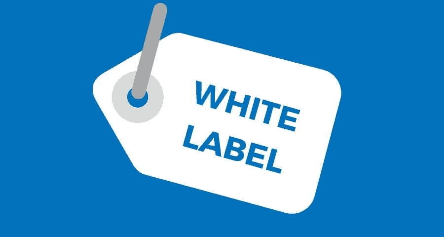
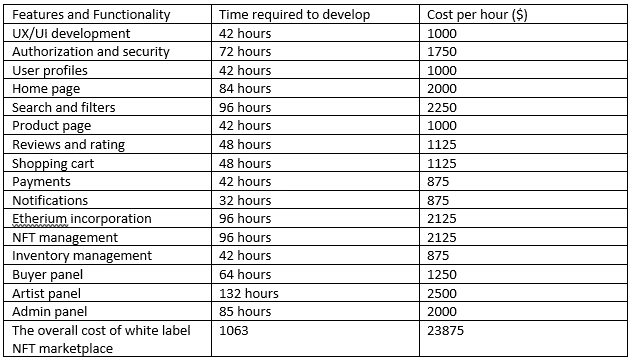
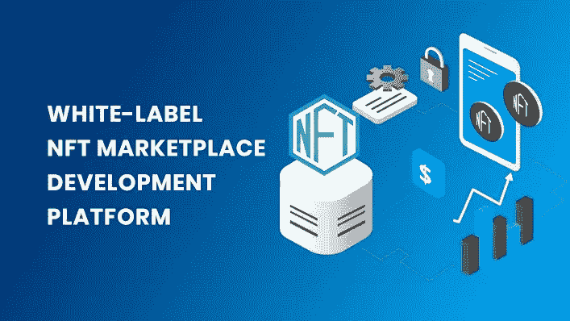

# 白标 NFT 市场开发成本(2022 年)

> 原文：<https://medium.com/nerd-for-tech/white-label-nft-marketplace-development-cost-in-2022-25b930b1fb7d?source=collection_archive---------5----------------------->

# 白标 NFT 市场开发

据预测，到 2029 年，NFT 的未来将达到 1638.3 亿美元的可观价值。这可能会诱使许多人进入这个市场，碰运气赚钱，并通过推出 NFT 平台将其转化为加密货币。然而，发展这种 NFT 市场的成本很高。然而，一个白色标签的 NFT 市场解决方案将是一个具有成本效益的方法来快速午餐 NFT 市场平台。白标 NFT 市场是一个出色的可定制的 NFT 市场，以 NFT 的形式列出和交易数字资产。本文提供了关于白色标签 [**NFT 市场开发**](https://radindev.com/opensea-clone-script/) 成本以及此类平台的优势和劣势的重要信息。

# 白标 NFT 市场开发总成本

根据一些估计，一个功能齐全的白色标签 NFT 市场的价格在 10000 到 90000 美元之间。更准确地说，白色标签 NFT 市场的价格很大程度上取决于客户希望在他/她的 NFT 市场中包含的功能。例如，选择像以太坊或具有高级功能的 BSC 这样的流行区块链需要花费大量时间来开发，从而导致开发成本增加。除了特性之外，安全特性和功能也增加了白牌 NFT 市场的成本。在这里，我们详细介绍了开发 NFT 最佳白色标签市场各部分的成本。

在我们分别分析白牌 NFT 市场开发成本的各个部分后，如果您能评估白牌 NFT 市场的核心特征以及采用白牌 NFT 市场的好处和坏处，那就太好了。

# 在选择影响成本的 NFT 白标解决方案时，您应该考虑以下特征:

在选择 NFT 白标解决方案之前，建议从以下特征开始项目:

-用户友好的酸痛前线:这鼓励你的平台访客研究和教育更多关于非功能性测试。他们还可以发现 NFT 的历史和每件物品的主人。

-每个 NFT 白标市场的一个重要特征是其列表功能，允许创作者和艺术家招募他们的 NFT 收藏进行投标或交易。

-一个伟大的平台应该允许它的访问者浏览平台上的 NFT 图书馆，并根据他们的兴趣选择它们。

-你的白标解决方案的用户界面(UX)应该足够友好，以吸引用户

*   最后但并非最不重要的是付款选项。您的解决方案必须包含几个可供用户使用的支付选项。

# 白色标签 NFT 市场的优势和劣势

每个平台都有其优缺点。

赞成的意见

- **准备好午餐**:由于从零开始开发 NFT 市场实际上需要很长时间和大量投资，开发像 [Opensea](http://opensea.io) 这样的白标平台将是一个更具成本效益的选择，它需要更少的时间，并且容易获得。

- **可定制**:虽然白色标签市场必须具备现有 NFT 平台的所有特性和功能，但你仍然可以根据自己的喜好定制你的 NFT 市场。你也可以将你的品牌应用到 NFT 市场。此外，白标市场提供商可以根据您的需求和要求提供定制的 NFT 市场。

- **低成本**:如前所述，从零开始开发一个 NFT 市场需要大量的金钱和时间。然而，NFT 白标的预制特性可以降低 NFT 白标市场的整体开发成本，您只需根据自己的需求支付定制费用。

- **钱包整合**:使用 NFT 白标解决方案，你可以得到一个内置的钱包，更有效，减少了很多尝试和金钱。你可以集成任何基于区块链技术的钱包。相反，要从零开始开发 NFT 市场，你必须为钱包开发和安全编写代码。

骗局

- **定制功能**:由于白牌解决方案的预制特性，开发新的定制功能以满足您的业务需求极具挑战性，并且需要时间。

- **品牌标识重叠**:根据白牌 NFT 解决方案的用户界面/UX 中允许的定制程度，您可能会遇到这样的问题，即您的 NFT 市场看起来与使用相同解决方案的其他 NFT 市场相似。

# 白色标签 NFT 市场的特点

每个白标 NFT 市场都有独特的特点，用于奇妙的交易和交换体验。这些功能包括:

- NFT 排名

NFT 白标市场平台可以基于数量、价格和最新的 NFT 洞察每小时对各种 NFT 进行排名。

-收藏

使用此功能，您可以将 NFT 列在选定的集合下，并以有效的费用一次性购买/出售多个 NFT。

-投标

一个透明和安全的平台使您能够参与公开拍卖，并通过白标 NFT 市场对可用的 NFT 进行投标。

-分类浏览

使用各种类别，您可以在平台上搜索特定的 NFT。

-过滤

过滤选项包括喜欢，最低或最高价格，最受欢迎，最近上市，你可以方便地找到你正在寻找的 NFT。

-收藏夹标记

在文件夹中的收藏夹下查看 NFT 有助于您在白色标签平台中标记您最喜欢的令牌。

-安全内容

平台的安全性是每个 NFT 白标平台的基本特征之一。一个完全安全的平台可以确保您的内容是保密的，除非它是通过白标市场成功购买的。

-轻松添加协作者

白标市场应该具备的功能之一是添加合作者，允许修改收藏设置、创建项目、接收付款等。

-无缝钱包集成

集成钱包到 NFT 白标允许无缝的资金存储，转发和接收。

# 突出显示突出的白色标签 NFT 市场更好拥有

功能齐全的白标 NFT 平台应预先集成以下特性和 NFT 功能:

# NFT 铸造过程使用白色标签 NFT 市场

像 Suffescom 一样，白标 NFT 市场开发的一个最重要的特点是，整个 NFT 铸造过程应该是无错误的和功能性的，因为 NFT 市场有助于 NFT 的日常交易。一些白标 NFT 造币平台提供懒惰造币和传统造币方法。第一个是指在购买点支付的 NFT 天然气费，而后一个是指在 NFT 创建点支付的天然气费。这些方法中的每一种都为不同的目标用户提供不同的目的。

# 加密支付

除了 NFT 铸币，一个白色标签 NFT 解决方案需要加密支付几乎所有的交易。这是每个 NFT 市场的基本特征；没有它你什么也做不了。加密支付使创作者和卖家能够使用加密货币进行安全、可靠和透明的交易。这些交易将永远留在区块链上，并且可以观察到它们的所有细节。

# 可定制的

如前所述，像 Tron 这样的白色标签 NFT 解决方案的本质允许您引入不同级别的定制，以便应用您的品牌。为了普及，NFT 白标解决方案应该支持这样的功能。每个白标解决方案的基本可定制性是能够更改 NFT 市场的页眉和页脚，为您的品牌添加一些内容。在一个更高级的水平上，你应该能够进一步定制你的主题定制，添加等 NFT 市场。

# 管理仪表板

选择具有整体管理仪表板的白标 NFT 市场的重要性在于，您可以确保您的白标解决方案是可扩展的，并且其管理不会对您造成问题。一个全面的管理仪表板使您能够在一个地方查看和控制进入您的白牌 NFT 平台的一切。此外，仪表板应包含您的 NFT dales 报告，最近的交易，用户活动等。