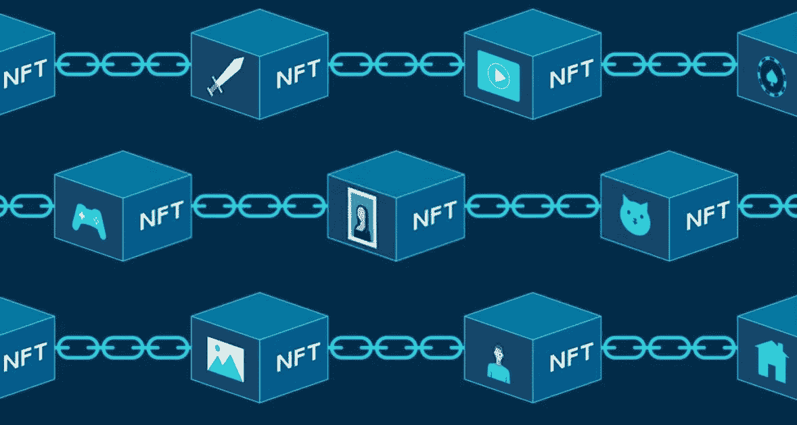
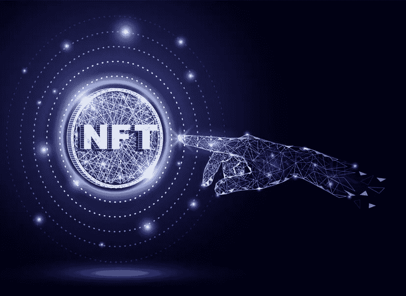

# 白标 NFT 市场开发解决方案—简易指南

> 原文：<https://medium.com/nerd-for-tech/whitelabel-nft-marketplace-development-solutions-easy-g-c7969473034e?source=collection_archive---------4----------------------->

在目前的趋势下，NFT 是一个时髦词，也是搜索引擎的关键词。虽然嗡嗡声对许多人来说可能听起来不合理，但有些人已经在这些虚拟令牌中找到了安慰和潜力，就像第一架飞机飞行时其他人所做的那样。这些代币为一些创造者创造了价值数百万美元的加密货币，这是 2021 年下半年大肆宣传的原因。一些积分进入了那些出售赚钱的数字代币的门户网站，也就是通常所说的 NFT 市场。不是创造者也不是投机者，但想参与 NFT 大浪潮的人可以冒险进入这样的门户网站。在(一定程度上)无风险的同时，安 [***NFT 市场***](https://www.blockchainappfactory.com/nft-marketplace-development?utm_source=NerdForTech+medium&utm_medium=GB-08042022&utm_campaign=Vishnu) 可以通过各种交易活动的手续费为你赚得盆满钵满。但是，正如我们所知，任何行业的增长都不是永久的，抓住时机非常重要。

在这种情况下，现成的解决方案可能会很方便，这正是白标 NFT 市场平台向其所有者提供的。在这篇博客中，我们将看到更多关于 Whitelabel NFT 市场的信息，以及为您的新企业寻求现成解决方案时需要注意的许多事项。

## 什么是 NFT 市场？

NFT 市场是一个销售 NFT 产品的平台。尽管对于购买终端用户来说，它们可能看起来像任何其他在线购物网站，但它们背后的技术完全不同。这些市场出售不同的 NFT 商品，如数字/实物艺术品、音乐、游戏内资产、视频、迷因、元宇宙的虚拟土地，甚至现实世界的产品。这些平台中的大多数通常接受加密货币作为支付方式。然而，一些平台接受固定支付，试图被更广泛的社区接受。主要的 NFT 市场平台包括 OpenSea、Rarible、SuperRare、Solsea、Sorare、分散地和 NBA Top Shot。其中一些市场出售通用的非功能性游戏，而其他市场则专注于某一类 NFT 项目，如艺术品或游戏内资产。此外，它们中的一些甚至在多个区块链网络上运行，以接触更多的用户。

## 描述 NFT 市场的工作流程

*   用户在 marketplace platform 上注册并创建他们的帐户，之后帐户应该连接到他们的加密钱包，或者加密货币应该填充到集成的加密钱包中。
*   一个创造者将铸造他们的 NFT 并且将他们分组为集合。他们还可以选择用于支付 NFT 商品的加密货币。
*   创造者也应该决定如何销售他们的 NFT 产品。它可以是定时拍卖，也可以是固定价格销售。在门户上列出项目之后，创建智能合同，该智能合同将在 NFT 从其上经历的每一次交易期间执行。
*   在市场管理员审核销售的 NFT 产品后，销售开始在平台上进行，并且潜在的买家可以开始出价。
*   如果卖方接受了投标或者投标截止日期已经到来，则通过将 NFT 产品转让给最高投标人来进行交易。市场平台获得销售额的一部分作为交易费来维护门户的软件。

## 白牌市场不会错过的显著特征

*   **商店橱窗—**NFT 市场的商店橱窗看起来与任何电子商务门户相似，产品列在不同的类别下。专门的页面提供了关于个别 NFT 项目的更多细节。
*   **搜索引擎—** 每个白牌 NFT 市场都应该有一个搜索引擎，让用户能够轻松找到他们想要购买的 NFT。搜索引擎还必须包括各种过滤选项，以使用户更容易浏览门户。
*   **注册/登录选项—** 应该为返回用户的帐户创建和登录提供单独的部分，这两个部分都应该出现在主页上。
*   **加密钱包** —处理 NFTs 的白标市场需要一个数字钱包来进行交易。一些门户网站允许集成可信的第三方加密钱包，如 Metamask 或比特币基地。其他门户网站已经集成了钱包，用户应该在钱包中加载加密货币以参与交易活动。
*   **通知—**NFT 市场的企业要想取得成功，就必须通过电子邮件和推送通知让用户了解所有最新的更新。
*   **评论和评级—** 一个以客户为中心的 NFT 市场平台让其用户对他们购买的 NFT 进行评级和评论，以了解卖家的受欢迎程度和 NFT 物品的价值。

## 构建白牌 NFT 市场平台的成本

要为 NFT 市场构建一个白标解决方案，需要注意的是，由于在第一步开始之前就已经有了蓝图，因此成本会比从头构建低很多。价格随着所有者希望其平台前端和后端具有的功能而增加，因为高级功能意味着更高的价格。最后，当考虑到从白标解决方案建立 NFT 市场所产生的成本时，它涉及到所有者的意图。

 [## 白标 NFT 市场开发|推出您自己的白标 NFT 加密收藏品…

### 白标 NFT 市场是加密市场的创收平台之一。我们提供一个无障碍的…

www.blockchainappfactory.com](https://www.blockchainappfactory.com/white-label-nft-marketplace?utm_source=NerdForTech+medium&utm_medium=GB-08042022&utm_campaign=Vishnu) 

## 得出结论

如果你想在当前 NFT 的繁荣中抓住一个黄金机会，在稀释之前，一个白牌 NFT 市场平台将是你业务的关键。这样一个平台以相对较低的成本在短时间内出现，使风险企业在推出后的短时间内开始盈利。此外，您可以通过可定制的模板获得新的 NFT 市场平台，作为一些流行的市场。

对于 [***从最先进的白标解决方案开发 NFT 市场***](https://www.blockchainappfactory.com/white-label-nft-marketplace?utm_source=NerdForTech+medium&utm_medium=GB-08042022&utm_campaign=Vishnu) 业务来说，有一些公司是 NFT 白标市场开发艺术的先驱。他们的解决方案可以在更短的时间内为您带来非凡的效果，而您的成本却大大低于从零开始开发的平台。由于所有的解决方案都经过了多次尝试和测试，安全问题永远不会对您的新业务构成威胁。所以，用白标营销解决方案为你的新 NFT 事业开个好头吧。