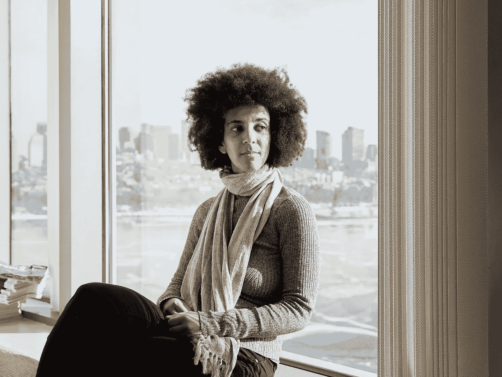

# 谁该为人工智能的缺点负责…

> 原文：<https://medium.com/nerd-for-tech/who-to-blame-for-the-cons-of-ai-1c1979f07214?source=collection_archive---------1----------------------->

在过去的几十年里，人工智能已经成为一个大事件。它在人类活动的几乎每一个方面的多方面利益是不可否认的和非凡的。如同这个世界上的一切事物一样，人工智能也有它的缺点。

是啊，如果我们不明智地使用它，人工智能是不好的。我说的不是那些肤浅迷信的关于机器人控制世界、智胜人类的阴谋论。这是一个长镜头和牵强。我甚至怀疑我们编写比我们更聪明的机器人代码的能力。

我说的是基于社会结构的影响。我说的是一个监视系统怀疑一个黑人在附近犯罪。我说的是一个帮助招聘软件工程师的项目，这个项目给了一个白人不公平的优势。

人工智能的这些和其他缺点伤害了每个国家的少数群体。像 Timnit Gebru 博士这样的许多人工智能研究人员认为，人工智能算法应该对每个人都公平。他们提出了一个标准的数据集数据表来训练算法的模型。

我对问题的看法和我提出的解决方案与上面的有很大不同。我认为人工智能的缺点不仅仅在于我们用来训练特定模型的数据集。我认为，对于这种问题，我们不应该只责怪数据科学家或机器学习工程师。

我说这些问题的根源在于现实世界。我认为系统性的种族主义与这些问题有很大关系。白人至上和不正当的政治与此有关。这让我想起了艾斯·库伯的歌曲《枪支与毒品》。让我举例说明这首歌的几节:

*他们给我们枪支和毒品
然后奇怪为什么在 f*ck 我们暴徒*

责怪政客而不是专业人士才公平。虽然数据科学家和 ML 工程师应该谨慎，对他们遵循的方法和他们用来训练模型的数据集负责，并对他们的所作所为负责。

我想说的是，让世界变得更美好、更公平是每个人的责任。让我们团结起来，反对种族主义。让我们善待彼此，停止根据肤色、种族、性别或任何其他定性指标来评价他人。注意安全！

*(灵感来自 Timnit Gebru 博士的作品)*