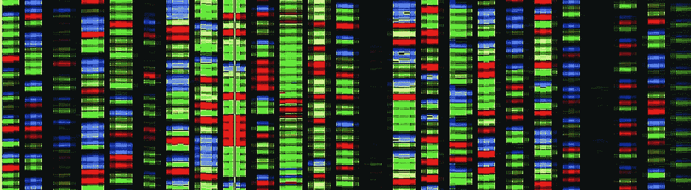

# 全基因组测序(WGS)和慢性炎症疾病:一个潜在的机会领域？

> 原文：<https://medium.com/nerd-for-tech/whole-genome-sequencing-wgs-and-chronic-inflammatory-diseases-a-potential-area-of-opportunity-4804a3a4ab00?source=collection_archive---------17----------------------->

DNA 序列，每种颜色代表四个碱基对中的一个:A、T、C、G(来源: [Gerald Barber](https://www.nist.gov/news-events/news/2015/05/measuring-stick-standard-gene-sequencing-now-available-nist) ，弗吉尼亚理工大学国家标准与技术研究所(NIST)网页)

## 全基因组测序、基因编辑以及人工智能和机器学习技术的融合导致了我们对基因和疾病的理解的爆炸。然而，我们目前是否忽略了一整类疾病？

近年来，基于“多组学”的新方法为我们自身生物学的复杂性带来了新的曙光。基因组学、转录组学和蛋白质组学等方法提供了大量我们以前无法获得的数据，揭示了我们对基因组和构成每个个体的构件的见解。至关重要的是，人工智能和机器学习算法的同时发展，以及处理和分析这些大量数据的能力，使我们能够进一步拓展这些边界。由于这些技术平台的同步发展，遗传学领域被推到了我们意识的最前沿。这一点在 2020 年诺贝尔化学奖授予 Jennifer Doudna 博士和 Emmanuelle Charpentier 博士时得到了最好的概括，因为他们“发现了一种基因编辑方法”，仅在他们关于 CRISPR-cas 9[T3 的开创性论文发表 8 年后。](https://science.sciencemag.org/content/337/6096/816)

各种技术在这个时间点的融合导致了基因组学、个性化医学和生物技术领域的爆炸。现代下一代测序(NGS)平台，如 Illumina 的 NovaSeq 6000 和 Pacific Biosciences 的 Sequel IIe，现在可以在几个小时或几天内生成全基因组序列。相比之下，人类基因组计划历时 13 年。)的数据，但只提供了今天可获得的数据的一小部分。处理、可视化和分析这些数据的能力只有在分析处理能力提高的情况下才有可能实现；AI，以及机器学习工具和算法。与此同时，CRISPR 作为基因编辑工具的发现引发了一场新的努力，以确定我们的基因和各种疾病之间的联系，以便利用其治疗潜力。这些融合的技术平台之间的协同作用最终将基因组学领域推向了新的高度。基因组学及其相关应用的全球市场随着更大的投资和需求而迅速增长。例如，软银集团最近宣布分别投资 9 亿美元和 12 亿美元给加州太平洋生物科学公司  和 Invitae 公司  ，而 Invitae 公司在 2020 年 [⁴](https://ir.invitae.com/news-and-events/press-releases/press-release-details/2021/Invitae-Reports-279.6-Million-in-Annual-Revenue-Driven-by-659000-in-Billable-Volume-in-2020/default.aspx) 的年可计费量同比增长了 41%，代表了自 2015⁵.以来 103%的惊人复合年增长率(CAGR)

特别是，基因测序和编辑已经放大到具有既定遗传原因的疾病，如癌症和镰状细胞病。然而，一般而言，慢性炎症和慢性炎性疾病似乎在很大程度上被基因测序及其相关应用所忽视。乍一看，这似乎是一个合乎逻辑的选择。慢性炎症性疾病如类风湿性关节炎(RA)、慢性阻塞性肺病(COPD)、脂肪性肝炎和炎症性肠病(IBD)被认为具有多因素发展模式——它们需要多种致病因素。虽然全基因组关联研究(GWAS)揭示了与慢性炎症及其相关疾病相关的基因，但从未证实遗传因素是其发展背后的主要驱动因素。对于慢性炎症性疾病，遗传通常被认为是一种风险，而不是一个原因。

尽管如此，慢性炎症性疾病目前对社会造成了严重的负担，因为它们缺乏确定的治疗方法。在西方社会，慢性炎症性疾病的患病率估计约为 5–7%[⁶](https://www.pfizer.com/news/featured_stories/featured_stories_detail/chronic_inflammation_and_inflammatory_disease)。在美国，患有这种疾病的患者每年在相关支出上估计要多花 38，000 美元 [⁶](https://www.pfizer.com/news/featured_stories/featured_stories_detail/chronic_inflammation_and_inflammatory_disease) 。在欧洲，患有炎症性肠病的患者每年的直接医疗费用估计在 46-56 亿欧元之间 [⁶](https://www.pfizer.com/news/featured_stories/featured_stories_detail/chronic_inflammation_and_inflammatory_disease) 。与此同时，慢性阻塞性肺病已经上升为全球第三大致死原因 [⁷](https://www.who.int/news-room/fact-sheets/detail/the-top-10-causes-of-death) 。这些疾病的慢性性质也导致长期生活质量显著下降，不成比例地导致其他疾病，如癌症和抑郁症。这些疾病在发病机理和病因学方面的复杂性阻碍了开发可行治疗方法的努力。由于慢性炎性疾病的原因仍然未知，目前的治疗方法仅针对其症状。然而，如果慢性炎症发展背后的遗传因素比我们想象的要大得多呢？在这种情况下，我会想到两件事。首先，现代 NGS 方法可以更好地识别这些遗传“标记”，如果它们存在的话。第二，这种标记的出现将立即为筛选技术开辟新的市场机会，重点是开发强有力地检测和识别这些遗传变异的测试。

事实上，最近的一项发现质疑了基因本身不足以成为慢性炎症疾病驱动因素的观点。美国国家科学院院刊(PNAS)上的一篇原始研究文章描述了一种突变蛋白如何足以导致小鼠肝脏大囊泡脂质沉积症，即肝脏内的脂肪堆积 [⁸](https://www.pnas.org/content/118/14/e2018069118) 。当突变蛋白被移除后，积累的脂肪在一段时间后消失。在非酒精性脂肪性肝病(NAFLD)的常规研究中，这种疾病通常是通过在几个月内提供高热量饮食而诱发的。这种方法与传统的“多次击中”模型相联系，因为高热量饮食引发了一个复杂的信号网络，最终导致疾病。然而，这篇文章中的研究描述了一种情况，在没有额外诱因的情况下，单个突变蛋白足以导致小鼠 NAFLD 的开始。虽然重要的是要记住，这些发现只在实验室老鼠身上得到了证实，但潜在的逻辑确实值得进一步考虑。在人类中会有类似的东西吗，就像癌症中的癌基因一样，突变蛋白能够驱动慢性炎症状态的发展和进展？

虽然这些发现还处于早期阶段，但它们强调了遗传可能是慢性炎症疾病的关键原因(而不仅仅是风险因素)。使用的突变蛋白质只是突变体库中的一种变体，由于 1-2 个点突变 [⁹](https://www.jbc.org/article/S0021-9258(20)69925-2/fulltext) ，每种突变体都具有不同水平的增强活性。至关重要的是，这些突变体活性的增加源于一种自然现象，并且也经过了测试，以确保它们保留了正常的特性。有没有可能在人类中存在类似的突变和多态性，也许在其他具有类似引发慢性炎症疾病能力的蛋白质中也存在？目前，尚不清楚这种突变是否存在。如前所述，遗传从来没有被视为这类疾病发展背后的关键致病因素，而只是一种风险。患有 NAFLD 等疾病的个体的基因组测序和测试并不常见，导致缺乏关于可能的遗传驱动因素的数据。如果这项研究中展示的概念适用于人类，这表明基因测序可能会揭示慢性炎症疾病背后的遗传原因，甚至有可能在未来用基于基因编辑的疗法在源头进行治疗。

由于各种技术平台的融合，基因测序及其在个性化医疗中的应用近年来呈指数增长。如果遗传学被发现也是慢性炎症疾病的主要原因，它应该进入这个快速扩张的领域，导致新的市场机会变得可用。对这些疾病背后的遗传原因的潜在识别可能会导致范式的转变——不同于目前的症状导向方法，它针对遗传“根本原因”。随着越来越多的资源投入到上述技术的 R&D，我们很可能会看到更多的采用，这是由与莱特定律相关的成本下降所驱动的。如果基因组分析显示我们的基因和慢性炎症疾病之间有更强的联系，这只会加强在该领域进一步投资的理由。希望这种对有效疗法的探索将继续推动该领域的研究和创新，以改善这些疾病患者的生活。

> "我们知道的越多，我们就越意识到有更多的东西需要了解."
> 
> 詹妮弗·杜德纳(Jennifer Doudna)博士，2020 年诺贝尔化学奖共同获得者，“因为开发了一种基因编辑方法”。

**TL；DR:** 在非酒精性脂肪性肝病等慢性炎症性疾病的研究中，基因测序方法并不常见，因为人们一直认为其病因在本质上是多因素的。然而，一项新的发现提出了一种可能性，即遗传可能是这种情况的主要致病因素，而不仅仅是风险。如果这是真的，它为基因组测试、诊断和治疗开辟了许多新的市场机会，由于 NGS 以及人工智能和机器学习平台的同时发展，这些领域已经出现了指数级增长。

*免责声明:作者是本文引用的题为“活性 p38α导致小鼠大泡性脂肪肝”的论文的作者之一。*

**参考文献**

1.  Jinek *等，*适应性细菌免疫中的一种可编程双 RNA 引导的 DNA 内切酶， *Science* ，2012。[https://science.sciencemag.org/content/337/6096/816](https://science.sciencemag.org/content/337/6096/816)
2.  软银将向太平洋生物科学公司投资 9 亿美元，*华尔街日报，* 2021。[https://www . wsj . com/articles/Softbank-to-make-9 亿投资太平洋生物科学-11612921031](https://www.wsj.com/articles/softbank-to-make-900-million-investment-in-pacific-biosciences-11612921031)
3.  软银将带领 12 亿美元投资基因检测公司 Invitae，*华尔街日报，* 2021。[https://www . wsj . com/articles/Softbank-to-lead-120 亿投资于基因检测公司-invitae-11617597250](https://www.wsj.com/articles/softbank-to-lead-1-2-billion-investment-in-genetic-testing-company-invitae-11617597250)
4.  新闻稿:Invitae 报告年收入为 2.796 亿美元，2020 年可计费量为 659，000 美元， *Invitae Corp.* ，2021 年。[https://IR . Invitae . com/news-and-events/press-releases/press-release-details/2021/Invitae-Reports-279，600，000-in-659，000-in-billing-Volume-in-2020/default . aspx](https://ir.invitae.com/news-and-events/press-releases/press-release-details/2021/Invitae-Reports-279.6-Million-in-Annual-Revenue-Driven-by-659000-in-Billable-Volume-in-2020/default.aspx)
5.  CAGR 使用 Invitae 报告的 2015 年交付的 19，000 项测试和 2020 年交付的 659，000 项测试的计费量进行计算。
6.  慢性炎症和炎性疾病，*辉瑞公司*[https://www . Pfizer . com/news/featured _ stories/featured _ stories _ detail/chronic _ infinition _ and _ infinitive _ disease](https://www.pfizer.com/news/featured_stories/featured_stories_detail/chronic_inflammation_and_inflammatory_disease)
7.  十大死亡原因，*世界卫生组织，* 2020。[https://www . who . int/news-room/fact-sheets/detail/the-top-10-causes of death](https://www.who.int/news-room/fact-sheets/detail/the-top-10-causes-of-death)
8.  Darlyuk-Saadon 等，活性 p38α导致小鼠大泡性脂肪肝，*美国国家科学院院刊，* 2021。[https://www.pnas.org/content/118/14/e2018069118](https://www.pnas.org/content/118/14/e2018069118)
9.  Diskin 等，人类 p38α丝裂原活化蛋白激酶的活性突变体，*生物化学杂志，* 2004。[https://www . jbc . org/article/s 0021-9258(20)69925-2/full text](https://www.jbc.org/article/S0021-9258(20)69925-2/fulltext)