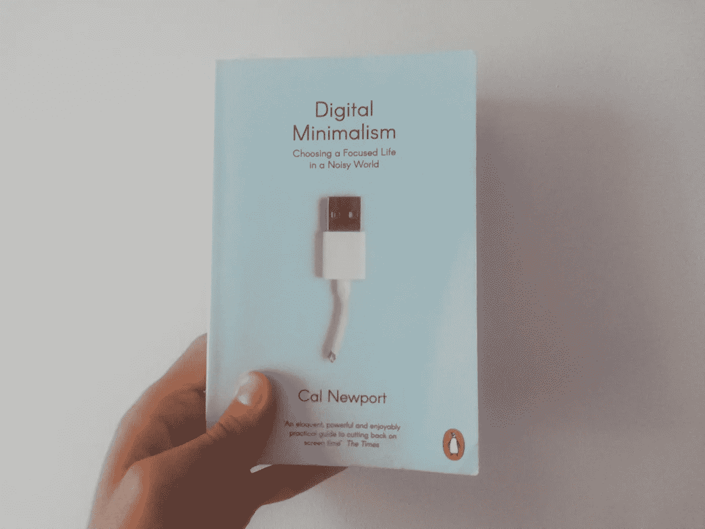

# 为什么我在生活中应用数字极简主义。

> 原文：<https://medium.com/nerd-for-tech/why-am-i-applying-digital-minimalism-in-my-life-a864fc486b9f?source=collection_archive---------1----------------------->

为什么我在生活中应用数字极简主义。

作为一名开发人员和一个总是渴望了解科技行业新趋势的人，不知道如何阻止事情真的让我付出了代价。我在去迪拜的旅途中偶然发现了这本书，它引起了我的注意。这是我学到的。

# 注意力

整个所谓的“革命”你可以说是在脸书被宣布的时候开始的…