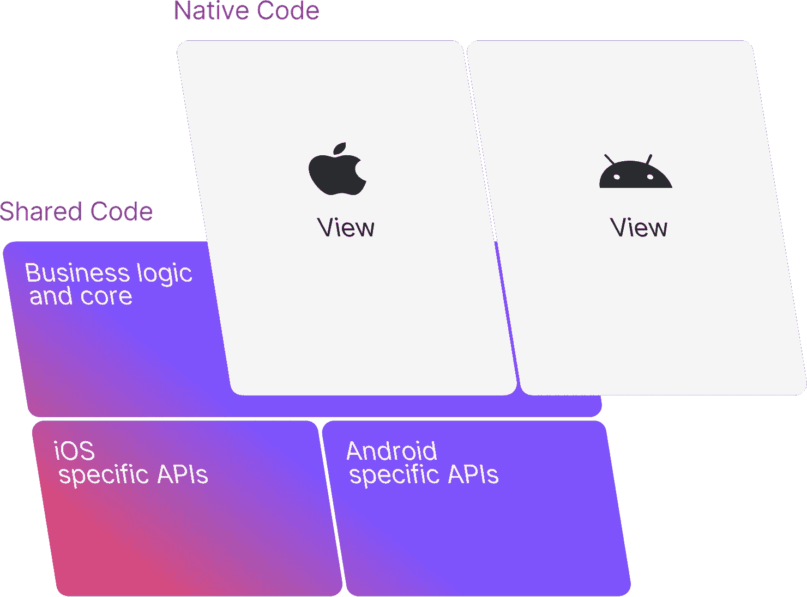
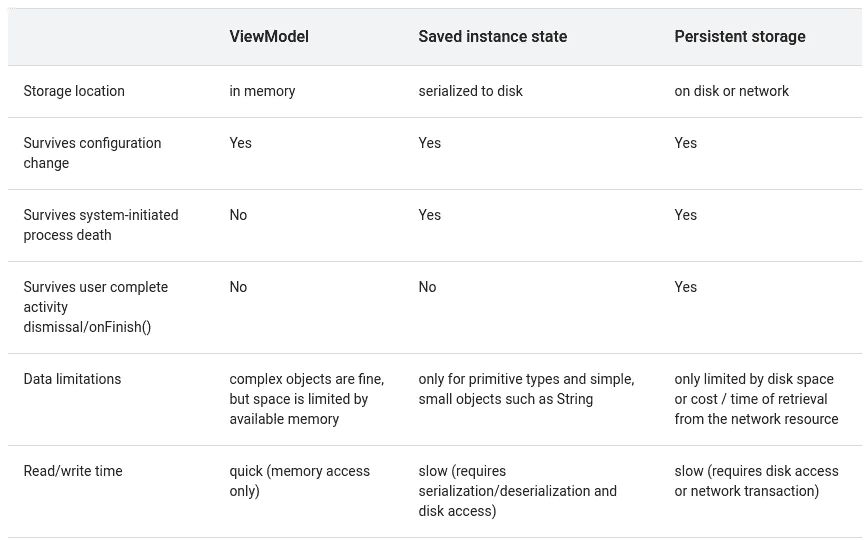

# 为什么 Android 视图模型在 KMM 过时了

> 原文：<https://medium.com/nerd-for-tech/why-android-viewmodels-are-obsolete-in-kmm-ecbd0124fad1?source=collection_archive---------0----------------------->



# 问题是

Android 上的一个挑战是，当发生屏幕旋转等配置更改时，需要保存和恢复 UI 状态。Android `[ViewModels](https://developer.android.com/reference/androidx/lifecycle/ViewModel)`的引入是为了让这个过程尽可能的无痛。

> `[*ViewModel*](https://developer.android.com/reference/androidx/lifecycle/ViewModel)`类旨在以生命周期意识的方式存储和管理 UI 相关的数据。`[*ViewModel*](https://developer.android.com/reference/androidx/lifecycle/ViewModel)`类允许数据在屏幕旋转等配置变化后仍然存在。([https://developer . Android . com/topic/libraries/architecture/viewmodel](https://developer.android.com/topic/libraries/architecture/viewmodel))

在设计和实现 Kotlin 多平台的 UI 框架时，我发现现有的框架使用两种方法之一来解决(Android 特有的)UI 状态保持问题:

1.  在 Android 上使用一个`ViewModel`，它从 UI 代理到实现业务逻辑的组件(姑且称之为 bloc = business logic component)。`ViewModel`存在的唯一原因是意识到生命周期并在配置变更时保持状态。
    Touchlab 在他们的 [KaMPKit](https://github.com/touchlab/KaMPKit) 中利用了这一点，创建了一个共享的`ViewModel`平台特定实现，这样所有的业务逻辑都可以放入共享的`ViewModel`中。
2.  在 bloc = business logic 组件中添加保留状态/保留实例的功能。[分解](https://arkivanov.github.io/Decompose/)，例如正在使用[essentity 的](https://github.com/arkivanov/Essenty) StateKeeper 和 InstanceKeeper。这使得 bloc 独立于 Android `ViewModel`(至少在表面上)但是现在它需要显式地保存和恢复状态。在我看来，这是一个不太理想的解决方案，尤其是因为这是一个只存在于单个平台上的问题的解决方案。

# “更好”的解决方案

还有第三条路。

简单回顾一下，我们需要一个块/业务逻辑组件，它是生命周期感知的，并在配置更改时保留。这是我的解决方案在`Activity`或`Fragment`中的样子:

```
val bloc by getOrCreate { bloc(it) } // `it` is an Essenty lifecycle
```

我们使用的是[essentity](https://github.com/arkivanov/Essenty)生命周期，它是 [Android 生命周期](https://developer.android.com/reference/androidx/lifecycle/Lifecycle)的平台独立版本。它作为参数传递给 bloc，业务逻辑可以使用它来启动、停止和在销毁时清理资源(调用 onDestroy())。

让我们看看引擎盖下是什么:

`getOrCreate`是`ViewModelStoreOwner`的一个扩展函数，使用构建器函数`(lifecycle: Lifecycle) -> Component`惰性地创建一个组件。活动和片段都是`ViewModelStoreOwner`，所以我们可以从其中任何一个调用它。

`ComponentLazy`有点难以理解:

(注意:在`androidx.lifecycle` 2.5 中，create 函数的签名稍微改变为:
`override fun <T : ViewModel> create(modelClass: Class<T>): T`
- > T 不再可空)

使用`ViewModelStoreOwner`我们创建一个`[ViewModelProvider](https://developer.android.com/reference/androidx/lifecycle/ViewModelProvider)`，它将创建`ViewModels`并将它们保留在给定`ViewModelStoreOwner`的商店中。`get`函数返回一个现有的`ViewModel`或在作用域(片段或活动)中创建新的`ViewModel`，与此`ViewModelProvider`相关联。创建的`ViewModel`与给定的作用域相关联，并且只要该作用域是活动的，就会被保留(例如，如果它是一个活动，直到它完成或进程被终止):

*   创建的视图模型是一个`BlocViewModel`，它包含一个要素`Lifecycle`和一个要素`InstanceKeeper`:

*   现在我们使用这个`InstanceKeeper`来检索或创建`Component`。与实现`InstanceKeeper.Instance`相比，`Component`被包装成一个类，因为只有那些可以存储在`InstanceKeeper:`中

概括地说:

*   `Component`存储在`InstanceKeeper`中
*   `InstanceKeeper`存储在一个机器人`ViewModel`的`BlocViewModel`中
*   `BlocViewModel`持有一个与其自身生命周期相关联的`Lifecycle`。这个生命周期被`Component`用来管理其内部资源(协程、流程、通道等)。)
*   只要`BlocViewModel`的所有者还活着，它就会存储在`ViewModelStore`中，这意味着它将在配置更改时被保留

# 摘要

我们可以创建一个共享的/独立于平台的业务逻辑组件，并通过一行代码在 Android 上实现 it 生命周期感知:

```
val bloc by getOrCreate { bloc(it) }
```

使这成为可能的代码可以驻留在一个共享模块中(`androidMain)`)。最近发布的用于 Kotlin 多平台的 UI 框架`[Kotlin Bloc](https://1gravity.github.io/Kotlin-Bloc)`实现了这种机制。

感谢您的阅读和反馈。

## 附录

请注意，虽然在底层使用 ViewModel 可以确保跨配置更改保留阻塞，但它不会在进程死亡后继续存在。

为了避免系统启动的进程死亡，您仍然必须使用一个`[SavedStateHandle](https://developer.android.com/reference/androidx/lifecycle/SavedStateHandle)`:



[https://developer . Android . com/topic/libraries/architecture/saving-States](https://developer.android.com/topic/libraries/architecture/saving-states)

你的 UI 是否需要那种“留存”取决于你的应用。根据用户采取的操作，他们要么希望清除活动状态，要么希望保留状态。