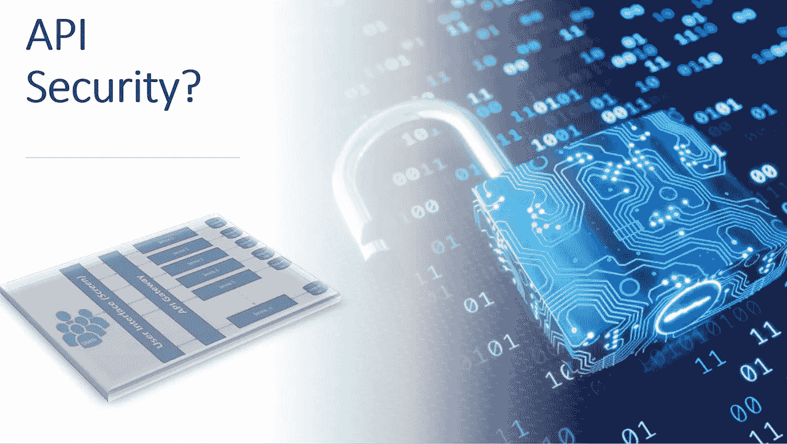

# 为什么 API 安全性至关重要？

> 原文：<https://medium.com/nerd-for-tech/why-api-security-is-crucial-dce65de7edc8?source=collection_archive---------17----------------------->

API 是任何数字化转型的基础，如今几乎每个组织都在朝着云之旅和微服务架构努力。出于实用目的(PHI、SPI、法律等。)，在云中一次性移动数据可能很难，但在云环境中逐步推进数据是最常见的方法。因此，为了在组织努力采用云的同时释放云功能，它自动提高了 API 安全性的重要性，因为大多数 API 需要暴露在公共云上。此外，即使是在与直接客户打交道时，也总是有在公共领域公开 API 的强烈需求。

黑客喜欢 API，因为它们提供了多种访问数据的方式，可以在无意中一起使用。仅在 2018 年，API 安全性不足是至少[六起](https://securityboulevard.com/2018/12/2018-sees-api-breaches-surge-with-no-relief-in-sight/)高调数据泄露的原因。到 2022 年，Gartner 估计 API 将成为涉及[企业应用数据](https://www.gartner.com/en/documents/3834704)的攻击中使用最频繁的载体。

当您处理公共云和向公众公开 API 资源时，会涉及各种安全风险。为了使组织免受任何攻击，每个人都了解它的副作用以及必须采取的所有预防措施是非常重要的。如今，由于组织被构建或转变为独立产品或敏捷团队的方式，独立团队或流程(如 DevSecOps)承担了大量责任，而在过去，安全是网络或安全团队的责任，但现在是“共同责任”。

让我们来看看各种安全风险，以及可以做些什么来减轻或保护 API:

**API 参数—** 攻击者最常用的方法之一是篡改 API 参数中的数据(查询和路径参数)。如果这些参数很简单，很容易被猜到，那么它还可以用来对 API 资源进行逆向工程和检索数据。

为了保护 API 免受此类攻击，尽量不要使用像计数这样的可预测输入，而是通过利用 [OSS 库](https://github.com/ramsey/uuid)来使用一些随机 UUIDs。在代码级别，开发人员需要利用 ESAPI 来净化输入。此外，执行侧重于安全性的测试用例，如模糊测试、命令注入。即使对于 ui，隐藏字段也需要正确地评估。

**DDoS 攻击—** DDoS 代表分布式拒绝服务攻击，它通常是由恶意行为者通过使用僵尸程序泛洪流量来试图中断目标服务器、网络、API 的常规流量时执行的。通常，互联网资源具有处理终端客户端发起的大量请求的特定能力，每当任何系统受到 DDoS 攻击的影响时，它就会使整个系统停机或变慢，最终影响服务正常预期流量的能力。通常，黑客使用“僵尸”网络进行 DDoS 攻击，这种攻击是通过 Bonet(机器人和网络的结合)完成的。DDoS 攻击也可以是容量攻击、应用层攻击(HTTP、HTTPS、DNS 或 SMTP)和协议攻击(SYN flood、格式错误的数据包)。

DDoS 攻击通常由安全的网络基础设施保护，如防火墙、VPN、内容过滤、负载平衡器、强密码安全措施。还建议利用云，因为它比私有网络有更多的带宽可以扩展，这将提高容错能力。看看 [Nextflix DDoS 如何保护自己的系统](https://www.wired.com/story/netflix-ddos-attack/)是很有趣的。

**会话 Cookie —** 会话 Cookie 是存储在用户机器上的一段数据，以会话标识符(SESSIONID)的形式记录状态，该标识符对用户始终是只读的，包括用户 ID、密码、时间戳等。引起的主要攻击是“Cookie 中毒”，在这种技术中，攻击者获得关于另一个用户的未授权信息来窃取身份。Cookie 中毒也是参数篡改的一种类型，其中参数存储在 cookie 中。它还会导致 SQL 注入、跨站点脚本、会话嗅探等攻击。

防止会话 cookie 被窃听的一些方法是使用 HTTP，使用安全 cookie 标志，保持会话 id 长且随机，在每次登录尝试后重新生成 cookie，不接受来自 GET /POST 的会话 id，在客户端和服务器端使用反恶意软件，当会话注销时删除 cookie。

**API 身份跟踪** —在物联网和 API 分层策略等复杂的 API 生态系统中，系统被设计为使用 API 通道进行通信，在许多情况下，API 使用客户端证书对自身进行认证。现在，如果黑客获得了对任何中间 API 端点的控制，那么就很容易编排序列来窃取数据。

为了保护 API 免受身份跟踪，我们可以利用渗透测试、TLS 加密等常见技术，在所有层部署强大的 AuthZ 和 AuthN 系统，进行自动安全扫描和监控。

**MitM 攻击** —中间人(MitM)攻击允许黑客通过秘密窃听或改变中间流量来拦截两个 API 之间的通信。自 20 世纪 80 年代早期的[以来，计算机科学家一直在寻找防止威胁分子篡改或窃听通信的方法。MitM 攻击包括 SSL 剥离、镜像 Wi-Fi 接入点，恶意行为者可以在这些接入点监控、收集或修改用户信息。](https://dl.acm.org/citation.cfm?id=358797)

与其他攻击一样，用户需要遵循最佳实践，如在处理机密项目时不要使用公共网络、利用 VPN、使用 TLS 或 HTTPS 协议、利用双因素身份验证、安装入侵检测系统等。

总之，就 API 安全性而言，有一句话很适合这里“预防胜于治疗”。此外，我必须说(我不想说),随着组织向公众开放 API，API 安全性在未来可能会更差。因此，保证组织安全的唯一方法是遵循 API 安全的最佳实践，如利用 OAuth、使用令牌、加密数据、使用节流、利用 API 网关、服务网格、验证参数等模式，最后“采用零信任原则”