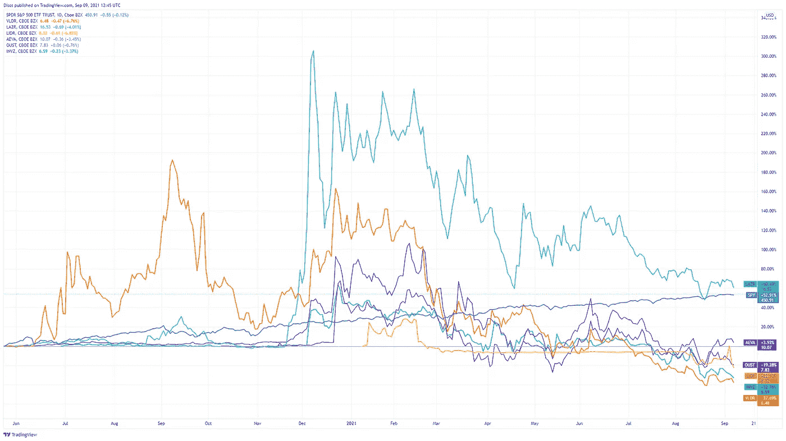
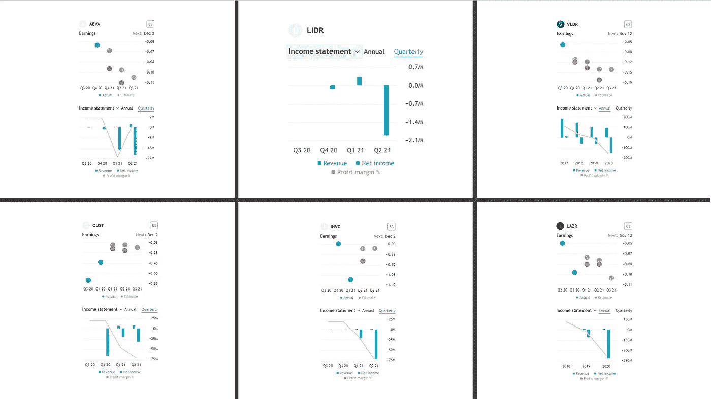
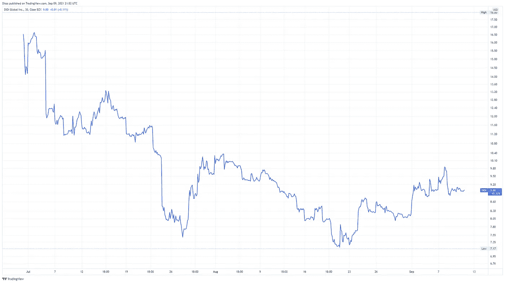
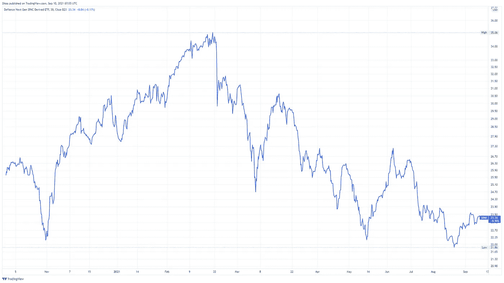

# 为什么激光雷达股票会下跌？

> 原文：<https://medium.com/nerd-for-tech/why-are-lidar-stocks-going-down-9929af918e22?source=collection_archive---------0----------------------->

最近我经常被问到为什么激光雷达公司的股票会下跌。虽然已经发表了几篇关于这个问题的文章，但我将尝试提出我的观点，并涵盖最近这种趋势的一些可能原因。

**免责声明:**我既不是金融分析师，也不是任何形式的金融顾问、律师或会计师。这篇文章只详细描述了我的猜测，所以不要把它们解释为购买/持有/出售任何提到的股票的任何建议或忠告。

自 2020 年 6 月以来，已有 6 家不同的激光雷达公司上市。他们都通过一个[特殊目的收购公司](https://www.investopedia.com/terms/s/spac.asp#:~:text=A%20special%20purpose%20acquisition%20company%20(SPAC)%20is%20a%20company%20with,have%20been%20around%20for%20decades.)的合并:

*   威力登激光雷达公司
*   卢米纳尔技术公司(LAZR)
*   创新技术有限公司
*   Aeye 公司(LIDR)
*   Aeva 技术公司(AEVA)
*   驱逐公司

另一家激光雷达制造商是 [Cepton，它也在与增长资本特殊目的收购公司](https://news.spacconference.com/2021/08/05/cepton-and-growth-capital-to-combine-in-1-5b-deal/)进行合并谈判。

自 2020 年 6 月以来，S&P500 上涨了近 53%。然而，与最初的名义价格 10 美元相比，6 家激光雷达公司中有 4 家的股票下跌了 19%至 38%。虽然有一家公司 AEVA 相对保持在 10.07 美元的水平，但只有 LAZR 目前的交易价格比名义上的 10 美元高出 16.53 美元。然而，LAZR 的价格相对于其 41.8 美元的峰值价格下跌了 60%以上。因此，所有公司的总体趋势是相似的。

激光雷达公司股票与 S&P500 相比的趋势。资料来源:TradingView.com

那么是什么原因导致这个小新行业的股票全部沉沦呢？我认为这是几个根本原因的混合，我将在下面详述。

# 缺乏技术共识

这六家公司都提出了截然不同的技术概念和方法，来解决为汽车市场提供鲁棒、高性能、小型和廉价的激光雷达传感器的类似问题。这些公司对该系统的任何主要模块都不同意:激光源、探测器和扫描技术。

虽然行业专家仍在争论开发这种传感器的最合适方式，但大多数投资者和公众对各种各样的技术细节感到迷惑不解。我在以前的文章中提到的另外两个问题也增加了普遍的困惑:[缺乏标准化](https://dimasosnovsky.medium.com/the-need-for-standardization-in-automotive-lidars-787dc3997745?source=friends_link&sk=66e2f473e5a8261880b8d5df05e16944)和[各种公司经常使用的营销伎俩](https://dimasosnovsky.medium.com/how-magically-increase-lidars-range-c990cd948873?source=friends_link&sk=845406065b31c4471e3bfcbb69237cab)。

结果是投资者无法决定如何挑选和押注获胜的马。

# 缺乏重要的新设计成功案例

一些交易的激光雷达公司在过去展示了设计成果(如宝马的 Innoviz 或沃尔沃的 Luminar)。尽管如此，这些上市前设计胜利的影响已经融入了公司的市场价值。与此同时，没有一家公司在 IPO 后展示了任何新的主要设计，特别是与戴姆勒、大众/奥迪、福特、丰田或 Stellantis(PSA 集团与 FCA 的合并)等大型原始设备制造商的合作。此外，尽管中国原始设备制造商赢得了一些设计，比如 Luminar 与 SAIC 的合作，但西方投资者通常不太熟悉这些原始设备制造商。

另一方面，9 月 9 日，Cepton [宣布](https://www.forbes.com/sites/samabuelsamid/2021/09/09/general-motors-selects-cepton-to-supply-lidar-for-2023-production/?sh=60275cd8701e)与通用汽车的重大设计胜利。因此，通用汽车公司计划开始在多达九种不同的型号中安装基于 Cepton 的激光雷达传感器。这种设计上的胜利有利于 Cepton 上市，削弱了其他公司的地位。

由于以下原因，缺乏新设计对现有激光雷达库存有双重负面影响:

1.  这些公司无法为未来几年带来可观且稳定的收入流。当然，汽车行业不是激光雷达公司唯一相关的市场，但它仍然是所有公司最重要的市场。
2.  正如我在上一章所介绍的，投资者无法自己正确评估和选择获胜的技术。因此，他们希望有一个主要的原始设备制造商为他们做这项工作。

# 令人失望的财务结果

根据上一章，上市公司无法提供有保障的未来收入流。此外，他们目前的收入经常低于预期(见下图:红圈是实际收入，灰圈是估计收入)。与此同时，他们的支出逐年增加，或逐季增加，利润率下降。

激光雷达公司的收益和收入。资料来源:TradingView.com

无疑，这样的数字无法让任何一个投资者心中充满喜悦。

# 冬天来了

每两个头条新闻都声称存在泡沫，熊市即将来临。然而，与此同时，像 T2、雷伊·达里奥、布里奇沃特和 T4 这样的大投资者都在采取守势。此外，[席勒 PE 比率](https://www.multpl.com/shiller-pe) (CAPE 比率)[自助餐指标](https://www.google.com/url?sa=t&rct=j&q=&esrc=s&source=web&cd=&cad=rja&uact=8&ved=2ahUKEwjKlI2k8_LyAhWR2qQKHeNTBAAQFnoECAIQAQ&url=https%3A%2F%2Fwww.currentmarketvaluation.com%2Fmodels%2Fbuffett-indicator.php&usg=AOvVaw3hV5de5LwVV-TpvuXtz-0h)，以及 [FINRA 的保证金统计](https://www.finra.org/investors/learn-to-invest/advanced-investing/margin-statistics)都可能预示着市场存在泡沫。

然而，在 2010 年至 2020 年的十年间，这种悲观的预言也很常见。然而,[牛市](https://www.investopedia.com/insights/digging-deeper-bull-and-bear-markets/#:~:text=Bear%20Market-,A%20bull%20market%20is%20a%20market%20that%20is%20on%20the,the%20economy%20are%20generally%20favorable.&text=In%20the%20case%20of%20equity,continue%20over%20the%20long%20term.)继续一次又一次地打破记录，导致了股票市场有史以来最好的十年之一。此外，诺贝尔经济学奖得主罗伯特席勒(Robert Shiller)提出了 T2(CAPE ratio)，他承认，尽管今天的 CAPE ratio 很高，但今天的股市估值并不过分。具体而言，极低的利率证明了今天的股价是合理的。巴菲特的指标也是如此。与此同时，FINRA 的指标在最近六年里一直保持在当前的高位附近，而市场行为是惊人的。最后，就连雷伊·达里奥也承认，他最大的失败发生在 1982 年，当时他把一切都押在了从未到来的大萧条上。

关键是我们不能可靠地预测市场的未来行为。然而，许多悲观的标题影响了投资者。因此，他们更愿意退出对小盘股公司的高风险投资，回到更稳健的 T2 蓝筹股公司。由于激光雷达公司相对较新，没有可观的收入，主要销售未来几年的承诺，它们属于第一类。此外，投资者难以理解这些公司背后的技术加剧了他们的担忧。要解决最后一个问题，我认为关键是要在行业内创造一种普通大众都能理解的通用语言，正如我在[上一篇文章](https://dimasosnovsky.medium.com/how-magically-increase-lidars-range-c990cd948873?source=friends_link&sk=845406065b31c4471e3bfcbb69237cab)中提到的。

# 新冠肺炎后果

激光雷达公司正在开发一项顶级技术，该技术将在未来几年的领先技术成就中实施，特别是自动驾驶汽车。然而，尽管该行业在 2017-2018 年左右普遍炒作，当时许多人预计在 5-10 年内看到自动驾驶汽车，但原始设备制造商意识到这需要更多的资源，包括时间和金钱。如果这还不够，2020 年出现了新冠肺炎疫情，它的关闭和原始设备制造商的巨大损失。如果这还不够，芯片短缺也严重影响了汽车行业。

因此，过去的一年半对许多公司来说都不容易，尤其是对汽车制造商来说。大多数公司在必须削减亏损的时候会怎么做？是的，他们首先削减了最雄心勃勃和最先进的 R&D 项目的资金。这些项目都包括对激光雷达技术的投资。

# 中国市场的不确定性

中国是最大的汽车市场。特别是，它也是自动驾驶汽车的最大市场。然而，中国政府最近针对一些领先科技公司(如阿里巴巴和腾讯)采取的措施令西方投资者感到恐惧。

具体来说，与我们的问题最相关的案例是中国打车巨头滴滴。以下是对那些不了解其 IPO 背后故事的人的总结(更多细节见福布斯的下一篇文章】:

6 月 30 日，滴滴在纽约证券交易所进行了首次公开募股，筹集了 40 亿美元。这是 7 年来中国公司在美国最重要的首次公开募股。该股首日上涨 15%，市值达到 800 亿美元。

但在 7 月 2 日，中国政府突然叫停了滴滴出行的商业发展计划(暂时？)并指示该公司停止与新客户签约，等待其“整改”。

到目前为止，滴滴出行的新股已经下跌了 45%以上。投资者感到不安(至少可以这么说)，一些人声称这似乎是第一次尽职调查的失败，一个未披露的业务关键风险因素，源自(可以预见的？)来自一个以使用一些粗暴措施而闻名的监管体制。

滴滴 IPO 以来的股票。资料来源:TradingView.com

# 特殊目的收购公司的火热趋势正在降温

投资者担心缺乏适当的尽职调查程序的另一个例子与通过与[特殊目的收购公司](https://www.investopedia.com/terms/s/spac.asp)(一家空白支票或特殊收购公司)合并而快速上市有关。

与常规 IPO 相对深入和系统的尽职调查流程不同，在特殊目的收购公司合并案中，投资者主要相信特殊目的收购公司高管的判断。

虽然 SPACs 已经存在了几十年，但它们在最近几年变得更加普遍，吸引了大牌承销商和投资者，并在过去几年筹集了创纪录的 IPO 资金。因此，2020 年，SPACs 从 248 项交易中筹集了[830 亿美元的总收入](https://markets.businessinsider.com/news/stocks/spac-market-stock-outlook-peak-decline-day-trader-interest-jpmorgan-2021-4)，超过了 2019 年创下的 136 亿美元的纪录(来自 59 次 IPO)。

然而，最近的统计数据显示，特殊目的收购公司的派对已经结束。例如，迪法恩斯次世代特殊目的收购公司衍生 ETF (SPAK)较 2020 年 10 月的初始价格下跌了约 9%，较 2020 年 2 月的峰值下跌了 34%。

另一项研究发现，从 2016 年到 2020 年底，在 115 起已完成的特殊目的收购公司并购中， [65%已经下降](https://www.barrons.com/articles/stocks-of-companies-that-emerge-from-spacs-dont-do-well-its-a-reminder-to-not-buy-the-hype-51612551672)。因此，激光雷达公司股票下跌的原因之一主要与它们选择上市的金融工具有关，而不仅仅是与公司的业绩有关。

# 特斯拉失去了雷达

特斯拉，尤其是埃隆·马斯克，声称自动驾驶不需要激光雷达，这已经是旧闻了。然而，在过去的几个月里，特斯拉宣布从 2021 年 5 月开始交付，为北美市场[制造的 Model 3 和 Model Y 车辆将不再配备雷达](https://www.tesla.com/support/transitioning-tesla-vision)，而是仅依赖于摄像头传感器。

幸运的是，特斯拉在这个位置上是孤独的。即使是目前汽车摄像头领域无可争议的领导者 Mobileye，在考虑在合理的时间内实现稳健可靠的自动驾驶解决方案时，也采取了不同的方法。因此，他们[增加了一个雷达-激光雷达子系统](https://www.mobileye.com/true-redundancy/)，独立于相机子系统，以提供增强的安全性和显著更高的平均故障间隔时间(MTBF)。

最近发生的多起特斯拉汽车碰撞事故，在利用自动驾驶系统的同时，是需要一整套各种传感器相互补充以达到足够的功能安全水平的又一个例子。激光雷达是这种套件的主干之一。因此，在夜间或恶劣天气条件下，如大雨或大雾，相机的物理限制必须由另一种类型的传感器支持。出于这个原因，大多数原始设备制造商同意，关于相机、雷达和激光雷达之间融合的需要，以达到 3 级以上的自主能力。

尽管如此，许多投资者仍然在特斯拉和最近更新的自动驾驶系统后蜂拥而至，动摇了他们对激光雷达公司繁荣的信心。

# 下一步是什么？

尽管上面提出了激光雷达股票最近下跌的各种原因，但我仍然相信，至少其中一些最终会蓬勃发展。

投资激光雷达技术是对未来技术的长期投资。由于上文详述的大多数原因都是相对短期的，行业将会克服它们。

例如，一家领先的德国原始设备制造商应该很快宣布一项设计胜利，这可能会对至少一家上市公司产生积极影响。此外，芯片短缺也将最终结束，这将缓解原始设备制造商的状况，使他们能够将更多的资金转向新技术和激光雷达。此外，中国的情况将会稳定下来，因为中国监管机构明白这种不确定性对市场不利，而允许行业发展符合他的利益。因此，要么市场将继续看涨，要么短期内将出现某种回调。尽管如此，从长远来看，投资者不会保持观望，而是会重新投资于小型成长型科技公司。最后，几年后，公司的业绩将决定价格，而不是它们是否通过特殊目的收购公司上市。

一方面，原始设备制造商在未来项目中包括激光雷达传感器的广泛共识，另一方面，可用激光雷达系统的持续改进，为该传感器的相关性和行业的整体未来繁荣提供了高度的确定性。然而，与其他新兴行业类似，在这些行业中，你会看到需求快速增长，许多公司都在努力满足需求，整合将会发生，最终留给我们的将是几个重要的参与者，而不是数十个小公司。因此，这几个剩下的参赛者将赢得头奖，给乐观的空间。