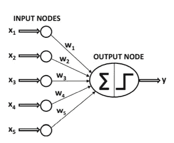

# 人工智能为什么叫人工智能？

> 原文：<https://medium.com/nerd-for-tech/why-artificial-intelligence-is-called-artificial-intelligence-4d6b301e496d?source=collection_archive---------10----------------------->

如今，每个人都知道人工智能是什么。但可能会有一个问题**人工智能为什么是人工的？**

来自 unsplash.com[的避雷线图片](http://unsplash.com)

人们首先想到的人工智能是一台可以预测或可以对一些数据进行分类以获得一些有用信息的计算机。或者称之为人工智能是因为一切事物背后的处理能力都是计算机。主要是人们的定义就足够了，但要了解更多，并进一步了解它为什么被命名为人工智能，请阅读这篇文章。

在这篇文章中，我们可以从技术上找到，人工智能为什么叫人工的原因。

# 生物智能

要深入了解人工智能，我们需要知道它的根源。人工智能来源于生物智能。生物智能，或者更确切地说是人类的大脑，是一组被称为神经元的微小轻量级处理单元。人类大脑包含超过 10 亿个神经元。这些神经元通过称为轴突的线连接在一起，轴突末端连接到树突。树突用于衡量神经元之间的信号。所以每个神经元的信号都通过树突加权。在神经元网络中，这些权重用于改变信号的值重要性，并且一起将影响输入信号的输出。

图一。一张神经元图片，取自 upgrad.com 网站

# 人工智能(神经网络)

想想一个生物智能。前面描述的生物智能网络是一组可以解决复杂问题的神经元。为了创造类似的可以在计算机中实现的东西并解决复杂的问题，我们需要类似于神经元的单元。**计算机科学中的一个神经单元叫做感知**。感知器是微小的轻量级单元，可以解决小问题。这些感知通过权重线连接在一起，它们的重要性通过这些权重来配置。

图二。感知器图像取自本书中的[环节](https://www.oreilly.com/library/view/hands-on-machine-learning/9781492032632/)

正如我们在图 2 中看到的，感知器(图 2 中称为输出/输入节点的部分)是一组简单的函数，它根据输入计算输出。每个感知器通过线连接，权重从 0 到 1，乘以输出以改变值的重要性。

这里我们不会深入研究感知器是如何工作的，但是对于一般知识来说，感知器可以是一个计算简单数学问题的简单函数。这些感知器的集合可以是一个网络，并计算复杂的问题。有关更多信息，这种类型的网络称为神经网络。人工智能科学有不同类型的网络，我们在这里介绍了其中最重要的一种。

所以现在我们知道为什么人工智能是人工的了。这是因为它是由类似于人脑神经元感知机的单元构成的。而这些感知机就是人工智能背后的处理能力。

感谢您的阅读，如果您有任何问题，请随时提问。