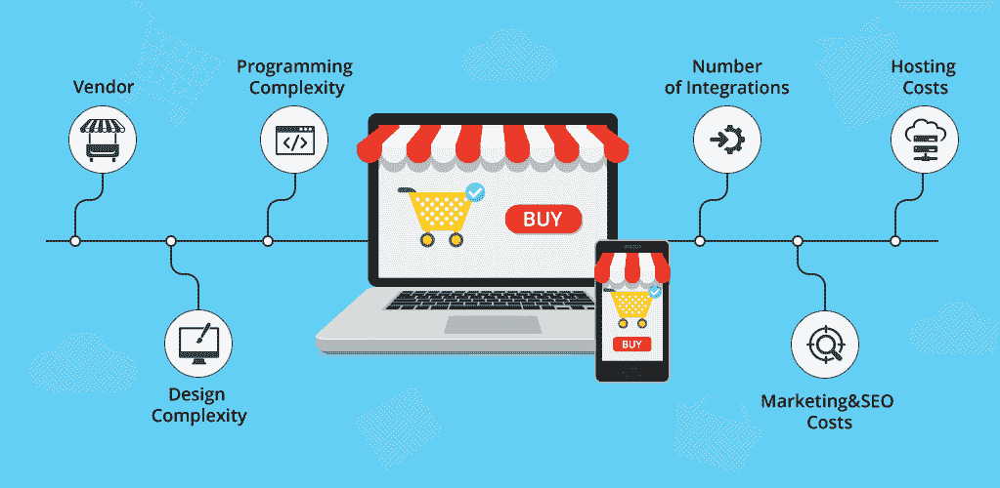
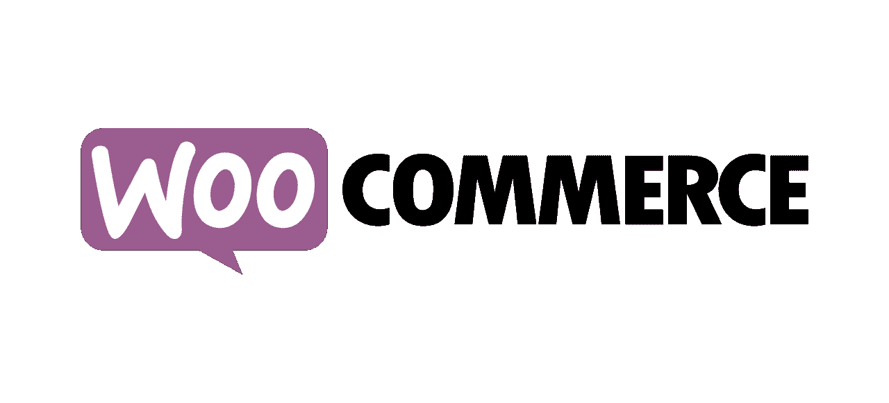

# 为什么选择 Magento 在 2021–22 年建立在线电子商务商店？

> 原文：<https://medium.com/nerd-for-tech/why-choose-magento-for-building-an-online-ecommerce-store-in-2021-3a506097d4e2?source=collection_archive---------5----------------------->

日复一日，全球网上购物者的数量不断增加，看到这种业务期待有自己的网上商店来销售他们的产品和服务。嗯，有各种电子商务平台，你可以用来建立一个多功能和用户友好的电子商务网站。

如果我说的是 [**最好的电子商务平台**](https://www.quora.com/Why-is-Magento-the-best-platform-for-E-Commerce/answer/Emma-Jhonson-24) ，那么 Magento 是当今电子商务网站开发的趋势和广泛使用。

*   [目前有 212361 个直播网站](https://trends.builtwith.com/shop/Magento)在使用 Magento 此外，历史上有 543，196 个遗址使用过 Magento。
*   大约有 270，000 家零售商更喜欢 Magento。
*   目前，Magento 为互联网上 1.2%的网站提供支持。

# 关于 Magento

Magento 是一个非常著名的开源电子商务平台，包括在线商店的内容和多种功能。此外，这个平台帮助你使你的网站更加搜索引擎优化(SEO)友好。

该平台包括开箱即用的功能、插件和主题，最终帮助您强化客户体验。你可以借助最好的 Magento 电子商务开发公司，在电子商务 web 应用程序开发中有效利用它。

# 选择 Magento 建立在线商店的理由

在这里，我陈述了各种原因，这将有助于你选择 Magento 作为你的下一个电子商务开发项目。

1.  **经济网发展**

*图片来源:MLSDev*

在选择电子商务开发平台时，负担能力是每个企业都要考虑的一个重要因素。如果你想要敏捷的电子商务开发解决方案，那么 Magento 将是你最好的选择。

Magento 的网站开发很经济，因为云托管降低了维护成本。web 应用程序的开发成本还取决于您要集成的特性和功能的数量。

2.**多个电子商店管理**

在电子商务网站中整合众多在线商店选项可能是获得更多客户的最佳想法，使用 Magento 可以轻松完成这项任务。

企业通常更喜欢 Magento 电子商务平台来应用多商店策略，最终帮助您从仪表板上建立和管理在线商店。这项功能可以节省您的时间，并帮助您简单快速地开发电子商务 web 应用程序。

3.**强大的社区支持**

Magento 有一个更广泛的社区，包括专门的电子商务开发人员、博客作者、项目经理等等。这主要有助于开发人员联系社区来解决问题和其他错误。

360，000+论坛成员与 Magento 社区联系在一起，他们足够聪明，能够为特定主题提供适当的指南和解决方案。选择雇佣 Magento 开发者是创建领先的电子商务应用的一个很好的选择。

4.**开放使用平台**

Magento 是一个免费开放的电子商务平台，使在线零售商能够定制与其业务相关的网站。要免费使用万磁王，你需要在你的设备上安装它。为了使适当的磁电机用于电子商务开发，你可以利用 Magento [**电子商务开发服务**](https://www.valuecoders.com/ecommerce-development-services-company?utm_source=medium-magento-d7&utm_medium=medium-magento-d7&utm_campaign=medium-magento-d7) 。这将帮助你创建一个有影响力的网站。

5.**卓越的性能**

说到卓越的性能，Magento 是最好的选择之一，因为它支持减少页面加载时间和其他统计操作。这个电子商务平台包括 1000 多个扩展，通常用于定制目的。如果你想让你的电子商务网站不同于其他网站，你可以选择添加一个新的定制选项。

6.**多种支付方式**

*图片来源:MagPress*

为了提高客户满意率，电子商务网站通常包含多种支付选项，因为它可以帮助客户通过选择支付选项进行支付。

Magento 支持大多数流行的支付网关，如 Authorize.net、货到付款、PayPal、亚马逊支付、谷歌结账、银行转账和其他方法。该平台可以支持您以轻松的方式在网上商店中加入各种支付选项。

7. **SEO 友好平台**

Magento 平台包含了各种 SEO 友好的特性，比如站点地图、SEO 友好的 URL 结构、定位层等等。整合了各种 SEO 扩展和插件的网站可以帮助你以一种简单灵活的方式对你的网站进行排名。此外，它使您的网站更加用户友好，简单的谷歌机器人抓取。

8.**与其他软件的简单集成**

使用 Magento 电子商务 web 开发平台，可以更容易地在电子商务网站上集成第三方服务。此外，这个电子商务平台提供各种内置的谷歌工具，如谷歌结帐，谷歌分析和谷歌基地，主要提高网站性能。

# Magento 上创建的流行电子商务网站

这里我提到了一些在他们的在线商店中使用 Magento 的流行公司的名字。要雇佣印度最敬业的 Magento 开发人员，你可以联系最好的 IT 外包公司之一。这将帮助你有效地使用 Magento 平台。

## 可口可乐

图片来源:熟食

可口可乐是最著名和最受欢迎的软饮料品牌之一。这家公司在他们的在线商店中使用 Magento 来提高网站的工作效率，销售礼品盒、个性化装瓶机等等。

## 福特

图片来源:Pinterest

福特是美国最受欢迎的组织。该公司采用 Magento CMS 向在线购买者零售福特配件。

## 福克斯连线

福克斯家庭娱乐于 2010 年 1 月 6 日推出了基于 Magento 的网站。

## 沃比·帕克

图片来源:十大点评

这是一家价值十亿美元的公司，以生产太阳镜和眼镜闻名。凭借在美国 80%的市场份额，该公司还倾向于使用 Magento 作为其在线网站的电子商务平台。

## 奥林波斯山

Magento 运营着这家日本公司的网站，该网站以其在多个国家领先的光学和数字精密技术制造商而闻名。

# Magento 顶级竞争对手

Magento 有强大的竞争对手；其竞争对手的一些细节如下所述。重要的是要知道，在电子商务甚至其他业务中，没有最好或最差的平台，因为每个公司都有自己的要求和预算，所以平台的选择只取决于其关键因素。

# 威克斯

这是一个优秀的电子商务平台众所周知的工作。该平台支持拖放功能，最终使开发过程更易于管理。

Wix 可以让你的电子商务网站更上一层楼，但为此，你需要使用它的付费版本，通过这样做，你将能够统一你的域名，删除 Wix 广告，利用 SEO 策略，等等。

建立一个利用电子商务平台的电子商务网站并不简单，因为在创建网上商店时会出现许多错误。但是所有这些问题都可以被有效地处理，但是为此，你需要**雇佣 Magento 程序员**。

***吃住睡，托比亚斯 Becs，好感觉货，法国结工作室，Vintique，两个一*** *都是大品牌* ***利用 Wix*** *。*

## Wix 重要功能

*   允许在更短的时间内建立专业的标志
*   让你能够为你的网上商店创造艺术，手工设计。
*   提供顶级搜索引擎优化工具
*   跟踪和控制您网站的性能
*   提供多种模板

# **购物化**

图片来源:Digital4design

这是一个可靠的电子商务基于云的 SaaS 平台，让您轻松设计网站。使用 Shopify 服务可以帮助您访问管理面板，在这里您可以关联产品、处理订单和存储连接的数据。

***企鹅图书、亨氏、防弹、DTH*** *是使用* ***Shopify*** *的最著名品牌。*

## **Shopify 特性**

*   虚拟主机和无限的带宽
*   移动商务就绪
*   分析仪表板
*   标准订单创建
*   欺诈调查
*   折扣代码

# 网络商务

这是一个著名的开源电子商务平台。它更灵活、更安全，也更容易利用。这个平台主要是为小型到大型的在线零售商设计的。

WooCommerce 因其诚实、定制等而闻名。它提供了主存储功能，包括来自插件库中的免费插件。该平台支持 100 多个扩展。

***woo commerce****平台被这些领先的公司所利用* ***根科学、波特与约克、蓝星咖啡烘焙、说不尽的心愿、Marché du Pre*** *等等。*

**WooCommerce 重要特征**

*   支持许多操作和过滤器
*   400 次官方延期
*   无数的主题
*   包括 REST API
*   无限定制

# 包扎

无论你有一个网上商店或计划在未来开始它，总是选择一个符合你的偏好和预算的电子商务平台。Magento 可能是最佳选择，因为它包括多种特性和功能，并且比 Shopify、WooCommerce 等其他平台更便宜。

如果你想做一个具有多种特性和功能的可扩展在线商店，我会建议你与最好的 [**Magento 电子商务开发公司**](https://www.valuecoders.com/hire-developers/hire-magento-developers?utm_source=medium-magento-d7&utm_medium=medium-magento-d7&utm_campaign=medium-magento-d7) **联系。**