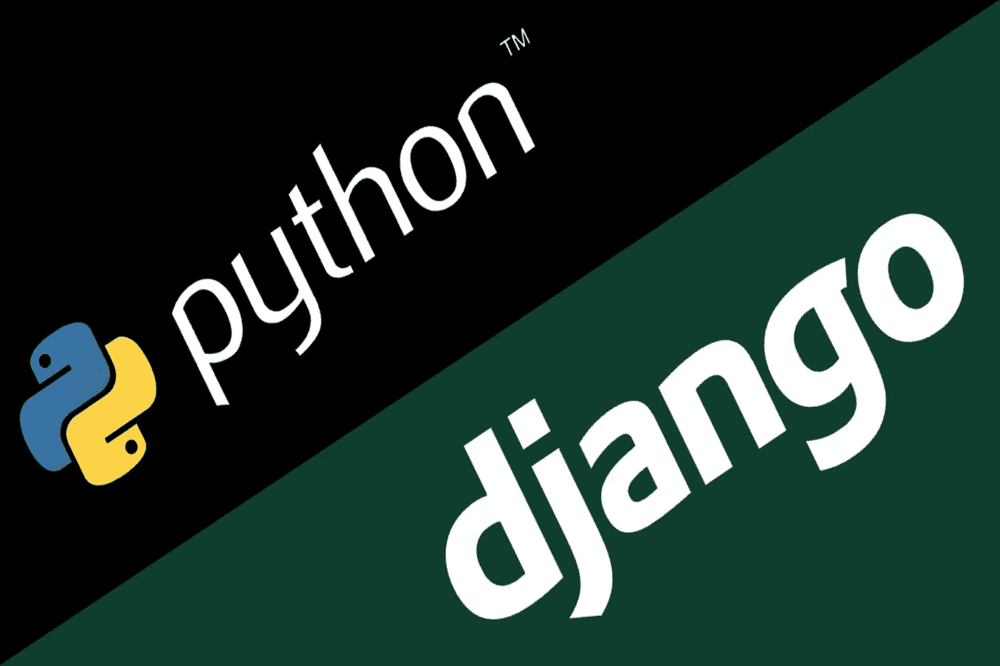

# 为什么选择 Python 和 Django 做 Web 开发？

> 原文：<https://medium.com/nerd-for-tech/why-choose-python-and-django-for-web-development-b74426afe71d?source=collection_archive---------9----------------------->

Python 和 Django 是我们这个时代最流行的两种技术。虽然 Python 是一种强大的编程语言，但 Django 是 Python 的最佳 web 开发框架之一。两者都有不同的用途，使开发者和公司能够获得使用 Python 进行 web 开发的好处。

如今，像谷歌、Instagram、脸书、Spotify 和其他公司都在他们的技术栈中使用 Python 和 Django。他们是数据科学、机器学习、大数据、深度学习、科学计算和其他高级应用的首选。Django for web development 和 Python 的结合使公司能够开发强大的、可伸缩的网站。一家 [Python 开发公司](https://www.botreetechnologies.com/python-development)开发了结合两种技术的独特解决方案。

本文将关注选择 Python 和 Django 进行 web 开发的[原因](https://morioh.com/p/a7af9e1b86a1)。对于公司来说，使用 Python 进行 web 开发的好处是显而易见的——可伸缩性、灵活性和健壮性。所以一定会成为 web 编程的未来。让我们详细了解一下编程语言和框架。

> ***阅读更多:***[***Django Web 框架非常适合创业公司的 7 个理由***](https://www.botreetechnologies.com/blog/django-web-framework-startups/)

# Python 是什么？

Python 是一种面向对象的编程语言，使开发人员能够构建动态 web 应用程序。它是一种简单易用的语言——可读性很强，看起来很像英语。它具有独特的结构，支持快速开发、测试和部署。当开发人员想到 Python 和 web 开发时，他们钦佩 Python 在运行时而不是编译时验证类型和错误的能力。它减少了开发时间，并导致编写更少的代码。

# 为什么选择 Python 进行 web 开发？

今天，Python 是全球公司的首选。对于创业公司和企业来说，这都是正确的技术。以下是 Python 在 web 开发中如此流畅的原因-

**简单易读**

*   Python 是最容易读写的编程语言之一。开发人员无需添加额外的代码就可以编写概念。他们可以使用英文关键词，而不是标点符号。Python 开发的目的是使编码尽可能简单，使开发人员能够快速构建动态 web 应用程序。

**高度可扩展**

*   虽然 Django 是 Python 网站的完美框架，但这种编程语言最适合构建可伸缩的应用程序。它可以帮助开发能够轻松处理大量流量的应用程序。Python 有一个强大的语法，使开发人员能够添加功能，当应用程序上有大量用户时，这些功能不会滞后。

**可扩展库**

*   Python 为构建 web 应用程序提供了一个健壮而强大的库。任何定制软件开发公司都会建议使用 Python，因为它提供的模块可以减少从头编写代码的时间。有用于字符串操作的插件和库，操作系统接口，以及其他一切。几乎每个功能都有一个模块库。
*   除了使用 Python 进行 web 开发的这三个好处之外，还有测试驱动的开发、灵活性和庞大的 Python 社区。几乎所有东西都有教程和文档。开发人员在不同的项目上合作，并定期探索 Python 开发的新范例。

# 姜戈是什么？

Django 是 Python 中最可信、最可靠、最流行的 web 开发框架之一。它是一个包含电池的框架，减少了开发时间，使初创公司和企业能够构建动态 web 应用程序。因为它使用 Python 编程语言，所以最终的应用程序非常强大。一家 [Django 开发公司](https://www.botreetechnologies.com/django-development)使用 Python 和 Django 创建动态 web 应用。

> ***结帐:****[***Django Web 开发指南***](https://www.botreetechnologies.com/blog/guide-django-web-development-for-business/)*

# *为什么选择 Django 做 web 开发？*

*现在有多种理由使用 Django 进行 web 开发。对于希望满足“新闻编辑室截止日期”并为开发人员提供最大灵活性的 Python 网站来说，这是一个完美的框架。这就是为什么 Django 是 Python 的顶级 [web 开发框架之一](https://www.botreetechnologies.com/blog/top-11-python-frameworks-for-web-development-in-2021/)*

***内置电池的方法***

*   *姜戈拥有一切。开发人员在用 Django 构建应用程序时从来不会感到失落。它有 ORM、认证、html 模板、模板引擎、URL 路由、视图层、模型层和许多主要组件。结合 Python，Django 在开发动态 web 应用程序方面变得势不可挡。这也导致更快的 MVP 开发，提供更多的时间来销售产品。*

***安全开发***

*   *对于 web 开发来说，Django 最好的一点是它的安全性。默认情况下，框架中的数据隐私和安全功能是打开的。常见的安全问题包括跨站点脚本、伪造请求、点击劫持、SQL 注入等。该框架经常收到新的安全补丁，这使得它成为 FinTech 和 HealthTech 应用程序的首选，这些应用程序涉及大量机密数据。*

***提供可扩展性***

*   *就像 Python 一样，Django 提供可伸缩的 web 开发。想要从使用 Python 进行 web 开发中获益的公司通常会结合 Django 来确保最大的可伸缩性。有线组件使开发人员能够随时随地构建应用程序。开发环境也是可定制的，确保开发人员不会拘泥于标准的开发生态系统，可以根据自己的需要进行修改。*
*   *除此之外，Django 还有一个大规模的开发者社区，这个社区正在快速发展。它提供了很好的文档，允许初学者和专家开发者回答所有在开发过程中产生困惑的问题。*

> ****点击此处:*** [***用 Python 构建的 15 大热门网站***](https://www.botreetechnologies.com/blog/top-15-websites-built-with-python/)*

# *总结*

*Python 和 Django 是许多公司的首选技术栈。原因很简单—两者都是可扩展的、快速的和安全的。企业正在探索它们来构建数据科学应用程序，因为它们具有支持科学计算、统计、数值分析等等的能力。越来越多的用例使得每个定制软件开发公司以某种方式与 Python 合作，并专注于动态 web 应用程序开发。*

**最初发表于*[T5【https://morioh.com】](https://morioh.com/p/a7af9e1b86a1)*。**