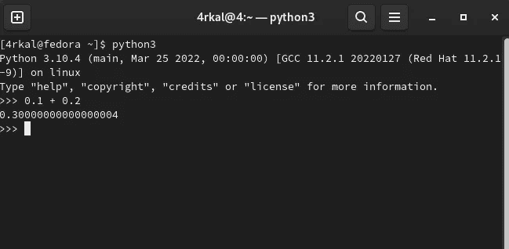

# 为什么计算机不能准确表示 0.3

> 原文：<https://medium.com/nerd-for-tech/why-computers-cant-represent-0-3-accurately-2e52bb86b155?source=collection_archive---------3----------------------->

大多数人都知道，0.1 + 0.2 加起来等于 0.3。然而，计算机将它表示为 0.3000000000000004。

下面是 python3 中的截图

您的第一个想法可能是这只是某种错误。不是的

这是为什么呢？