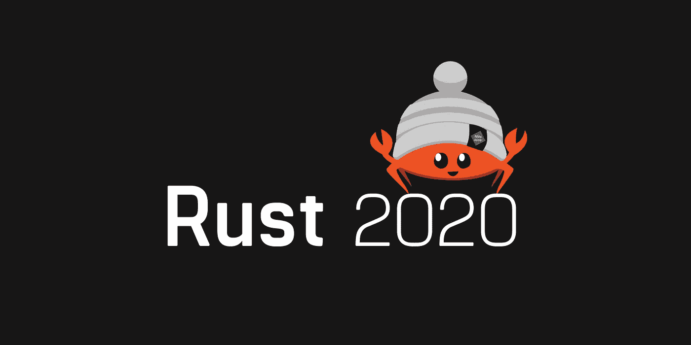

# 为什么 DevOps 对基质生态系统非常有意义

> 原文：<https://medium.com/nerd-for-tech/why-devops-make-perfect-sense-for-the-substrate-ecosystem-b8b002a10770?source=collection_archive---------2----------------------->

https://substrate.dev

传统区块链在升级底层链技术时通常会面临一个重大挑战，通常被称为区块链硬分叉。这主要是因为改变核心协议代码库通常需要网络节点之间的大量一致协调，以使改进建议生效。一个典型的例子是，导致 hardfork 的臭名昭著的以太坊 DAO hack 将以太坊社区分裂为以太坊(ETH)和以太坊经典(ETC)。通过分裂网络，分叉严重削弱了相应的以太坊网络安全。

然而，我们可能需要升级区块链的原因有很多:

1.修复严重的安全缺陷

2.更改核心协议规则

3.添加新的区块链功能

4.修复链状态

今天，一个新的区块链建筑框架——奇偶校验基板承诺通过引入无叉区块链升级的未来来解决这个生态系统范围的问题。substrate 是一个开源的、模块化的、可扩展的框架，用于构建定制的区块链。底层提供了区块链的所有核心组件——数据库层、网络层、共识引擎、事务队列和运行时模块库。

**SubOps(基板运行时间+ DevOps)**

substrate 是一个开源框架，可以让您在最短的时间内构建完整的、可配置的区块链。或者，您可以作为 para 链加入 Polkadot 网络，以实现共享安全性和与其他连接的区块链的互操作性。

DevOps 是现代软件开发方法，其核心原则可以概括为“持续一切”，包括:

*   持续发展
*   连续累计
*   连续交货

底层运行时，即区块链的块执行逻辑，由运行时模块组成，也称为状态转换功能。托盘是一种特殊类型的 Rust 模块，可以由它组成基底运行时。每个托盘都有自己的离散逻辑，可以修改区块链状态转换功能的特性和功能。

例如，模块化实体运行时聚合框架(FRAME)中包含的 Balances pallet 为您的区块链定义了一种加密货币。更具体地说，它定义了跟踪用户拥有的令牌的存储项、用户可以调用来传输和管理这些令牌的函数、允许其他模块刻录或铸造这些令牌的 API，以及允许其他模块在用户余额变化时触发函数的挂钩。

您可以编写自定义托盘，定义您想要引入区块链的逻辑和功能。

运行时升级通常涉及在外部目标链中添加带有升级指令的特殊事务。然而，底物副链的运行时升级机制与独立链的运行时升级机制完全不同，因为副链一致性遵循中继链的终结性小工具。

**结论**

由于可以通过链上治理访问底层运行时代码，因此基于底层的链可以方便地执行频繁的、无分叉的区块链升级，从而保持网络社区的凝聚力，同时不断改进他们的技术。