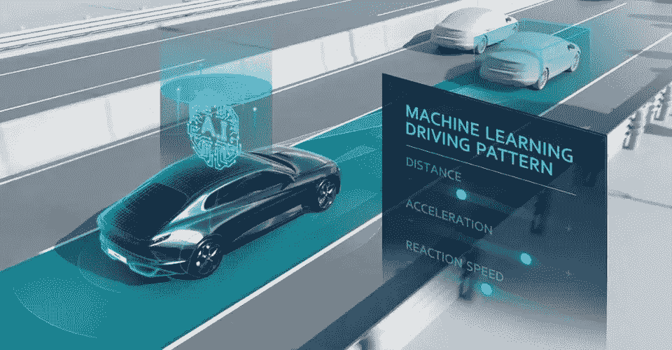

# 为什么德国和奔驰一起给 L3 自动驾驶开绿灯？-第一部分

> 原文：<https://medium.com/nerd-for-tech/why-did-germany-and-mercedes-benz-give-the-green-light-for-l3-autonomous-driving-together-part1-5890ee1a4589?source=collection_archive---------2----------------------->

http://www . autor . com . cn/index/technology/smart car/10424 . html

德国监管当局走在了世界的前列，为世界各国提供了借鉴。相信会鼓励更多国家推动未来交通时代的到来。是政府部门和车企共同推动的结果。梅赛德斯-奔驰赢得了第一个 L3 量产落地的名字，也将在 2022 年面对世界的围观、审视和严格的测试。

2021 年 12 月 10 日是自动驾驶历史上值得纪念的一天。德国监管部门正式发布 L3 自动驾驶。

戴姆勒董事长康宋林拿着德国联邦汽车运输管理局(简称)的文件，激动地宣布，奔驰成为全球首家获得 L3 自动驾驶上路许可的车企。

然而，第一批奔驰车主需要等到 2022 年上半年，才能购买配备 DRIVE PILOT 的新款本 S 级轿车或奔驰电动旗舰轿车 EQS，在全德 13191 公里的高速公路上行驶。它可以用于速度高达 60 km/h 或交通拥挤或拥堵的条件下的自动驾驶。

在那一刻，驾驶员可以摆脱方向盘，因此他们可以在中央显示屏上进行操作，如在线购物或处理电子邮件或玩游戏，或看电影。

这个成就是不小的。康宋林称之为“自动驾驶的一个创举”并不为过。目前，在德国，特斯拉的 FSD 仍然是公认的 L2。

这一方面证明了奔驰在自动驾驶量产技术上的成就。尽管如此，更大的意义在于它促进了自动驾驶法律治理模式的正式进入。**人类已经开始接触和探索如何管理真正的自动驾驶汽车。**

这当然涉及技术能力，但也涉及确定责任和道德伦理。

在这方面，德国联邦汽车运输管理局(KBA)也唤醒了世界上的其他国家，尤其是中国和美国。不过，在回答为什么会成为世界上第一个允许 L3 自动驾驶上路的国家之前，我们会在下面的文章中解释德国“有条件自动驾驶”给奔驰设置了哪些前提条件。

# 自动驾驶行业背后的数据标注服务

自动驾驶的主流算法模型主要基于有监督的深度学习。它是一种算法模型，推导出已知变量和因变量之间的函数关系。需要大量的结构化标记数据来训练和调整模型。

在此基础上，要想让自动驾驶汽车变得更加“智能”，形成可在不同垂直落地场景下复制的自动驾驶应用商业模式闭环，模型需要有海量、高质量的真实道路数据支撑。

在自动驾驶领域，数据标注场景通常包括变道超车、通过路口、无红绿灯控制的无保护左右转弯，以及一些复杂的长尾场景，如车辆闯红灯、行人过马路、路边以及违规停放的车辆等。

现在的人工智能也叫数据智能。在这个发展阶段，神经网络的层数越多，需要的标记数据量就越大。对于深度学习来说，数据只有贴好标签才有意义。

## 自动驾驶场景的产业化焦点——人工智能数据

**2D-3D 融合数据:**例如，为了开发自动驾驶汽车的多模型机器学习算法，一些制造商需要融合两个不同维度的不同数据集。这个操作很重要，但是手动执行很有挑战性。

AI 公司甚至希望数据公司能够更好的了解算法技术和需求场景，参与算法的研发，给出数据采集的优化建议。创造竞争优势也成为数据服务提供商关注的焦点。

**常见的数据标注类型有:**

*   2D 包围盒
*   [车道标线](https://tinyurl.com/u7u4me)
*   [视频跟踪注释](http://tinyurl.com/wmu4yfhh)
*   点标注
*   [语义分割](https://tinyurl.com/48w576p7)
*   三维物体识别
*   3D 分割
*   传感器融合:传感器融合长方体/传感器融合分割/传感器融合长方体跟踪

# 结束

将你的数据标注任务外包给 [ByteBridge](https://tinyurl.com/4rae2x2u) ，你可以更便宜更快的获得高质量的 ML 训练数据集！

*   无需信用卡的免费试用:您可以快速获得样品结果，检查输出，并直接向我们的项目经理反馈。
*   100%人工验证
*   透明和标准定价:[有明确的定价](https://www.bytebridge.io/#/?module=price)(含人工成本)

为什么不试一试呢？

来源:https://k . Sina . cn/article _ 5140861246 _ 1326 b 513 e 001014 foi . html？ab = qiche & _ rewrite time = 1639319502386 & http = from http