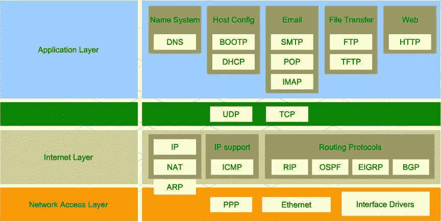
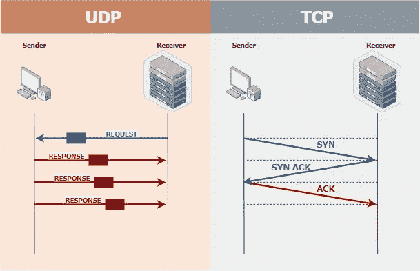
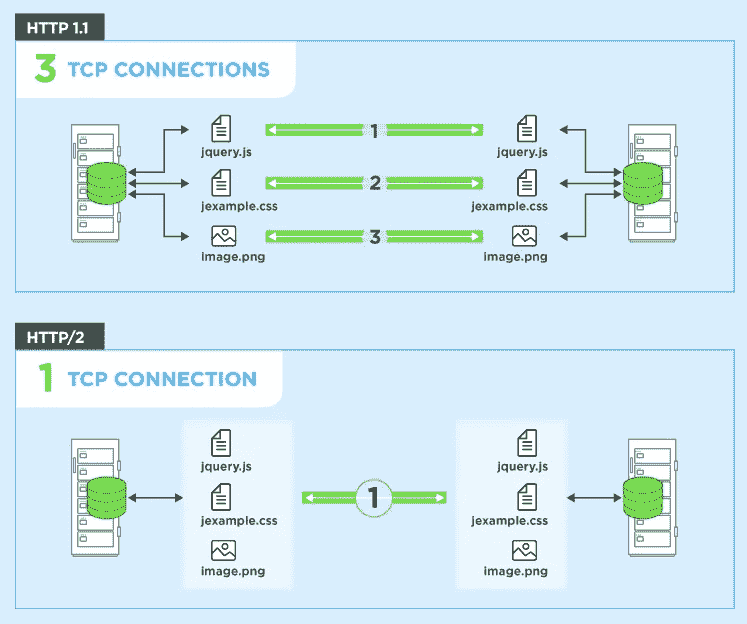
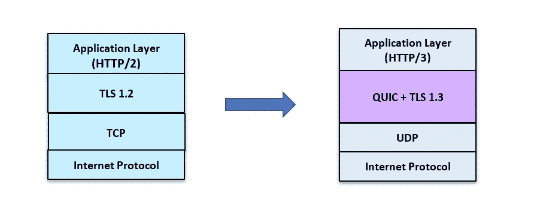

# 为什么谷歌和脸书停止使用传统的网络连接？

> 原文：<https://medium.com/nerd-for-tech/why-did-google-facebook-stop-using-the-traditional-network-connection-ae936926f1ee?source=collection_archive---------12----------------------->

随着用户群的增加，google 需要一个高效的方法来处理这些请求。在我们回答为什么 google 停止使用 TCP 连接之前，让我们先了解一下基本的。

# 协议层

协议层

可以参考上图。协议层有 4 层，让我们详细了解每一层。

## 网络接入层:

这是协议层中的最底层。这一层为系统提供了向直连网络中的其它设备传送数据的方法。

## 互联网层:

这一层有一个 internet 协议，为网络上的计算机提供识别和定位系统，并在 Internet 上路由流量。

## 传输层:

传输层直接为运行在不同主机上的应用程序进程提供通信服务。这里我们有两种类型的协议 TCP 和 UDP。

*   **TCP:** 这是遵循三次握手原则的协议。在这种情况下，客户端向服务器发送一个请求，服务器发送一个响应，之后客户端再次发送一个确认，表示它已经收到了响应。如果服务器没有从客户端得到确认，那么它将再次发送响应，因为它将认为客户端没有收到响应。
*   **UDP:** 在这个协议中，客户端建立连接并发送请求，服务器发送响应。响应可以在多个分段中发送。客户端没有发送收到响应的确认。所以服务器不关心客户端是否得到响应，它只是发送响应。

## 应用层

应用层是指定通信网络中的主机所使用的共享通信协议和接口方法的抽象层。

# **了解 HTTP**

现在您对网络层有了一个基本的概念，现在让我们看看 HTTP1.1 和 HTTP2 之间有什么区别。这是应用层的一部分。HTTP 协议用于传输超媒体文档，如 HTML。它旨在使网络浏览器和网络服务器之间的通信成为可能。

## HTTP 1.1 与 HTTP 2

在 HTTP 1.1 协议中，为每个请求调用建立一个 TCP 连接。而在 HTTP 2 中，协议作为一个流工作，它建立一个 TCP 连接，在这个连接中，多个请求和响应由客户机发送和接收。

## 为什么是 HTTP 2？

在 HTTP 1.1 中，对于每个请求调用，都会建立一个连接。假设一个网站有 100 万用户，对于一个特定的页面，有 20 个请求调用需求。如果所有 100 万用户同时打开该页面，则需要同时建立 2000 万个连接。这可能导致拒绝服务攻击。

因此，为了防止这种情况，浏览器将请求限制为一次 6 个请求调用，这意味着浏览器每次可以为每个打开的页面建立 6 个连接。如果任何连接被关闭，那么只会建立一个新的连接。

使用单个连接中的 HTTP2，可以同时发送多个请求。这意味着在单个连接中，我可以同时执行 20 个请求呼叫。因为这个页面也将在更短的时间内加载。

## HTTP 2 的缺点

由于 HTTP 2 使用了流的概念，一个问题是如果客户端没有收到对特定请求的响应，客户端将不会再次调用该请求。

## HTTP 3

转折来了，HTTP 3 是在 QUIC 上实现的。QUIC 是 Google 设计的一个协议，它充分利用了 TCP+TLS 的优点，优化了 HTTP 协议的性能。

TCP + TLS 连接需要大约 6 次往返。另一方面，UDP 上的 QUIC 大约需要 1-2 次往返。QUIC 包括丢失控制、拥塞反馈。

但是由于 QUIC 是在 UDP 上实现的，你可能会在前面的点上有所劣势，如果一个包丢失了，那么它就丢失了。

QUIC 还有一个特性，它不在客户机和服务器之间建立连接，而是在客户机 IP: port 和服务器 IP: port 之间建立连接。QUIC 连接独立于 IPs 的 UUID。这样做的好处是，你可以切换你的互联网连接而不会丢失数据，并且连接可以保持有效。

TLS 用于加密目的。它有助于加密和解密包。

## 结论

谷歌和脸书转而使用 QUIC，与传统的 HTTP 连接协议相比，QUIC 更优化，速度更快，带宽更大。这自动降低了处理成本并改善了用户的性能体验。