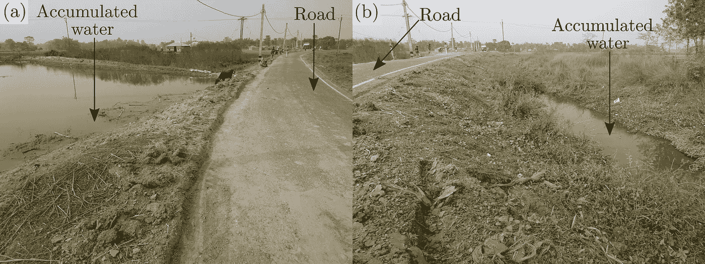
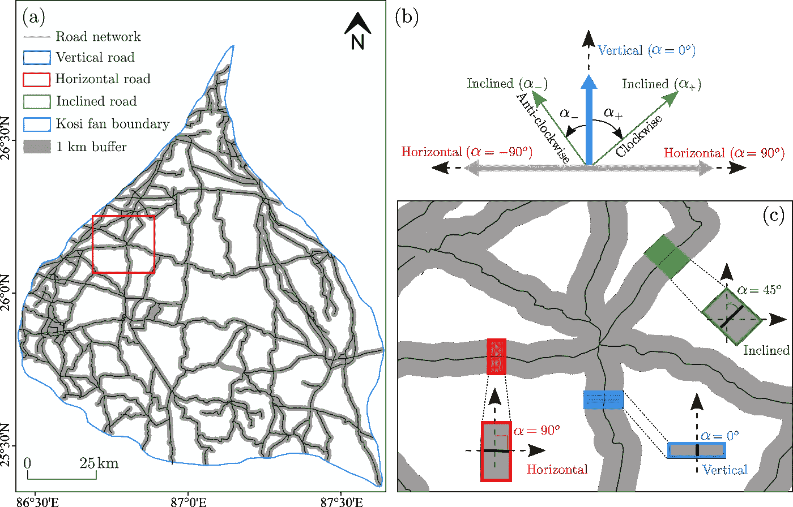
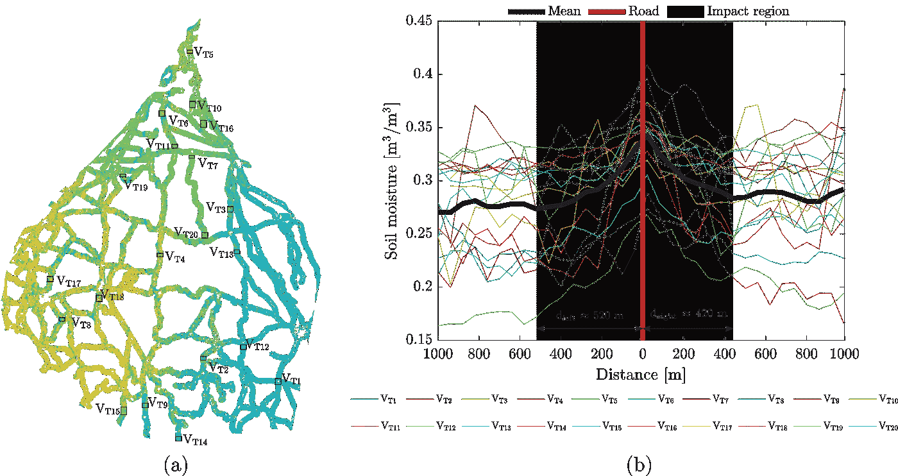
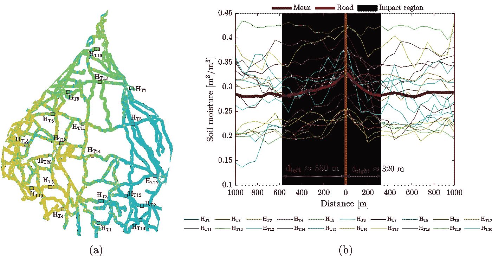
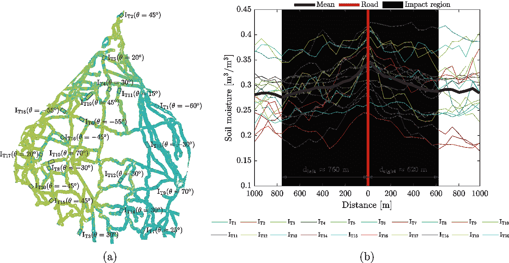

# 为什么距离道路的距离被认为是地球科学问题的机器学习建模中的潜在输入特征？

> 原文：<https://medium.com/nerd-for-tech/why-distance-from-the-road-is-considered-a-potential-input-feature-in-machine-learning-modeling-of-5ca2b9346cd1?source=collection_archive---------1----------------------->

近年来，研究人员已经开始将距离公路铁路网络的距离作为输入特征，通过机器学习来解决地球科学问题。你有没有想过这个特性会如何影响响应或目标变量？在本文中，我们将通过最近发表的一个合适的案例研究来尝试理解这个问题。你可以 [**下载**](https://www.researchgate.net/publication/361688612_Drainage_congestion_due_to_road_network_on_the_Kosi_alluvial_Fan_Himalayan_Foreland) 的论文了解更多详情。你可以写信给我(abhilash.singh@ieee.org)如果你有任何问题或访问 [**我的网页**](https://www.abhilashsingh.net/?source=drainage_medium) 了解更多更新。

人类活动经常引起排水系统堵塞的问题。公路铁路网的发展起到了人为屏障的作用，导致这些物理屏障附近的土壤水分积累。在最近的一项研究中，Singh 等人 2022 使用土壤湿度作为代理来研究和量化道路网络造成的排水拥堵的影响区域。为此，他们首先使用 Sentinel-1/2 卫星图像来估算高分辨率的地表土壤湿度图，然后研究道路网附近土壤湿度的空间模式。有趣的是，他们发现不考虑道路方向(即垂直、水平和倾斜；图 1)公路网附近的土壤湿度非常高，随着远离公路，土壤湿度逐渐降低(图 2-4)。

[图 1:根据角度α将道路分为垂直、水平和倾斜三类(资料来源:Singh 等人，2022 年)。](https://www.researchgate.net/publication/361688612_Drainage_congestion_due_to_road_network_on_the_Kosi_alluvial_Fan_Himalayan_Foreland)

[图 2: (a)道路网(两侧有 1 公里缓冲带)沿线土壤水分，(b)垂直道路沿线土壤水分格局。道路附近的土壤湿度最大，随着远离道路，土壤湿度逐渐降低。灰色阴影表示基于斜率分析的影响区域(资料来源:Singh 等人，2022 年)。](https://www.sciencedirect.com/science/article/pii/S1569843222000942)

[图 3: (a)道路网沿线土壤水分(两侧有 1 公里缓冲带)，(b)水平道路沿线土壤水分格局。道路附近的土壤湿度最大，随着远离道路，土壤湿度逐渐降低。灰色阴影表示基于斜率分析的影响区域(资料来源:Singh 等人，2022 年)。](https://www.sciencedirect.com/science/article/pii/S1569843222000942)

[图 3: (a)道路网(两侧有 1 公里缓冲带)沿线土壤水分，(b)倾斜道路沿线土壤水分格局。道路附近的土壤湿度最大，随着远离道路，土壤湿度逐渐降低。灰色阴影表示基于斜率分析的影响区域(资料来源:Singh 等人，2022 年)。](https://www.sciencedirect.com/science/article/pii/S1569843222000942)

基于这一研究，得出以下几点结论:

1.  土壤湿度信息可用作测量道路网沿线排水堵塞的前兆。
2.  道路网络作为一种物理屏障，导致多处排水系统堵塞。这最终导致公路网附近的土壤湿度很高。
3.  对于垂直、水平和倾斜方向的道路网络，排水拥堵的程度是不同的。在道路以倾斜方向穿过的位置，排水堵塞的程度相对更大。

通过这项研究，我们了解到公路网附近的土壤湿度很高。我们还知道，土壤水分在区域气候变化中起着非常关键的作用，并在气候变化、农学、水资源以及许多其他科学和工程领域中有着广泛的应用。因此，土壤水分直接或间接地影响着地球科学的各个领域。因此，道路网络将影响土壤水分的模式，最终控制地球科学机器学习问题中的目标变量或响应变量。

**参考文献**

1.  辛格，纳伊克，M. N .，&高拉夫，K. (2022)。喜玛拉雅山前陆 Kosi 冲积扇道路网导致的排水堵塞。国际应用地球观测与地理信息杂志， *112* ，102892。
2.  [辛格，a .，高拉夫，k .，米娜，G. K .，&库马尔，S. (2020)。用改进的 dubois 模式估算 Sentinel-1 的土壤湿度:印度中部的区域研究。*遥感*， *12* (14)，2266。](https://www.mdpi.com/2072-4292/12/14/2266)