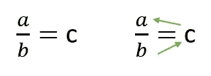
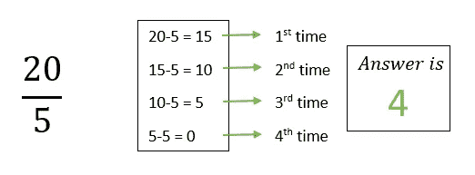
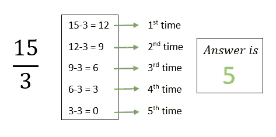
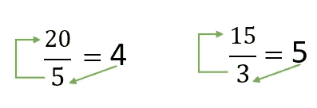
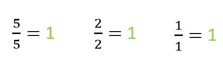
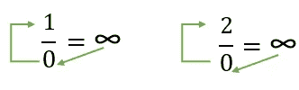
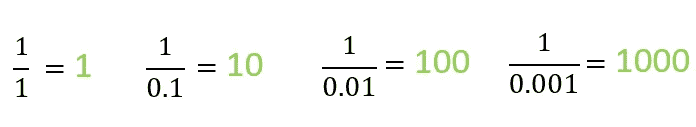
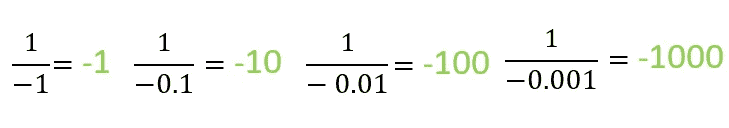
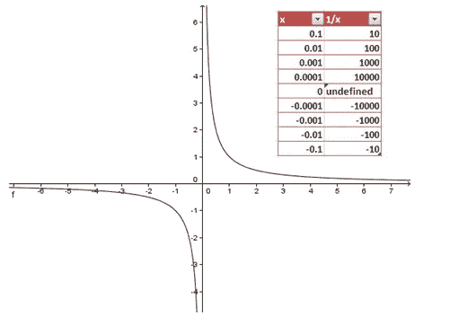

# 为什么被零除会让你陷入困境？

> 原文：<https://medium.com/nerd-for-tech/why-dividing-by-zero-can-get-you-into-trouble-943d98dcb54d?source=collection_archive---------5----------------------->

从童年开始，我们都明白任何数都不可能被零除。在数学中，被零除被认为是无穷大(例如 10/0)。但是为什么计算机不接受呢？除以零后，结果未定义。如果你一直用更小的数除任何一个数，结果的值会一直增加。

但是为什么会这样呢？为什么不能被一个简单到零的数整除？在这篇博客中我们将找到“**为什么？**“问题。

在此之前，
让我们讨论一下来自计算机的除法的定义。

# 什么是组织？

如果“a”除以“b”=“c”，并且“c”是唯一的，那么根据除法的概念，“b”乘以“c”等于“a”。

分部的定义

如果计算机想整除任何一个数，它只需减去给定的数，直到它等于零。

举个例子，

示例 1

示例 2

因此，为了达到零，计算机必须用 4 乘以 20 减去 5。此外，为了使值 15 为零，计算机必须用 5 乘以 3。计算机就是这样做除法的。同样的，如果计算机做乘法，它会做加法。

增加

在这种情况下，20 除以 5 等于 4，4 乘以 5 等于 20。15 除以 3 等于 5，而 5 乘以 3 等于 15。

# 让我们除以零

数学老师会教他们的学生，任何数或整数除以它自己总是等于 1。考虑以下场景:

除以数本身

根据数学理论，1 除以 0 是无穷大，2 除以 0 也是无穷大。用同样的乘法逻辑，无限进 0 等于 1，无限进 0 等于 2。这意味着 1 等于 2。这是不可能的。因此，计算机不会认为任何被零除的数是无穷大。

数字除以

# 为什么？

一除以正十进制数

我们可以看到，当我们试图达到一个零，我们走向零。价值正在上升。结果会变得很大。

一除以负十进制数

如果我们用负值，结果会变得很小。

数字除以 0 图

如上图所示，如果我们试图通过 x 达到零，y 值会上升，负值也会上升。结果，我们甚至不能定义无穷大的值，这就是为什么它们被称为未定义的值。因此，我们认为被零除是不可定义的。

# 参考

> 2020，为什么被零除不是无穷大，【视频】——[https://www.youtube.com/watch?v=sCW5dbk4C_o](https://www.youtube.com/watch?v=sCW5dbk4C_o)