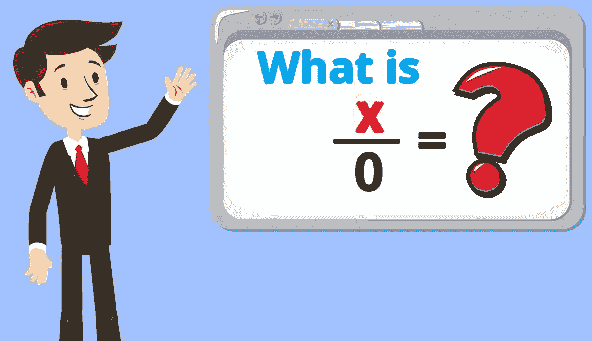
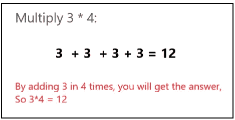
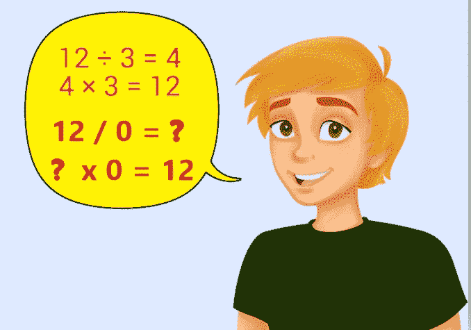
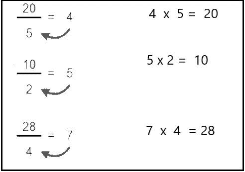
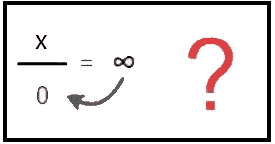
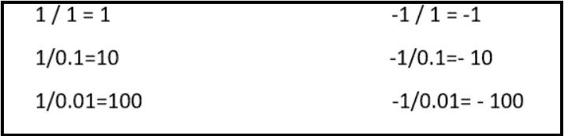
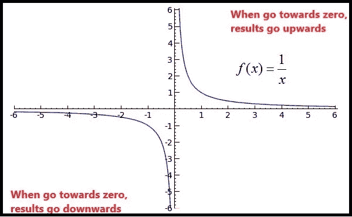
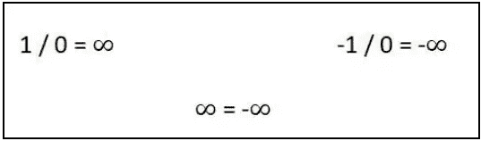

# 为什么被零除不是无穷大？

> 原文：<https://medium.com/nerd-for-tech/why-division-by-zero-is-not-infinity-7e4ec468c6e9?source=collection_archive---------1----------------------->

在普通数学中，我们已经知道除以零是无穷大。但是，在计算机中也是如此吗？为什么计算机不认为那是无穷大呢？

**1。你知道计算机是如何做除法和乘法的吗？**

**除法** →乘*减去* 的数值

**乘法** →通过*相加*数值

而一般数学中有这样的规律，如果 12 / 3 = 4，4 *3 =12。让我们看看那个。

但是接下来会发生什么呢，当我们用除法得到 0 的时候。

让我们认为这个规则是正确的，然后我们可以用无穷大乘以零。那么我们的答案是 x。

但是你知道，x 可以有任何值，比如 1，2，3，10 等等。

那么，如果它是正确的，那就意味着 1 = 2，2 =3，因为在所有情况下，它都会给出 x 的答案。

现在，你可以看到，我们不能得到无穷大作为我们除以零的答案。

***因此，计算机不会把任何数除以 0 视为无穷大。***

我们可以再举一个这样的例子。我们可以像这样用 0.1，0.001，0.0001 来除一些数。然后才能考虑结果。

你可以看到当我们试图这样达到零点时，

在**正侧** →结果走 ***向上***

在**负侧** →结果向下

*下图将说明这种情况。*

**

*如果被零除是无穷大。如图所示，你可以看到，它在正方向是正无穷大，在负方向是负无穷大。*

*然后它说，正无穷大等于负无穷大。*

**

*但是，你看我们不能有这个条件。他们永远不会相遇，因为他们有两条不同的路，一条向上走，一条向下走。*

***因为种种原因，我们所谓的被零除在计算机中是未定义的而不是无穷大。***