# 印度最优秀的教授为什么离开印度？

> 原文：<https://medium.com/nerd-for-tech/why-do-indias-best-professors-leave-india-15489d4305c3?source=collection_archive---------12----------------------->

最近，普拉塔普·巴努·梅塔辞去了阿育王大学的教授职务，阿育王大学是一所哈里亚纳邦的私立大学。阿育王大学(Ashoka)的经济学教授阿文德·萨勃拉曼尼亚(Arvind Subramanian)也辞去了自己的职位，以示对梅塔辞职的支持。萨勃拉曼尼亚曾担任总理纳伦德拉·莫迪(Narendra Modi)的首席经济顾问。

梅赫塔先生在辞呈中提到，由于来自印度政府越来越大的压力，他是被迫做出这一决定的。“在与(该大学)创始人会面后，我非常清楚，我与该大学的关系可能会被视为一种政治责任，”他写道。“我公开撰文支持一种试图尊重自由和平等尊重所有公民的宪法价值观的政治，这被认为给大学带来了风险。为了大学的利益，我辞职。”另一方面，Subramanian 先生指出这一事件是对我国学术自由的侮辱。
像 Abhijit Banerjee，Gita Gopinath，Arvind Panagariya，Amartya Sen 这样的早期知名人士在印度完成了他们的教育，但更喜欢为外国机构工作。
但问题是“为什么印度最好的教授会离开印度？”。政府对其大学的影响不足为奇，但它对私立大学事务的干预引发了一个关于学术自由的问题。具有讽刺意味的是，莫迪总理通过他的演讲表达了印度对优秀研究人员和教授的需求。每个国家都需要优秀的研究人员来进行创新，也就是研发。
根据衡量全球各国学术自由指数的 V-dem 研究所的报告，印度的排名自 2014 年以来已经下降，现在低于全球平均水平。

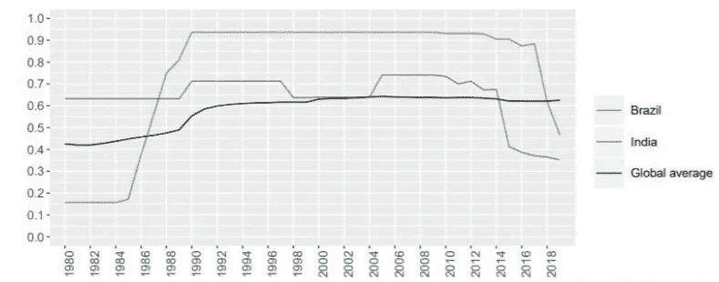

在学术自由指数 0 到 1 的范围内，印度的得分为 0.352

现在让我们试着分析一下各国在研发上的支出。互联网上可用的数据和数字有很多变化，所以我从维基百科**中选取了一个数据，另一个来自 [**Knoema**](https://knoema.com/atlas/India/topics/Research-and-Development/RandD-Expenditure/RandD-expenditure-as-a-share-of-GDP) 。您可以从提到的链接中查看这些数据。**

**让我们直接跳到代码中。首先，导入所有库并将 CSV 文件转换为数据框**

**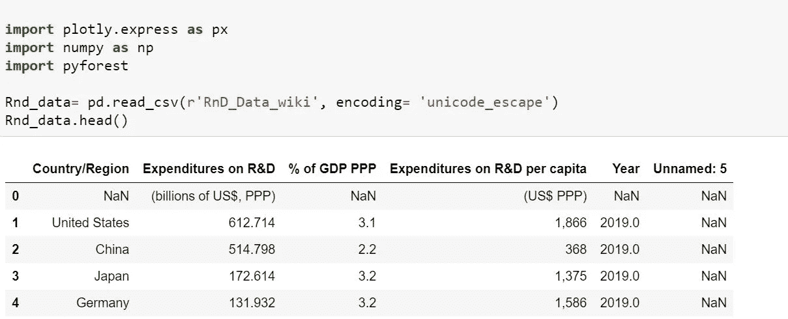**

**注意:如果您的 csv 文件位于其他位置，则使用—RnD _ data = PD . read _ CSV(r ' file path \ RnD _ data _ wiki . CSV ')**

> **上表列出了各个年份所有国家及其在 R&D 的总支出(以十亿美元计)。它还显示了用于 R&D 的 GDP 百分比和人均支出.**

# **数据清理**

**我将删除不必要的列和行。这里我删除了第一行和最后一列。**

**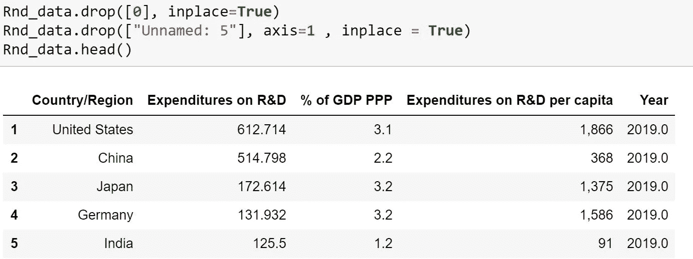**

**为了便于理解，现在让我们重命名列名。此外，我将选择最近几年即 2019 年的数据。**

**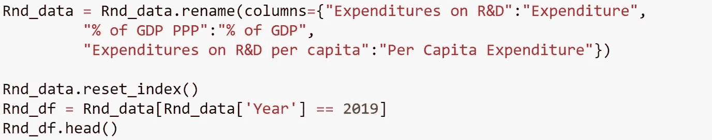**

**Rnd_data.rename —用于重命名列名，Rnd_data.fillna —用于将空值替换为 0**

**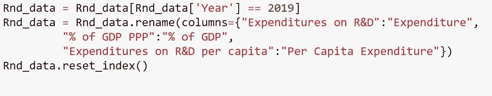**

**Rnd_data.rename —用于重命名列名，Rnd_data.reset_index()—用于串行索引数据**

**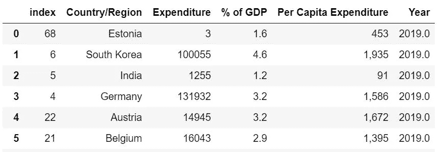**

# **数据可视化**

**现在让我们借助图表进一步分析和理解这些数据，并将印度的地位与其他国家进行比较。首先，我们可以绘制每个国家分配给 R&D 的 GDP 百分比数据**

**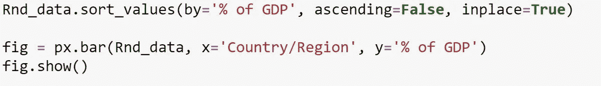**

**条形图代码**

**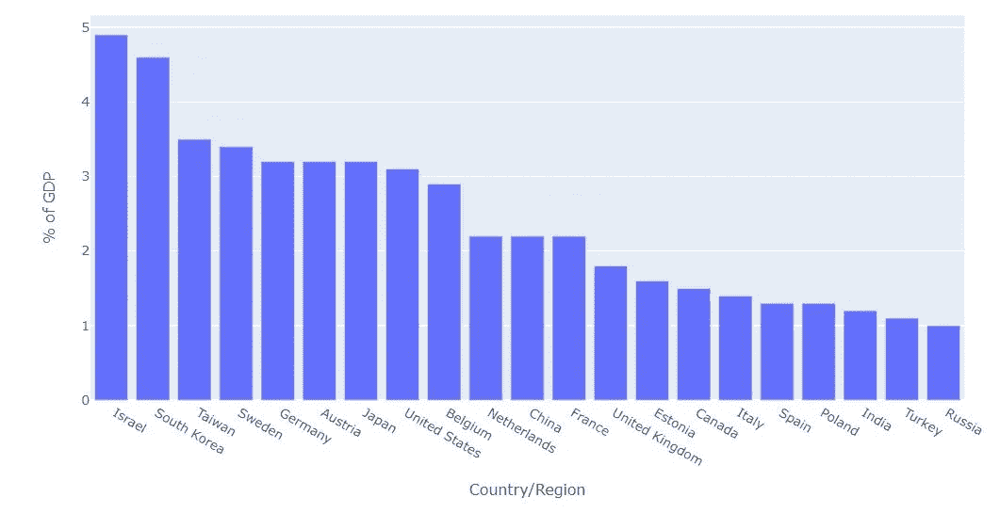**

**观察:我们可以看到，以色列和韩国将超过 4.5%的 GDP 用于研发，而印度 GDP 的微薄份额令人担忧。
现在我们来绘制人均支出的图表。这里我将把 column 的数据类型转换为 int。**

**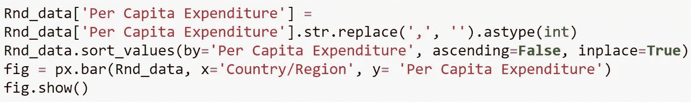****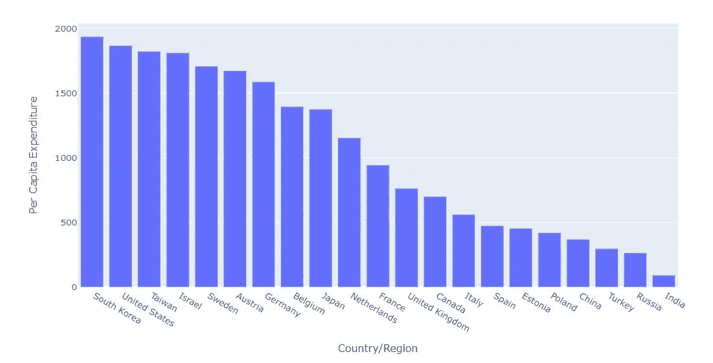**

****观察:**我们可以看到，印度的人均研发支出很低。在这方面，韩国在美国的支持下做得非常好，我们可以说这些国家一直处于创新和技术的前沿。**

# **印度研发支出占国内生产总值的比重**

**现在让我们来分析一下过去十年印度在 R&D 上的支出。我从 Knoema 得到了这些数据。**

**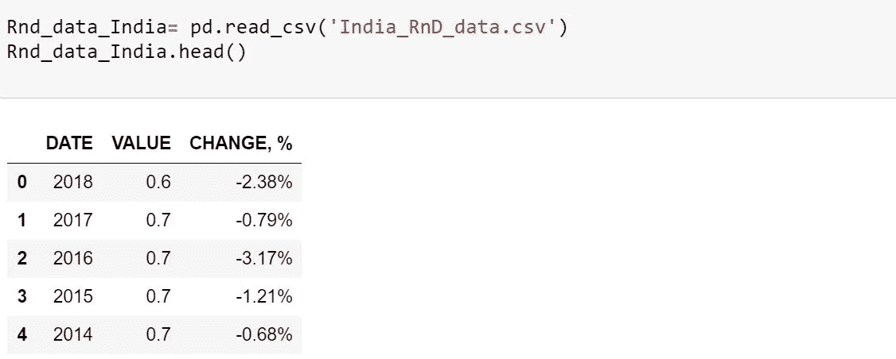**

**现在让我们用折线图来绘制这些数据。**

**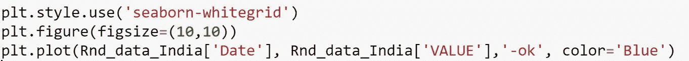****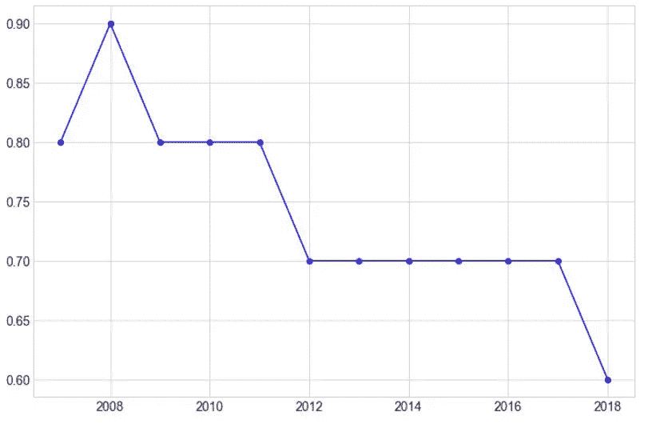**

**研发支出(占国内生产总值的百分比)——印度**

****观察:**我们可以看到，印度的研发支出占 GDP 的比重在过去十年中逐渐下降。目前，印度将国内生产总值的 0.67%用于研发**

**我们推断，导致这一问题的两个主要原因是学术自由和缺乏研发资金。最近，在 2021 年 1 月，政府颁布了一项规定，即大学必须获得外交部的许可，才能就一个敏感的主题组织国际研讨会，但由于反弹，这项规定被进一步取消。这向我们表明政府想要控制我们的大学。教授的工资也很低，阿育王、金达尔大学等私立大学很好地解决了这个问题。另一个原因是经济压力，印度没有足够的资金来维持研究。预计印度将向 R&D 投资约 2%的 GDP，并加速整体经济发展。在 COVID 19 期间，研发在抗击疫情和拯救人类方面发挥了重要作用。印度必须专注于改善其在制度和商业复杂性创新投入方面的表现。**