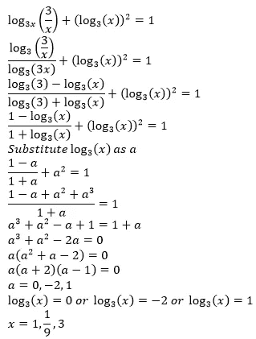
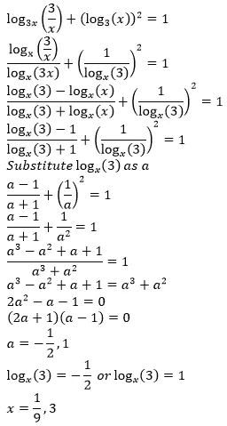

# 为什么在对数中使用基数变化规则时需要小心？

> 原文：<https://medium.com/nerd-for-tech/why-do-you-need-to-be-careful-when-using-the-change-of-base-rule-in-logarithms-b3c08b6ee5a4?source=collection_archive---------2----------------------->

页（page 的缩写）c:俳句甲板

基数规则的变化是对数的基本原理之一。底数变化规律说明:log_a(b) = (log_c(b))/(log_c(a))其中 c>1(因为对数底数的限制是必须大于 1)。

但是即使有这个简单的规则，我们在解方程的时候也必须非常小心。

这里有一个例子:

这里我们把对数改变后的底数取为 3。然而，当我们从不同的角度看同一个问题时:

我们只能得到 2 个答案，而不是 3 个！这一不可思议的发现背后的原因是，当我们将对数的底数作为 x 时，我们间接排除了 1 作为 x 的有效解。出于这一确切原因，在为底数规则的变化选择不同的底数时，请务必小心。

如果你喜欢这篇文章，请阅读[如何反驳格兰迪系列](https://srivishnuvusirikala.medium.com/how-to-refute-grandis-series-37f5c3cff3f9?sk=8faa4aba369e5fd31d5366ccc612e658)。

或者，如果你是一个物理爱好者，请阅读[，这是人们在不使用运动方程时犯的一个常见错误](https://srivishnuvusirikala.medium.com/a-common-mistake-that-people-make-when-they-do-not-use-the-equations-of-motion-7f1cedf068cb?sk=c8d98479399381e258090854e2304c71)。