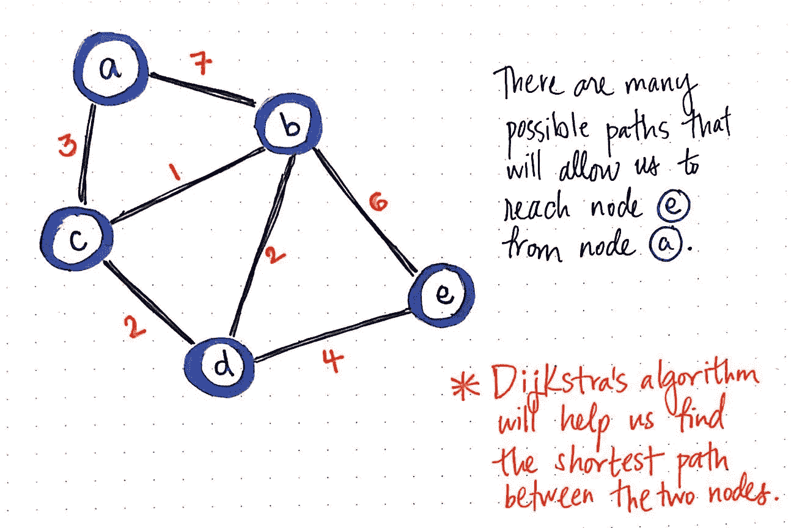

# 为什么竞技编程热爱数据结构和算法？

> 原文：<https://medium.com/nerd-for-tech/why-does-competitive-programming-love-data-structures-and-algorithms-a69b53077ce8?source=collection_archive---------3----------------------->

竞技编程的重要性是什么？

# 介绍

从上一篇文章中，我得到了一些问题，总结成一个主要的查询，“这很好，但为什么每个人都需要知道它。有许多工程学科不需要它。我在过去的 5 年里一直在工作，但从来不需要实施其中的任何一项”。让我们创造一些假设性的问题，一起找出这些问题的答案。

# 为什么要学竞技编程？

> "竞争性编程是一项运动，就像板球、足球、游泳等."

为什么要学竞技编程？

如果你想成为像迈克尔·菲尔普斯那样著名的奥运游泳冠军，你需要练习，大量练习，然后和很多人竞争。编程的职业生涯也是如此，如果你想成为一名摇滚明星程序员，那么你需要练习大量的编程，并与许多其他程序员竞争，以找到你目前在层级中的位置。每当这个问题在你脑海里冒出来的时候，我不认为也不推荐任何人去想以上这些。请不要光顾它，否则你会开始害怕它，而不是崇拜它。

# 为什么要练习数据结构和算法？

为什么要练习数据结构和算法？

> 解锁第六感之前，先掌握常识。

让我们先来回答这个问题，“我在过去的 5 年里一直在工作，但从来不需要实施这些”。有人在过去的 5 年里工作得很舒适，因为一个优秀的程序员对代码编辑器的编码做出了贡献，这样他/她就可以看到所有那些聪明的建议，并在你推送代码之前发现它们的错误。严酷但在现实中，你是那种优秀程序员的顾客。

动力不足，现在让我们考虑一下现实。如果有人喜欢创建随意的按钮和静态页面，强迫他们成为他们不想要的人本身就是一种罪恶。不建议任何人重新发明轮子，但如果你是一名工程师，了解轮子是如何工作的，应该是你的常识。

敢于迈出一步并理解如何达成某种解决方案是很重要的，这不仅是因为你的问题得到了解决，而且在未来你将能够相当容易地解决从相似概念分支而来的问题。数据结构是久经考验的实用工具，通过它你可以将现实世界的问题建模到你舒适的想象世界中。另一方面，算法只是您在通用数据结构上执行的步骤，以便为您的特定问题创建定制的解决方案。

**比如:**

每个工程师都想在谷歌工作。假设你加入了谷歌，并被安排在**谷歌航班**团队。一个非常现实的问题是找到两个城市之间最便宜/最短的航班，无论是直达航班还是中转航班。

谷歌航班算法

如果您通过执行一些 SQL 查询从您的数据库中找到直飞航班，那么祝您好运，但是如果直飞航班不存在，您将不得不编写一个基于**图数据结构**的**算法**，其中每个节点代表一个城市，您的目标是找到图中两个节点之间的最短路线。

> 工程学院的逃课课，有印象吗？

最短路径算法。

# 竞争性编程和 DSA 有什么关系？

这个问题的答案很简单，没什么。CP 和 DSA 没有任何共同点，但如果不是 DSA，那是什么？我试着想象许多事情，但我找不到任何像 DSA 一样可量化和基本的东西。比方说，你想买一台电视，你可以在原产地、机身颜色、边框、价格、品牌等诸多因素的基础上进行判断。但是如果你要建立一个单一的衡量标准来评判世界上所有的电视，我认为没有什么比“图像质量”更接近的了。

竞争编程和 DSA 之间的关系也是如此。它的存在是因为我们应该根据对每个人都有期望的一些基本的东西来判断程序员，而不需要在某个特定领域进行非常精确的训练。比如，如果你想在你的 **CSS** 技能上竞争，看看 [https://cssbattle.dev](https://cssbattle.dev)

# 结论

说了所有赞成 CP 和 DSA 的话后，我想用一句相当悲伤的话来结束我的发言。它应该被使用而不是被滥用。人们和公司开始仅仅根据 DSA 来衡量候选人的潜力。像 FAANG 这样的公司也因此声名狼藉。在很大程度上，这对他们来说似乎没问题，因为他们每天收到 1000 份申请，他们需要平等地对它们进行评判。但是，即使是小众公司也更倾向于将此作为一种招聘实践，从而创造了一个肮脏的市场，在这个市场上，这些值得学习的话题被灌输。整个 youtube 都充斥着“如何破解亚马逊”之类的视频。像 leetcode、hacker rank、CodeChef 等网站仅仅是为了找工作。我想知道他们的用户群中有百分之多少在找到一份好工作后继续练习。

> 这些工具的存在是为了让混乱变得有序，解决问题，推动项目，但从未被想象成获得高薪工作的通行证。

# 去连接

🏭领英:[https://www.linkedin.com/in/sameerkumar1612
🏠网址:](https://www.linkedin.com/in/sameerkumar1612/)[https://hi-same er . web . app](https://hi-sameer.web.app/)

