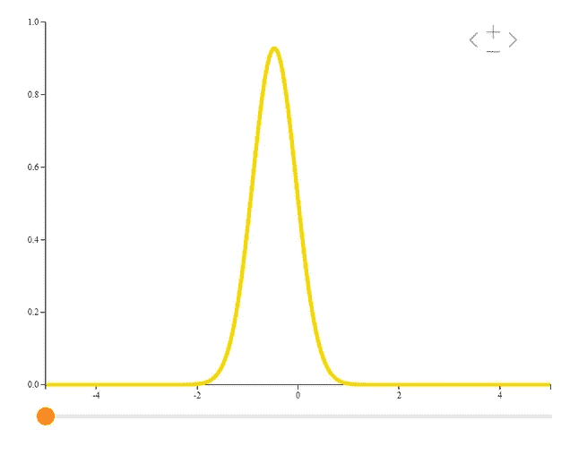
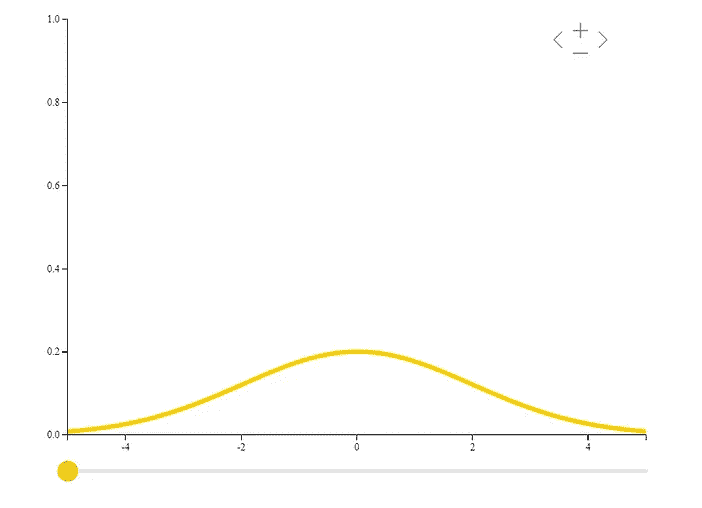
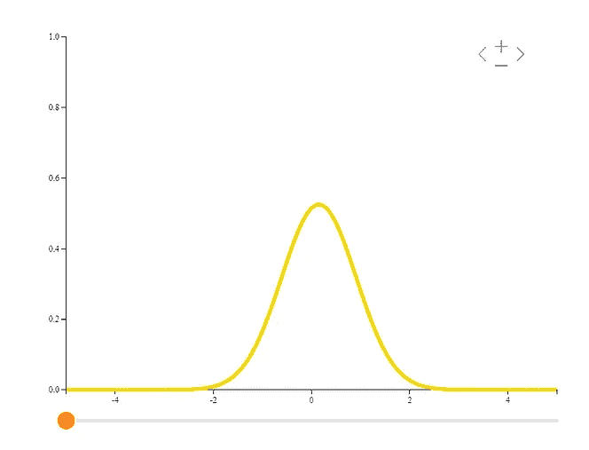
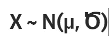
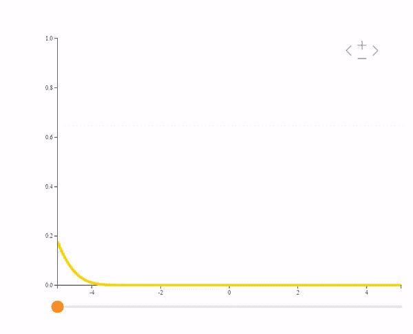
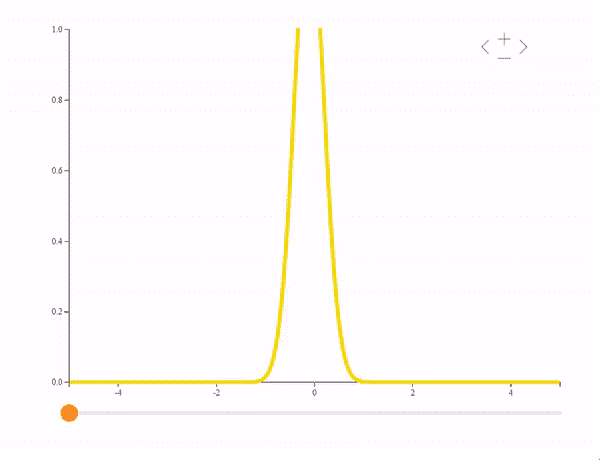
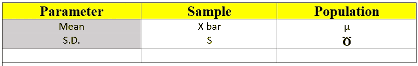
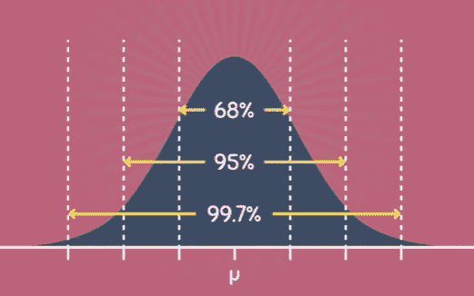
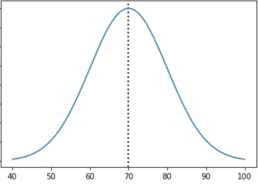
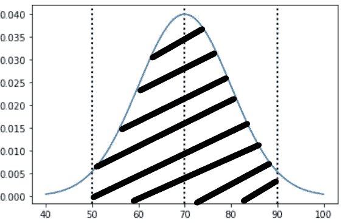

# 为什么大家都执着于正态分布？

> 原文：<https://medium.com/nerd-for-tech/why-everyone-is-obsessed-with-normal-distribution-d631dab5b979?source=collection_archive---------2----------------------->

照片由 [Azin Javadzadeh](https://unsplash.com/@azinjx?utm_source=medium&utm_medium=referral) 在 [Unsplash](https://unsplash.com?utm_source=medium&utm_medium=referral) 上拍摄

> “我一直认为，我的生活一定不正常，但我的数据分布一定正常！！!"-金梅

正态分布是由**卡尔·弗里德里希·高斯**首先发现的。这就是为什么它也被称为**高斯分布。**虽然它最初被称为高斯分布，但当 19 世纪发表的研究表明许多自然事件似乎正态偏离平均值时，这个词就被采用了。博物学家弗朗西斯·高尔顿爵士在他 1889 年的著作《自然遗传》中将“正常变异”的概念推广为“正常曲线”。

高斯分布的最大优点是，来自任何分布的一组样本的平均值近似于高斯分布，样本越多，近似值就越精确。

数据科学就是关于数据的。分布告诉我们关于数据的信息。数据是如何表现的，它有什么特点，我们能从中得出什么结论和推论！让我们看看什么是正态分布...

有两种类型的分布:

1.掷硬币或掷骰子总会给你一个不连续的[可数的]结果。代表离散数据的分布称为**离散分布。**

a.均匀分布

b.伯努利分布

c.二项分布

d.泊松分布

上面提到的都是离散分布。

2.测量距离，测量人的高度，总是会给你持续的结果。我们不能离散计数或可以取连续值的分布称为**连续分布。**

a.正态分布

b.学生 T 分布

c.卡方分布

d.指数分布

e.配送

以上都是连续分布。

那么主要的问题就产生了，为什么统计学如此执着于正态分布？

首先，让我们了解什么是正态分布。

描述正态分布有两个重要的东西。

*   **平均值** —这是样本中所有点的**平均值**，计算方法是将这些值相加，然后除以样本中值的总数。
*   **标准偏差** —这表示数据集偏离样本平均值的程度。

**常态分布**

正态分布由两个参数决定:均值和方差。一个**均值为 0** 、**标准差为 1** 的正态分布称为**标准正态分布。**

正态分布是一条钟形曲线，理想情况下**均值=众数=中位数。**

最重要的是正态分布[图片来自作者]

当数据分布集中在中心或平均值处时，通常结构是正态分布。如果我们绘制它，那么它看起来像一个钟[见上图],因此，它被称为钟形分布。

您可以通过一个简单的公式来量化正态分布，

作者图片

作者图片

看这个公式不要慌。理解起来很简单。由于正态分布仅由两个参数定义，即均值和标准差，上述公式为，对于属于正态分布 **N** 的变量 **X** ，其均值为，标准差为**ծ**。

**正态分布的假设:**

> 平均值的抽样分布是正态的。

如果你收集了一个样本，确定了它的平均值，并记录下来；接下来，你采取了第二个，独立的样本(来自同一人群)，确定其均值，并记录下来；并重复了几次；然后考虑你的值是如何分布的，那么你写下的值的分布总是一个完美的钟形曲线。

换句话说，只要每个样本包含相当数量的观察值，均值的抽样分布就一定是正态的。因为常态对于大样本总是准确的，如果我们要做一个适用于所有情况的假设，它必须是常态假设。

如果我改变正态分布的这两个参数呢？

*   我们首先会看到，如果我改变意思呢？？

相同的标准偏差，不同的平均值[所有荣誉归于作者]

在上面的视频中我们可以看到，如果我们改变均值【量化正态分布的第一个参数，放上标准差常数】，那么分布是如何变化的？由于正态分布以平均值**为中心，**标准差将保持不变。

现在我们来看看，如果我改变标准差呢？？

相同的意思，不同的标准偏差[全部归功于作者]

现在我们可以看到，分布集中在平均值上，但是离中心的距离在变化。它要么在膨胀，要么在收缩。这表示数据中有多少异常值。如果异常值很低，则分布的标准差很小，反之亦然。

当我们提到正态分布时，有两件事；

**样本和总体**。

*   **样本**是从总体中提取的一小部分数据。
*   **人口**是我们实验的全部数据。

根据平均值和标准差为样本和总体创建一个术语。

样本和总体的均值和标准差[图片由作者提供]

像这样，我们就可以理解问题是关于样本或总体的。

68–95–99.7 规则:

作者图片

如果我们偏离平均值 1 个标准偏差，那么大约 68%的样本点将会包含在这个范围内。如果我们从平均值开始，那么我们将会覆盖几乎 95%的例子。如果我们从平均值开始计算 **3 sd** ，那么我们将覆盖分布中几乎 99.7%的数据点。人们倾向于走得更远，也是因为正态分布的线**从不接触 x 轴**，但实际上这些百分比可以覆盖分布中几乎所有的点。

为了前任。

> **正态分布的均值为 70，标准差为 10，在 70 和 90 之间会包含什么区域？**

→假设:

## >>平均值:70

## >>标清:10

如果我们试图绘制这个 ND，那么它将

作者图片

根据给定的信息，如果我们离开平均值 2sd，那么它将是 50 和 90 之间的区域，该区域将是我们前面讨论的 95%。

突出显示的区域在 50 到 90 之间[图片由作者提供]

从所有的假设来看，上图是平均值的 2 倍标准差。大概占 50 到 90 也就是 40 个单位。

问题是要找出 70 到 90 之间的区域，所以它是 50 到 90 区域的一半。

因此答案是 **20 台**。

我举这个简单的例子是为了让你理解均值、方差和标准差。

**对正态分布的执念:**

自古以来，许多事物都遵循同一类型的属性。

*   数兰花里的苹果，
*   测量身高，体重，
*   收缩压和舒张压，葡萄糖，
*   选举预测，
*   婴儿的出生体重，鞋码，
*   表演分数，
*   板球运动员的平均退休年龄，

还有更多…..

服从正态分布的量是无穷无尽的。由于其有用类型，它被称为**正态**分布。**钟形曲线**描述了符合正态分布的数据形状。如果我们在日常生活中看到很多次，我们称之为正常。正态分布的情况也是如此，大多数统计和推断问题都遵循正态分布，这是如此普遍，以至于从业者开始首先假设它是正态的，然后使用假设检验来证明或否定这一点。

关于正态分布有很多东西，

中心极限定理:给定 N 个观察值的随机独立样本，样本均值的分布随着 N 的增加而接近正态，而与总体分布的形状无关。

大数定律、正态分布及其 PDF、正态分布和 Z 表、证明或否定正态分布存在的统计测试，但这只是为了关注正态分布的核心和基础，所以我暂时忽略了这些。

**参考文献**

*   [**所有的统计数据由拉里·a·乏色曼**](https://link.springer.com/book/10.1007/978-0-387-21736-9)
*   [**与 Josh Starmer 的 stat quest**](https://www.youtube.com/c/joshstarmer)
*   [**Brilliant.org。*连续随机变量****——*](https://brilliant.org/wiki/continuous-random-variables-probability-density/)*概率密度函数。*
*   [**百科**](https://en.wikipedia.org/wiki/Normal_distribution#Standard_normal_distribution) *。*
*   [**常态的假设。**](http://www2.psychology.uiowa.edu/faculty/mordkoff/GradStats/part%201/I.07%20normal.pdf)
*   [**Nic 博士的数学与统计**](https://www.youtube.com/c/CreativeHeuristics)