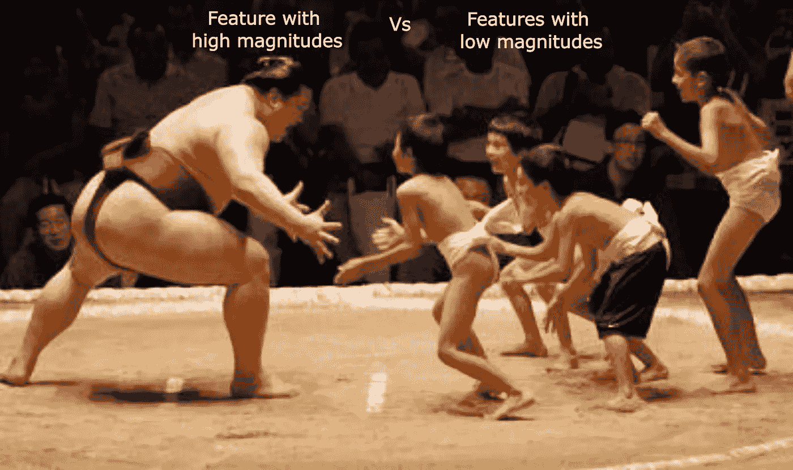
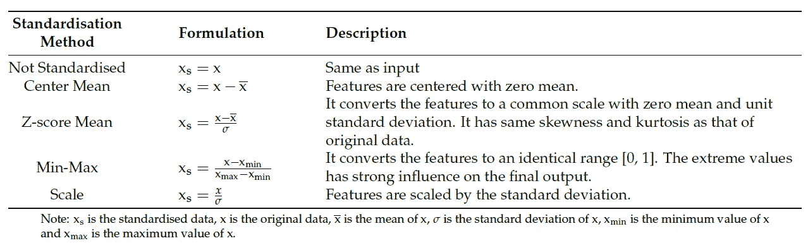
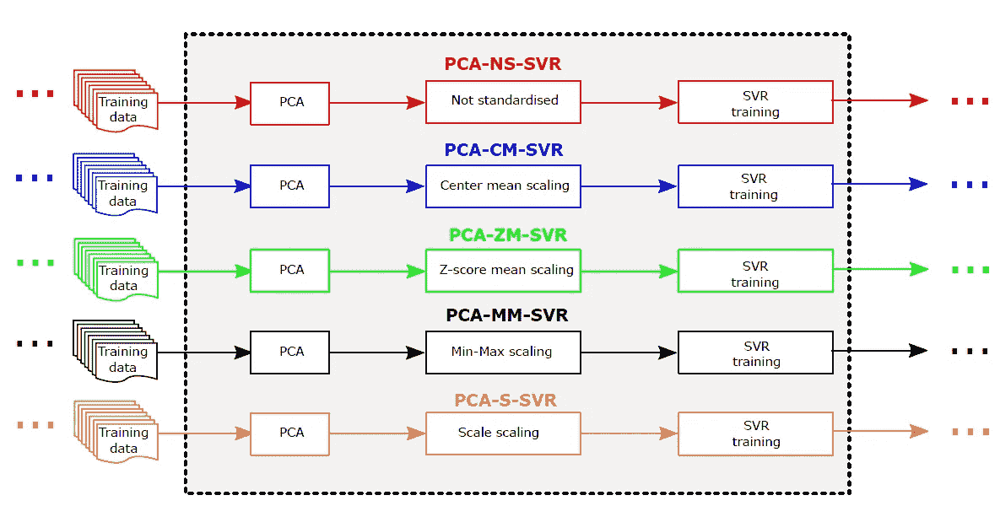
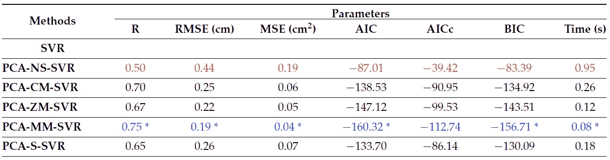

# 为什么特征缩放(或标准化)在机器学习中很重要？

> 原文：<https://medium.com/nerd-for-tech/why-feature-scaling-or-standardization-is-important-in-machine-learning-aaba175b664?source=collection_archive---------0----------------------->

**图 1:** 图片来自作者

在各种特征工程步骤中，特征缩放是最重要的任务之一。在机器学习中，有必要将所有特征带到一个共同的尺度上。 ***特征的缩放保证了具有相对较高幅度的特征不会支配或控制训练好的模型*** 。在本文中，首先，我们将了解经常用于缩放特征的方法，其次，我们将通过一个 [**案例研究**](https://www.researchgate.net/publication/354751895_Machine_Learning_to_Estimate_Surface_Roughness_from_Satellite_Images) 来了解任何一种方法的选择如何影响模型性能。

1.  **缩放方法**

现在让我们看看，有哪些方法可用于特征数据标准化。在图 2 中，我们汇编了最常用的缩放方法及其描述。

**图 2:** 不同的缩放方法及其说明。该图摘自[**Singh et al . 2021**](https://www.researchgate.net/publication/354751895_Machine_Learning_to_Estimate_Surface_Roughness_from_Satellite_Images)

2.**不同缩放方法的影响**

为了了解上面列出的缩放方法的影响，我们考虑了最近发表的一篇研究文章。在本文中，作者提出了基于特征预处理的支持向量回归(SVR)算法的不同变体。总的来说，他们考虑了从卫星图像中提取的 7 个输入特征来预测地表土壤粗糙度(响应变量)。首先，他们应用了主成分分析，并考虑了解释约 99%方差的前五个主成分。之后，他们应用了图 2 中给出的所有五种缩放方法。基于此，他们将每种方法命名为如图 3 所示。

**图 3:** 基于降维和缩放的 SVR 变体。该图摘自 [**辛格等人 2021 年**](https://www.researchgate.net/publication/354751895_Machine_Learning_to_Estimate_Surface_Roughness_from_Satellite_Images)

一旦他们训练了 SVR 模型，他们就通过使用 R(相关系数)、RMSE(均方根误差)、MSE(均方误差)、AIC(阿凯克的信息标准)、AICc(修正的 AIC)、BIC(贝叶斯信息标准)和计算时间作为性能指标来评估他们的性能。结果列于图 4 中。

**图 4:**SVR 模型不同变体的比较。图摘自 [**辛格等人 2021 年**](https://www.researchgate.net/publication/354751895_Machine_Learning_to_Estimate_Surface_Roughness_from_Satellite_Images)

他们的结论是，SVR 的**最小-最大(MM)缩放变体(也称为范围缩放)优于所有其他变体**。

**参考文献**

[【1】。Singh Abhilash、Kumar Gaurav、Atul Kumar Rai 和 Zafar Beg“从卫星图像估计表面粗糙度的机器学习”，遥感，MDPI，13 (19)，2021，DOI: 10.3390/rs13193794。](https://www.mdpi.com/2072-4292/13/19/3794)

**建议阅读**

[【1】。Singh、Abhilash、Jaiprakash Nagar、Sandeep Sharma 和 Vaibhav Kotiyal。"预测无线传感器网络入侵检测 k-barrier 覆盖概率的高斯过程回归方法."专家系统及应用 172 (2021): 114603。](https://www.sciencedirect.com/science/article/abs/pii/S0957417421000440)

[【2】。Singh、Abhilash、Vaibhav Kotiyal、Sandeep Sharma、Jaiprakash Nagar 和程-李骥。"预测平均定位误差的机器学习方法及其在无线传感器网络中的应用." *IEEE 访问*8(2020):208253–208263。](https://ieeexplore.ieee.org/abstract/document/9261408/)

[【3】。Singh，Abhilash，Amutha，j .，Nagar，Jaiprakash，Sharma，Sandeep 和 Lee，Cheng-Chi。“LT-FS-ID:基于对数变换的特征学习和特征缩放的机器学习算法，预测使用无线传感器网络进行入侵检测的 k 障碍
,《传感器》，第 22 卷，第 3 期，第](https://www.mdpi.com/1424-8220/22/3/1070) [(2022)](https://www.mdpi.com/1424-8220/22/3/1070) [1070 页。DOI:10.3390/s22031070](https://www.mdpi.com/1424-8220/22/3/1070) 。

***注:*** 如有任何疑问，请写信给我(***【abhilash.singh@ieee.org】***)或访问我的 [**网页**](https://www.abhilashsingh.net/?source=medium_scaling_roughness) 。

# 别忘了订阅我的 YouTube 频道。