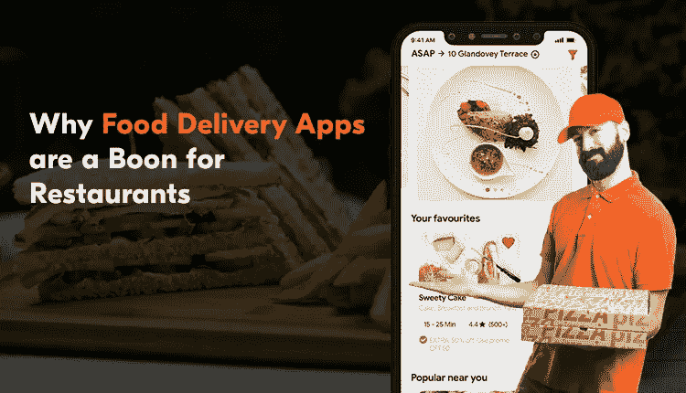
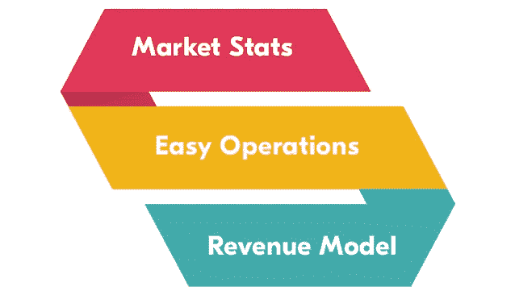
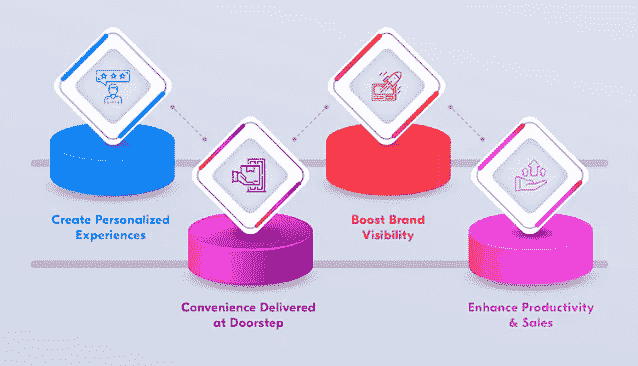

# 为什么送餐应用是餐馆的福音？

> 原文：<https://medium.com/nerd-for-tech/why-food-delivery-apps-are-a-boon-for-restaurants-bcda09cbd443?source=collection_archive---------1----------------------->

在线食品行业的全球交付市场将在 2028 年左右产生 3887.4 亿美元的收入。这些数字证明了食品配送应用的影响是积极的。这是什么原因呢？方便。由于该应用程序使客户能够轻松访问附近的餐厅，与他们联系，点餐并在此后获得送货上门服务，他们的知名度在很大程度上得到了提高。

本文将详细阐述这一方面。阅读后，您将了解该解决方案对餐厅设置的整体效果。它也将帮助你弄清楚为什么那些计划数字化他们的餐馆运营的人应该利用它们。

# 送餐应用——受欢迎的原因

当你踏上[为餐馆开发在线送餐应用](https://www.fooddeliveryclone.com/blog/food-delivery-business-models/)的旅程时，你必须有关于该解决方案的实践知识。同样重要的是，你要知道该解决方案获得重视的原因。

## 操作简单

该应用程序以简单的方式完美运行，从而确保附近餐厅的顾客获得完美的送餐服务。

*   客户进入应用程序并添加他们的位置信息。
*   连接到附近的餐馆，搜索他们想要的食物，并下订单。
*   餐馆收到订单，确认订单，并指派送货司机去取货。
*   通知客户。
*   送货司机取走订单。顾客和前顾客可以互相跟踪，保持联系。
*   交货完成了。
*   评级和审查在最后提供。

## 食品配送应用的市场统计

数字很有说服力。下面提供的市场统计数据阐明了食品配送应用程序的性质和受欢迎程度。

*   到 2029 年，在线食品行业的市场规模预计将达到 3200 亿美元。
*   预计到 2027 年，市场规模将达到 1.45 万亿美元。
*   到 2027 年，用户数量将达到 26.442 亿。
*   目前的市场规模是 2022 年的 2156.9 亿美元。
*   按照 2022 年至 2028 年间 10.8%的 CAGR 计算，2028 年的收入将达到 3887.4 亿美元。

## 收入模型

对于任何解决方案，其成功的先决条件是它们是否有助于创收。这是食品订购和配送服务使用的东西。他们采用四种主要模式来增加餐馆的利润。

*   向司机和客户收取的交付和订单费用。
*   高峰时段、节日、特殊场合等收费。
*   餐厅因应用内促销活动而支付的广告费。
*   餐馆在平台上注册的订阅费。

所以你知道餐厅在线送餐 app 流行的原因。了解他们如何转变运营方式也很重要。

# 送餐应用对餐馆的影响

送餐应用对餐馆的影响是多样而巨大的。观察下面的指针，以便更好地动手操作。

## #1:创造个性化体验

谁不享受个性化的用餐体验——随心所欲地享受用餐的快乐？这是餐厅送餐应用程序实现的事情。

通过定制膳食功能，客户可以根据自己的喜好灵活定制菜肴，然后享受丰盛的大餐。

这是像 UberEats 这样的解决方案为其客户带来的可能性。这有助于提高用户参与度，并确保他们长期关注该解决方案。

## #2:在家门口提供便利

工作了一整天后，做饭成了一件费力的事情。限制活动，确保顾客在最需要的时候得到食物。

例如，你开了一个长时间的会议后很晚才回家，你不想准备东西——你有一个应用程序，这个应用程序允许你随时点你想吃的饭并享用它。

## #3:提高品牌知名度

通过按需送餐应用开发服务，餐厅获得了提升品牌知名度的支持。这是因为该解决方案支持他们让更多的客户了解他们的产品。

所以，总而言之，口碑是创造出来的。例如，如果顾客对餐馆提供的东西感到满意，品牌知名度将会成倍提高。

## #4:提高生产力和销售额

餐馆的在线食品交付应用程序在很大程度上提高了生产率和销售额。想知道怎么做吗？由于任务自动化通过该解决方案得到简化，员工可以专注于其他任务，如就餐客户和他们的订单，管理他们的账单等。，不一而足。

简而言之，该解决方案对餐馆来说无异于因祸得福，它的采用将提升和推动它们的价值，并确保它们通过采用它获得最大回报。

然而，在你开始之前，有一些要点你应该记住，并利用它们为你的餐馆服务。

# 如何从你的在线送餐应用中获取价值？

在利用餐馆在线送餐应用程序之前，请记住几个要点。

1.  研究客户和目标市场，仔细研究你的竞争对手和他们的行动。这将告诉你需要采取什么行动来提升你的应用程序的价值。它还会给你一个应用程序设计的想法，它的使用会提高你的受欢迎程度。
2.  选择允许顾客、餐馆和送货专业人员无缝连接的功能
3.  使用已经存在很久的技术
4.  从一家有能力开发现成食品的公司那里获得现成食品，外包这些产品。

了解了确保您从食品配送应用程序中获得最大益处的不同步骤，现在让我们了解一下应用程序开发的成本。

# 为餐厅开发送餐应用程序的成本

为餐馆开发一个在线送餐应用程序的成本将在 2 万至 8 万美元之间。如果情况复杂，增加了不相关的功能，或者在内部执行按需食品交付应用程序开发服务，它可能会上升。这是一个好主意，因此尽可能保持应用程序的相关性，并将产品外包。

# 包扎

食品配送应用程序将在 2028 年产生约 3887.4 亿美元的收入。因此，至少可以说，该解决方案对餐馆的影响是巨大而积极的。因此，如果你是一家线下经营的食品配送公司，就要利用你的应用程序的优势来获得解决方案。让食品配送克隆成为你的商业优势。品牌将会加速发展，更多的顾客会知道你。今天就联系专门的海外送餐应用程序开发人员，看看您的送餐应用程序创意是否成功成型，您是否获得了前所未有的回报。