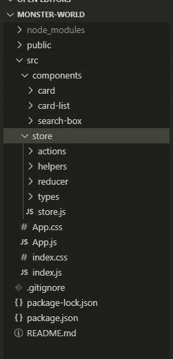

# 为什么要在 React 中去掉获取数据的承诺？

> 原文：<https://medium.com/nerd-for-tech/why-get-rid-of-promisesto-fetch-data-in-react-bd9f61b6e697?source=collection_archive---------13----------------------->

如何让你的代码结构良好！！


克里斯里德在 [Unsplash](https://unsplash.com?utm_source=medium&utm_medium=referral) 上的照片

嘿，**你还在一个大项目中使用承诺来获取数据吗，**这导致你的代码看起来很乱？

现在是时候将 ***从承诺切换到结构良好的数据获取*** 并使您的代码变得干净。所以，我们从一个文件开始到另一个文件。但是在你开始编码和 ***实现这个过程*** 之前，让我给你一个我们的文件结构是什么样子的概念…



这就是我们的代码看起来的样子，我建议你照着做。

```
**NOTE*: we have to only create a store folder only***
```

那么，让我们从 store 文件夹开始，在 store 文件夹中创建文件名 ***store.js*** 并编写如下代码:

***store.js***

```
import { createStore, applyMiddleware } from "redux";
import { persistStore } from "redux-persist";
import thunk from "redux-thunk";
import rootReducer from "./reducer/rootReducer";
import { composeWithDevTools } from "redux-devtools-extension";export const store = createStore(
 rootReducer,
 composeWithDevTools(applyMiddleware(thunk)),
);
export const persistor = persistStore(store);
export default store;
```

***关于这个代号:***

**createStore** 授予我们 ***创建商店*** 的权限。也就是有减速器(你可以创建多个，但是我已经导入了一个有多个减速器**的根减速器**。

在此之后，thunk is **中间件**允许副作用运行而不阻塞状态更新。我们在商店中应用了中间件。Persisitor 用于我们商场使用的本地存储。

之后，创建文件夹 reducer 并创建根 Reducer，以便在根中添加多个 Reducer。

***root reducer . js***

```
import { combineReducers } from "redux";
import { persistReducer } from "redux-persist";
import storage from "redux-persist/lib/storage";
import adminReducer from "./adminReducer";const persistConfig = { key: "root", storage, whitelist: [] };
const rootReducer = combineReducers({
 admin: adminReducer,
});
export default persistReducer(persistConfig, rootReducer);
```

***关于这段代码:***

在这里，我们配置了我们在代码中使用的持久化器。而 ***rootReducer*** 就是用合并器来合并那些 Reducer。并且我们已经通过 **admin** (记住这个以后用)**初始化了这个缩减器的名字。**之后，我们用**配置**和 **rootReducer** 输出了这个**持久器**。

接下来，我们创建了 adminReducer，这是我们在 rootReducer 中使用的。让我们创建文件:

**admin reducer . js**

```
import * as types from "./../types/types";const initalState = {
 **monsterList**: [],
};const adminReducer = (state = initalState, action) => {
 **switch (action.type) {**
  case types.FETCH_MONSTER_DATA:
   return {
    ...state,
    **monsterList**: action.payload,
   };
  default:
   return state;
 **}**
}
export default adminReducer;
```

***关于这段代码:***

在这里，我们创建了一个名为 monsterList 的状态，我们将使用它来存储数据，这些数据将在我们点击 API 时存储，我们将在我们的组件中使用它来提取数据。

我们使用了一个开关来匹配我们在动作中使用的大小写，其中动作确定哪个状态与它相关，动作存储数据。

之后，我们将在包含 adminAction 文件的 **Actions** 的 store 文件夹中创建一个文件夹。

***adminAction.js*** :

```
import * as actionTypes from "./../types/types";
import { handleResponse } from "./../helpers/userServices";export const **MonsterListing** = () => {
 return (dispatch) => {
  const request = new  Request("[https://jsonplaceholder.typicode.com/users](https://jsonplaceholder.typicode.com/users)", {
   method: "GET",
   headers: new Headers({
    "Content-Type": "application/json",
   }),
  });
  return fetch(request) **.then(handleResponse)**
   .then((data) => { **// NOTE HERE** **dispatch({
     type: actionTypes.FETCH_MONSTER_DATA,
     payload: data,
    });**
    return 1;
   })
   .catch((error) => {
    return 0;
   });
 };
};
```

***关于这段代码:***

我们已经创建了一个名为 **MonsterListing、**的动作，并看到了 URL 路径，然后在我注释了“ ***的地方查看，注意这里是*** ”。我们在那里调度类型名 **FETCH_MONSTER_DATA** ，我们也在 **adminReducer** 中使用它。这被称为减速器，传递数据相关状态，具有相同的**动作类型**。

## **注:**

创建文件夹名称**类型**并创建文件名:

**types . js**

```
export *const* FETCH_MONSTER_DATA = "FETCH_MONSTER_DATA";
```

我们在返回数据时使用了一个函数，这个函数名为 handleResponse，它处理响应并从 API 返回数据。

因此，在店内创建一个文件夹，用**助手**命名该文件夹，并创建一个文件名

**userservice . js**

```
import swal from "sweetalert";export const handleResponse = (response) => {
 return response.text().then((text) => {
  if (response.status === 500) {
   swal({ title: "Error!", text: 'Something Went Wrong! Please Try Again Later.', icon: "error" });
  }
  const data = text && JSON.parse(text);
  if (!response.ok) {
   if (response.status === 401 || response.status === 400) {
    localStorage.removeItem("token");
    window.location.href = "/";
   }
   const error = (data && data.message) || response.statusText;
   return Promise.reject(error);
  }
  return data;
 });
};
```

几乎所有的事情都完成了，我们只需要在 APP.js 中设置这个动作(或者你想调用这个动作的地方)。

所以，让我们开始吧，

**app . js**

```
// import component and whatever you neededimport { MonsterListing } from "./store/actions/adminActions";
```

每当我们在组件中调用 API 时，我们都使用生命周期方法，所以让我们使用 componentDidMount。但在此之前，让我给你展示一下我们以前是如何调用 API 的:

```
componentDidMount() 
  fetch("[https://jsonplaceholder.typicode.com/users](https://jsonplaceholder.typicode.com/users)")
  .then((response) => response.json())
  .then((users) => this.setState({ monsters: users }));
 }
```

相反，我们只需要调用我们已经创建的动作。像这样:

```
componentDidMount() {
  // we're receiving in props because we're connecting component with connect at the end of the component. this.props.MonsterListing();
 }
```

让我们看看为什么使用**this . props . monster listing():**

```
const mapStateToProps = (state) => ({
 admin: state.admin,
});
export default connect(mapStateToProps, { MonsterListing })(App);
```

首先，您需要从“react-redux”导入连接。但问题仍然是我们使用这个的方式。行动前的道具？

答案是**“Redux 分派传递到道具中的动作(在花括号中)。因此，如果我们没有调度或者我们需要调用 API，那么我们需要使用它。道具”。**

所以，请看 ***App.js 的完整代码:***

```
import React from "react";
import "./App.css";
import { CardList } from "./components/card-list/card-list";
import { SearchBox } from "./components/search-box/search-box.component";
import { connect } from "react-redux";
import { MonsterListing } from "./store/actions/adminActions";class App extends React.Component {
 constructor(props) {
  super(props);this.state = {
   searchField: "",
  };
 }
 componentDidMount() {
  this.props.MonsterListing();
 }render() {
  const { monsterList } = this.props.admin;
  const { searchField } = this.state;
  const filteredMonster = monsterList.filter((monster) =>
   monster.name.toLowerCase().includes(searchField.toLowerCase()),
  );
  return (
   <div className="App">
    <h1>Monster's World</h1>
    <SearchBox
     placeholder="Search Monster"
     handleChange={(e) => this.setState({ searchField: e.target.value })}
    />
    <CardList monsters={filteredMonster} />
   </div>
  );
 }
}
const mapStateToProps = (state) => ({
 admin: state.admin,
});
export default connect(mapStateToProps, { MonsterListing })(App);
```

还有，可以参考我的 Github 代码:[见完整代码](https://github.com/ArunKashyap199/monster-world)

感谢您的阅读，如果您有任何疑问，请告诉我。