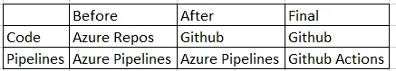

# 为什么我对 GitHub 感到失望

> 原文：<https://medium.com/nerd-for-tech/why-i-am-dissapointed-in-github-16fd664754ef?source=collection_archive---------8----------------------->


(如果 github 不允许这个图片，我可以删除它)

让我们从我为什么使用 GitHub 开始。

从一开始，我们公司就是一个微软商店。我们的第一个平台是用。NET FW，我们的云提供商是 Azure，所以我们使用后来成为 Azure DevOps 的 Visual Studio Online 是很自然的。我们的整个代码库都在那里，我们也有许多管道，让我们自动化部署已经很多年了。

但是现在，由于一些内部情况，以及多样化提供者的需要(另外 Azure Pipelines 在过去几个月出现了很多问题)，我们希望开始使用 GitHub 作为我们的代码库，自然，我们也将使用 GitHub 操作。GitHub 有一个非常便宜的团队层，它为我们提供了我们需要的东西(理论上)。

我们要转移的代码对应于我们正在构建的平台的第二个版本(大部分在 NodeJs 中，但仍在 Azure 中)。

我们的第一步是将所有代码从 Azure Repos 转移到 GitHub。我在周末花了大约两个小时来做这件事(这样车队就不会被堵住了),一切顺利，没有任何麻烦。

*提示建议:千万不要用导入，只需做一个普通的* `*git clone*` *，改变 git 原点，然后做一个*`*git push*`*`*master*`*分支。这样更简单快捷。你得到了全部的大师历史。如果你有其他分支，你可以做同样的程序。**

*周一，一旦我们有了 GitHub 中的所有代码，我们在 Azure Pipelines 中再次创建了所有管道(但仍然使用位于每个回购中的相同的`azure-pipelines.yml`脚本),但现在它们将从 GitHub 中检出。我们这样做是为了不阻碍团队继续他们的冲刺，因为 GHA 脚本需要更长的时间来转换。*

**

*我们计划好的旅行*

*现在是时候做一个概念验证来运行一个完整的迁移了，这是我们开始这篇文章的中心部分。*

# *第一步，Azure 工件到 GitHub 包*

*像往常一样，在每个有许多模块和应用程序的平台中(特别是现在有了微服务模式)，总是需要共享一个不可避免地需要在私有 feed 中发布的公共基础或框架，在这种情况下是**Azure Artifacts**(Azure devo PS 的一个模块)。*

*GitHub 中的对应物叫做 **GitHub 包**。这两个解决方案是相似的，但是 GitHub 包也允许 Docker 图像，这是一个很好的补充(在我们的例子中，它允许我们消除 Azure 容器注册，并把所有东西放在一个地方)。*

*将 NodeJs 包发布到 GHP 非常容易，您只需将名称与 org 匹配，并在您的`package.json`文件中放入一个`publishConfig`部分，如下所示:*

```
*"name": "@myorg/mypack",
"repository": "[https://github.com/myorg/mypack.git](https://github.com/jztechpe/infra.git)",
"publishConfig": {
    "registry": "[https://npm.pkg.github.com](https://npm.pkg.github.com)"
 },*
```

*然后对注册中心执行一个`npm login`(使用您用户名、PAT 和您的电子邮件)来将您的凭证和令牌存储在您的本地机器中，然后您可以运行`npm publish`来发布这个包。*

*所以，运行这些步骤很简单。我们所有的内部包现在都正确地发布到了 GitHub 包中。*

*如果不能使用这些包，发布就没有任何意义，所以下一步是构建一个 Docker 映像，其中包含我们第一个需要这些包的微服务。请记住，这在使用 Azure DevOps 之前就已经完成了，因此我们可以肯定地知道映像已经正确构建并运行。*

*我们的第一个问题就是从这一点开始的。*

*我们的 Dockerfile 会像往常一样复制代码，运行`npm ci`，然后启动`node index.js`。为了从我们的内部 feed 安装软件包，我们必须在`package.json`文件旁边有一个名为`.npmrc`的文件。该文件的内容应该类似于:*

```
*[@m](http://twitter.com/jztechpe)yorg:registry=[https://npm.pkg.github.com/](https://npm.pkg.github.com/)
[@m](http://twitter.com/jztechpe)yorg:always-auth=true*
```

*其中`myorg`是您的 github 组织。*

*我第一次尝试构建映像时，由于 403 未授权而失败，这意味着您没有访问该私有提要的权限。*

*在绞尽脑汁了一天，阅读了一些 github 问题和文章后，我发现了一条关于`package-lock.json`文件的非常微妙但关键的信息。*

*事实上，问题就在那里:所有注册的包都连接到我们的 Azure Artifacts 私有 feed(甚至那些应该在公共注册表中的包，我们稍后会解释原因)，这显然是我们想要避免的。*

*我尝试的第一件事是删除文件，并再次运行一个`npm install`。它不起作用。它不断生成 AA feed 的链接。所以我接下来做的是:*

1.  *运行`npm cache clean --force`以避免任何缓存。*
2.  *删除我的机器 npmrc 文件(在`%USERPROFILE%/npm`)。*

*这些步骤的结果是，我现在运行了一个新的 npm 副本。没有缓存，也没有登录的干扰，我再次运行了一个`npm install`。*

*这次成功了！。所有在 npmjs.org 发现的包裹，现在都与此相关，我们的私人包裹如我们所料来自 GHP。*

*于是我终于再次运行`docker build`，镜像构建成功。这个 docker 构建是使用 GitHub 操作完成的(获取示例非常容易),我的 docker 文件如下所示:*

```
*FROM node:15-alpine AS builderARG NPM_INSTALL_TOKEN
ENV NPM_INSTALL_TOKEN $NPM_INSTALL_TOKENENV NODE_ENV=production
WORKDIR /app
COPY package*.json ./
COPY .npmrc ./# npmrc needs to have a blank ending line for this to work
RUN echo //npm.pkg.github.com/:_authToken=$NPM_INSTALL_TOKEN >> ./.npmrc# install all dependencies
RUN npm ci
RUN npm install pino-papertrail
COPY . .ENTRYPOINT node "/app/src/index.js"*
```

*这里有两个关键点。*

*第一个是 ARG NPM _ 安装 _ 令牌，这是您使用`packages:read`权限创建的 PAT，需要作为构建参数传递给`docker build`命令。*

*注意:在文档的某些部分说你可以使用 GITHUB_TOKEN，但是我停止使用它了，因为我的包是作为 org-level 安装的，并且这个 TOKEN 只能在你正在处理的库内工作。*

*第二个是使用(`RUN echo //npm.pkg.github.com/:_authToken=$NPM_INSTALL_TOKEN >> ./.npmrc`)将这个令牌添加到 npmrc 文件中。*

**我知道将令牌写入 npm 文件可能不安全，但在我的情况下，docker 映像将位于私有注册表中，因此风险很低。**

*我的 GitHub 操作工作流程如下所示:*

```
*on:
  workflow_dispatch: # to allow manual execution
  push:
    branches: [main]
jobs:
  build:
    env:
      srcPath: core
      imageBase: ${{ github.repository }}
      ORG_BUILD_DEPLOY_TOKEN: "${{ secrets.ORG_BUILD_DEPLOY_TOKEN }}"
    runs-on: ubuntu-latest
    steps:
    - uses: actions/checkout@v2
    - uses: nanzm/get-time-action@v1.1
      id: time
      with:
        timeZone: -5 # Peru
        format: 'YYYYMMDD_HHmmss'
    - uses: docker/login-action@v1
      name: Log in to GitHub Docker Registry
      with:
        registry: ghcr.io
        username: ${{ github.actor }}
        password: ${{ env.ORG_BUILD_DEPLOY_TOKEN }}
    - uses: docker/build-push-action@v2
      name: Build docker image and push
      env:
        imageTag: ${{ steps.time.outputs.time }}
        imageUri: ghcr.io/${{ env.imageBase }}
      with:
        context: ${{ env.srcPath }}
        build-args: NPM_INSTALL_TOKEN=${{ env.ORG_BUILD_DEPLOY_TOKEN }}
        push: true
        tags: |
          ${{ env.imageUri }}:${{ env.imageTag }}
          ${{ env.imageUri }}:latest*
```

*此外，还有一个因素使事情变得更糟。有一样东西是 AA 有而 GHP 没有的，那就是上游信号源**。在 NPM(例如与 nuget 相反)，您只能配置一个注册中心来获取软件包。因此，为了获得应用程序需要的私有和公共包(如 axios)，您必须通过上游源将私有注册中心连接到公共注册中心(npm 在私有提要中查找，如果没有找到，它就在公共提要中查找)。因为 AA 的这个功能，我所有的`package-lock.json`引用都指向我的私有注册表。我们必须适应新的环境。***

***尽管我能够解决我的问题，但我确实认为拥有上游资源是必须的，令人惊讶的是 GHP 却没有。***

*既然我们已经构建并发布了 docker 映像，现在我们需要将它部署到我们的试运行和生产环境中。这就是我现在被困的地方。*

***总结***

*优点:GitHub 包允许 Docker 镜像。易于连接。*

*缺点:没有上游来源*

# *第二步，Azure 管道到 GitHub 动作*

*在我们的例子中，我们的开发工作流需要在转移到生产环境之前在试运行环境中进行一些手动检查，因此在测试完成之后，我们手动允许它被推到生产环境中。*

*这在 Azure Pipelines 中工作得很好，他们有环境的概念，然后为每个环境(STG 和 PROD)设置一个只能被某些人接受的批准检查。因此，通过这种方式，我们可以控制应用程序向生产环境的流动。*

*GitHub Actions 也有这个概念。然而**只适用于 GitHub 企业级(我们负担不起)**。**所以现在我们在死路一条，要把整个栈转换成 GitHub。***

```
*{{ TYPICAL PIPELINE STRUCTURE WITH THREE SERIAL STAGES OR JOBS }}code > [build] > artifact
artifact > [deploy] > stg
artifact > [deploy] > prod*
```

*以上是管道必须完成的典型结构:构建一个工件，并部署为该管道冻结的工件。理论上，我们不应该分离流程，因为您将面临部署“不同”的东西的风险(我知道您可以在一次提交中进行检查，但这更难执行)。*

*我试过了:*

1.  *创建单独的工作流以部署到 STG 或 PROD。*

*这并不简单，因为构建工作流结果(工件)应该通过管道进入部署工作流。但是如果它们是分开的，那么就不可能保持两者之间的强连接(例如，用相同的提交号启动两者)，甚至可能会出现同步问题(或人为错误)。*

*2.经过调查，默认的 github 动作不允许您从其他工作流下载工件。*

*然而，我发现这个动作[https://github.com/dawidd6/action-download-artifact](https://github.com/dawidd6/action-download-artifact)似乎解决了这个问题，然而，困难的部分仍然是如何将工件从构建到部署没有错误。*

*我试图生成一个`result.json`文件，并将其作为构建工作流工件上传。然后，在我的部署工作流中，使用这个定制操作，连接到构建工作流以获取工件，读取它，等等。然而，这导致了一个先有鸡还是先有蛋的问题，因为构建工作流的运行标识符在工件中，而我不能到达工件，因为我没有运行标识符。*

**

*3.很明显，正确的方法是让一个工作流包含三个任务(相互依赖)，这样可以很容易地共享同一个工件，避免阶段之间的任何不同步。但是，由于我们缺少团队层中的环境批准检查，似乎没有其他方法可以做到这一点(如果我们尝试使用手动批准来执行我们当前的工作流)。*

*另一方面，GitHub Actions 确实存在其他问题:*

*   *工作流文件必须位于。github/workflows 文件夹。虽然这只是一个习惯的问题，但当你有一个 monorepo 时，这是一种处理工作流的更混乱的方式。正确的做法应该是每个应用程序在自己的文件夹结构中有自己的工作流文件。*
*   *尽管 Marketplace 确实有许多可以使用的操作，但许多人只是觉得脱节或不够健壮。在 Azure Pipelines 的例子中，有更多的官方行动随之而来，你知道它们只是工作。*
*   *在 AP 中，你可以链接变量。虽然这不是一个主要问题，但它确实可以让你的脚本更整洁。所以你可以这样做:*

```
*variables:
  myvar: ABC
  myvar2: $(myvar)DEF*
```

*   *对于组织机密，首先你没有他们在自由层，所以你必须升级到团队层。第二，秘密不能用列表来组织。在我的例子中，我有一个“staging variables”列表，和一个镜像的“production variables”列表(具有相同的名称，但是不同的值)，所以这将允许我的脚本有一个单独的流。这在 GitHub 中是不可能的，所以当你有很多秘密的时候(甚至对于 N 个环境来说)，管理它们是非常困难的。*
*   *令人费解的是，要运行手动工作流，必须(手动)设置触发器`workflow_dispatch`。这对于任何工作流都应该是开放的。很多时候，您确实需要按需运行它。*

***总结***

*这是我最失望的地方。我认为 GHA 是一个更加强大和成熟的产品。*

*优点:yaml 语法短，执行速度非常快*

*缺点:没有秘密列表，默认情况下没有手动工作流，工作流文件位置，没有变量链接，尤其是没有对环境的批准检查。*

# *更新:Azure Repos vs GitHub*

*在这一部分，GitHub 应该统治 Azure Repos。但并没有我想象的那么势不可挡。在这几天里，我在 GH 中看到了一些更好的功能，但其他功能在 AR 中更好。*

*   *在 GH 中，克隆、推送、导航、编辑网页的速度更快。*
*   *在 AR 中，代码审查体验要好得多。你得到的文件夹将文件分组，这样可以更快地导航。*
*   *AR 比较算法看起来也更好，更精细。GH 的粒度更粗。*
*   *在 AR 中，我可以按组织(或项目)设置分支保护，但在 GH 中，只能在回购级别设置。当你有 5 个回复的时候，就可以了。但当你有 90 个回购时，那就太多了，再加上新的回购也需要手动配置。*

# *结论*

*作为 GitHub，也许是世界上最大的代码库，它的 GitHub Actions 产品看起来还很不成熟，这很令人失望。在 MS 收购 GitHub 的某个时候，我开玩笑说，那时 AzureDevops 可能会消失，让 GH 成为唯一的产品，但现在我甚至认为相反(至少在 Actions 方面)。*

*我还注意到的一件事是，GitHub 在设计时考虑了单个存储库，或者每个用户/组织可能有一堆存储库。许多东西在存储库级别运行(GITHUB_TOKEN、GitHub Packages Docker、Branch Policies 等),很少有 repo 是可以的，但是当您有 90 个 repo 时，在所有 repo 中应用策略，或者以标准化的方式配置它们是非常麻烦的。*

*有许多事情让我怀疑 GitHub 对公司工作流的能力(许多存储库，暂停的管道)。随着我对这篇文章的使用越来越多，我会尽量更新它。*