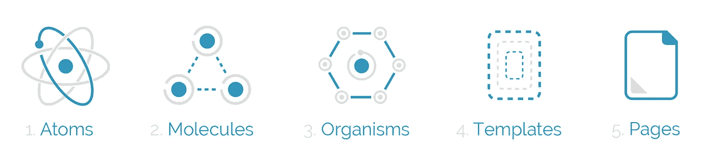
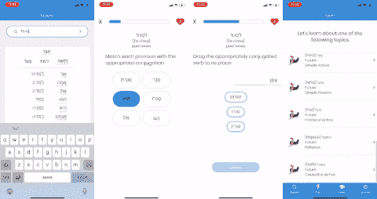
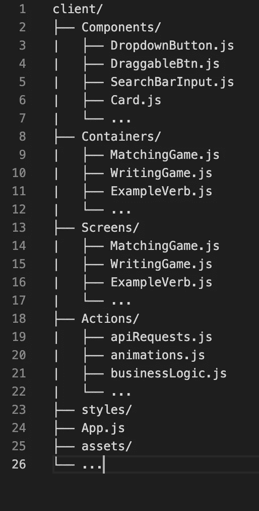
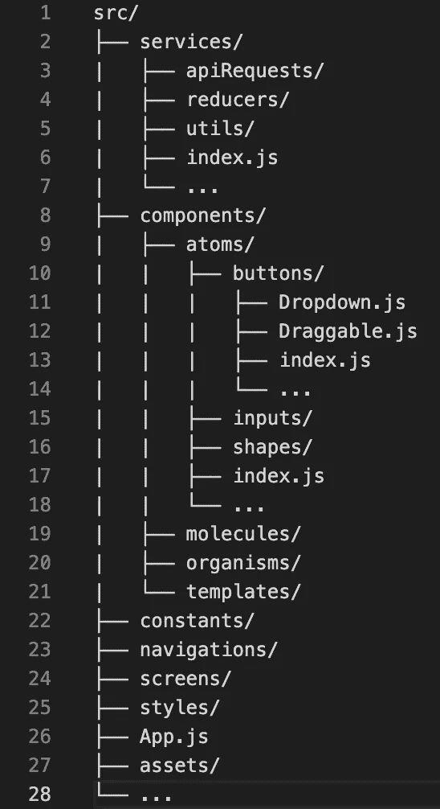

# 为什么我迁移到在我的 React 原生项目中使用原子设计…以及我面临了什么挑战

> 原文：<https://medium.com/nerd-for-tech/why-i-migrated-to-using-atomic-design-in-my-react-native-project-and-what-challenges-i-faced-65ab5ad12818?source=collection_archive---------3----------------------->

我在 React 原生项目中发现并转换到原子设计的经验概述。

从 https://danilowoz.com/blog/atomic-design-with-react 那里了解原子设计

首先，我将介绍我的经验、这个场景中应用的项目，以及我为什么对采用原子设计感兴趣。接下来，我将解释我采取了哪些步骤来迁移到原子设计模式。最后，我将讨论当我转向原子设计时所面临的挑战，以及我会有什么不同的做法。

所以让我们开始吧…

## 我的背景

我是一名自学成才的开发人员，使用 Javascript 将近四年，使用 React 大约两年。直到最近，我才开始学习 React Native 并尝试移动开发。

## 该项目

正在讨论的项目是一个教育应用程序，旨在帮助希伯来语学习者学习动词变化。它有 3 个主要特性和一些其他的支持特性。

讨论中的应用程序演示 [github 链接此处](http://github.com/jtalz/hebrootsMobileClient)

这个项目的前端使用 Expo 快速启动，并依赖于 react-navigation、react-native-gesture-handler、react-native-async-storage 等包。

其主要特征包括:
1。一个**搜索引擎**，它允许用户通过在搜索栏中键入该动词的一种形式(或翻译)来找到该语言中任何动词的完整变位表。
2。一个**交互式学习游戏**，它使用户能够通过回答多项选择(拖放)问题、写问题和匹配问题来练习动词变位(确定哪个变位属于哪个代词，例如。他跑了)。
3。**书面课程**，其为用户提供教育内容以学习如何恰当地结合每个动词模式。

支持功能包括:
1。一个**快速播放屏幕**，可以快速跟踪用户练习给定的动词集。
2。一个**设置屏幕**，供用户管理其个人详细信息和/或教学语言偏好。

在我自己学习希伯来语并发现动词变化对一些人来说是多么麻烦之后，我对创建这个项目产生了兴趣。我注意到像 Duolingo 这样的大玩家没有清晰的希伯来语学习选项，我认为它甚至可能成为一个有效的现实世界应用程序。此外，我对许多语言中动词变化的表格性质感到惊讶，将它们的性质与计算机科学概念(如对象)进行了比较，认为这将是一个有趣的项目。

## 为什么是原子设计？

最初，我的项目目录是这样构建的:

一开始，它工作得很好。我用项目不同部分的一些导入语句构建模块。然后，我开始构建越来越多的组件。屏幕越来越多。更多减压器。更多的国家管理。我开始合并更多的 API 请求，并且涉及到更多的业务逻辑。迟早，我决定是时候清理我的代码了，我意识到我有一个巨大的组织问题。不要误解我，代码成功了。它毫无例外地运行，但是如果另一个开发人员来阅读它，他们将需要很长时间才能找到自己的路。变量名是不可描述的，模块在意想不到的地方，我没有遵循任何正式的大小写约定。用干净的代码来说，这是一场灾难。在研究了如何构建一个 React 本地项目之后，我找到了这篇关于原子设计的文章。我稍微调整了一下他们的教导，以适应我的事业，但是在大量的离线工作之后(这是一个巨大的错误，尽管我将在后面详细介绍)，我的文件夹结构从上面的图片变成了这样:

有时迁移令人沮丧，但是一旦所有的重构都结束了，这是一个巨大的解脱。我相信这段源代码的可读性大大提高了。现在可以很容易地找到组件，导入和导出语句更加简洁，变量和目录名称也变得清晰。原子设计通过指导开发人员将模块整齐地组织到整齐组织的目录中，为项目提供了更多的专业感觉。

## 挑战

下面是我在迁移到原子文件夹结构时面临的一些挑战。
1。决定哪些组件放在哪个文件夹中。很自然，你会认为这是显而易见的，但是到了紧要关头，并不总是清楚一种成分是否应该进入*原子、分子或有机体。*是否仅使用原生组件？是在导入另一个原子吗？它有物理用户界面还是更多的是一个模板？
2。确定何时将业务逻辑模块化，以及何时将其保留在组件中。当然，减速器是模块化的，但是某些使用服务实用程序功能的初始状态需要保留在组件中，否则会导致需求循环。听说过[要求周期](https://stackoverflow.com/questions/55664673/require-cycles-are-allowed-but-can-result-in-uninitialized-values-consider-ref)吗？因为直到现在，我还没有…

## 我会有什么不同

有一件事我会做得不一样。改什么都要测试。我决定不做任何测试就下线一周。最后我为此付出了代价。当我最终运行我的代码时，我被无数的 require cycle 警告、类型错误和其他我从未见过的异常所困扰。只有在计算完所有这些之后，我才能够享受原子设计的好处。

最后，我明确地向您的任何 React 原生项目推荐这种模式。谢谢你。