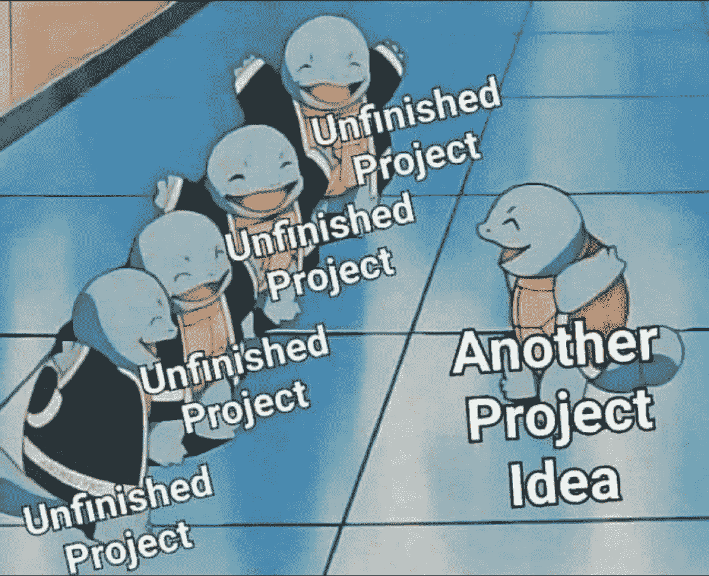

# 为什么我同时写 4 个项目

> 原文：<https://medium.com/nerd-for-tech/why-i-write-4-projects-simultaneously-b2e7151cc44e?source=collection_archive---------6----------------------->

如果你和我一样，你会同时写不止一个项目，并在它们之间切换。当我开始一个项目并达到某个我满意的程度后，我会开始下一个项目。

> 我个人认为 4 是我的极限，你的可能不同。

**但是**我总是完成我的项目，并开始下一轮 4 当所有当前…