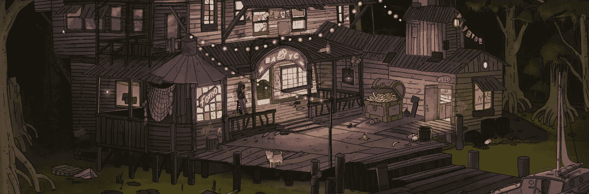
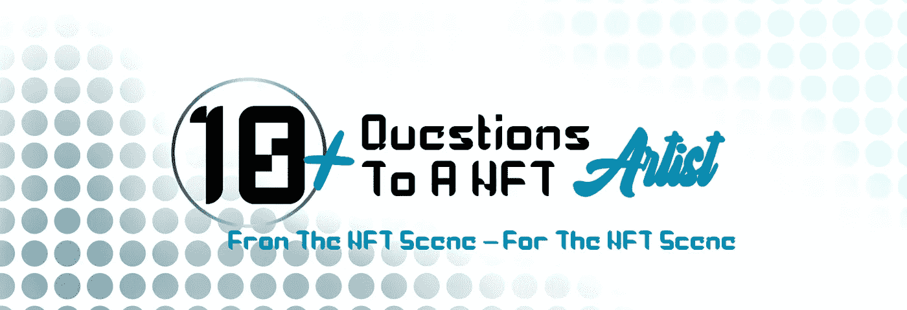

# 为什么采访 NFT 艺术家很重要？

> 原文：<https://medium.com/nerd-for-tech/why-interviews-with-nft-artists-are-important-3734b4eefcbd?source=collection_archive---------7----------------------->

去年，NFT 市场大幅增长。有像“无聊猿游艇俱乐部”这样众所周知的项目，但也有许多艺术家想把他们的艺术推销成 NFT。

无聊猿游艇俱乐部

这些艺术家通常没有团队在背后帮助他们营销。
**所以他们必须自己照顾它。**

我们知道，NFT 的空间主要是在 Twitter 上。
这是项目和艺术家们活动的地方。作为一名艺术家，你有很多机会在那里展示你的艺术。

# NFT 艺术家推广他们的 NFT 的可能性有多大？

## 最流行的方式是 shill tweets。

这些是由艺术家、收藏家和有影响力的人制作的，任何人都可以在下面展示他们的 NFT。你可以通过关键词识别推文，比如 shill，drop，show your art / nft。

有些给出了一些应该遵守的规则，例如，没有链接，只有图片…

来自大账户的 shill tweets 相对较快地拥有几百条评论，所以你会迷失在大众中。
来自小账号的 shill 推文通常**得不到太多关注**，所以这些推文**在人群**中迷失。

当推销你自己的艺术时，重要的是不要在每条推特上都这么做。如果有人在推特上发布了一些东西，然后用他们自己的 NFTs 对其进行了评论，这不会很好地被接受。

## 连接

友谊必须培养。NFT 地区的情况也是如此。在这里，它主要是支持他人。这是通过*点赞*、*转发*或*引用转发*来完成的。
**这也是 Twitter 上一个小简介如何成长的重要方式之一。**

这种对他人的支持应该是不求回报的。只要你做了，它就会自动回来。
不断要求别人转发或点赞是不受欢迎的。

## 直接消息

直接信息是与他人联系的一种方式。在这里，如果你用短信轰炸别人并要求他们转发一条推文，也要小心。这也不受欢迎。如果你只考虑你自己，你没有好机会。这是件好事。
**只有在一起我们才强大。**

但是 DMs 也可以完全瘫痪。如果有人没有跟随你，那么它可能是你的 DM 作为一个信息请求而被记录下来。

## DM 组

还可以选择创建 DM 组，并向所有成员展示您的作品。有些人不想在这样的群体里。

此外，这些群组中的消息会很快变得混乱，通知也会变得令人讨厌。

## Twitter 空间

Twitter 空间也是项目或艺术家展示自己的绝佳选择。这里有不同的格式，你必须睁大眼睛去发现正确的格式。

我想知道 NFT 世界真正缺少的是什么。

已经有各种东西了。**但是缺少的是对 NFT 艺术家的采访**。当然，除了那些不时在知名杂志上接受采访的大人物。

所以我想了想怎么养最容易。由于在这里发表文章很容易，所以 Medium 自然会提供给自己。我在单独的出版物上发表这些采访，以便有一个清晰的结构。

我想过可能的问题。几天来我一遍又一遍地看着这些问题，直到我满意为止。许多年前，我被允许对人们进行无数次采访，这对我很有帮助。

由于我想对每个人一视同仁，但仍给予一定的灵活性，我决定至少回答 10 个问题。

# 于是**【给一个 NFT 艺术家的 10+个问题】**这个概念就诞生了。

给 NFT 艺术家的 10 个问题

我开始在推特上或通过邮件联系艺术家。像 [Beeple](https://twitter.com/beeple) 这样的大牌是真的接触不到的。相反，我能够接触到一些伟大和成功的艺术家，当然是在其他人的支持下，比如 CryptoRabbit。
***艺人们都很善良，很乐意接受采访。很高兴得到这么好的回应，如果我能帮助他们也很好。***

这些采访将陆续发表。
在写这篇文章的时候，4 篇采访已经发表，还有一些正在等待发表。更多的艺术家同意接受采访。

为了更好地宣传采访，我从前 6 位艺术家那里买了一个 NFT，并在 Twitter 上抽奖。

这个概念在不断发展。了解推特个人资料背后的人并对他们有更多的了解是很好的。

你也想更多地了解 NFT 世界的人们吗？

那么你可以在这里做:[向一位 NFT 艺术家提出 10 个以上的问题](https://medium.com/10plus-questions-to-a-nft)。

欢迎订阅该出版物或在 Twitter 上关注我。