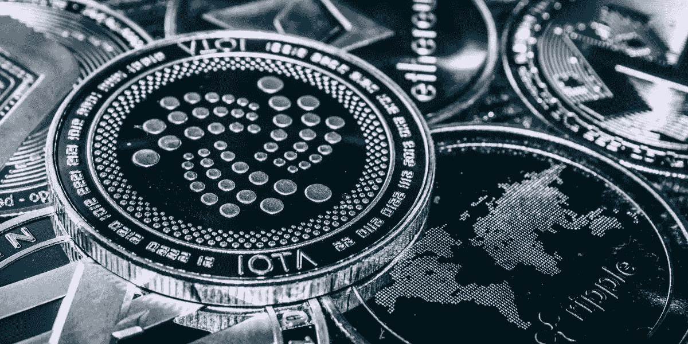
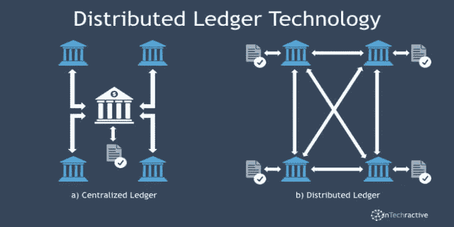
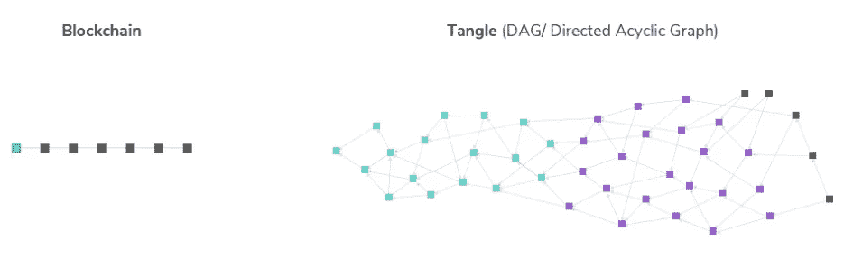

# 为什么 IOTA 比区块链更好，而且越来越好？

> 原文：<https://medium.com/nerd-for-tech/why-iota-is-better-and-getting-better-than-blockchains-b6eb62bf8b87?source=collection_archive---------8----------------------->

[https://www . crypto-news-flash . com/WP-content/uploads/2020/07/Stanslavs-IOTA-1-1200 x600 . jpg](https://www.crypto-news-flash.com/wp-content/uploads/2020/07/Stanslavs-IOTA-1-1200x600.jpg)

如果你对区块链感兴趣，那么你一定也听说过 IOTA。随着[蛹](https://chrysalis.iota.org/)的推出，IOTA 即将发布史上最大的更新。在我们了解 IOTA 相对于区块链的优势之前，我们需要首先了解 IOTA 和区块链之间的区别。

# IOTA 和区块链的区别

> IOTA 不是区块链

人们经常将 IOTA 混淆为区块链，但事实并非如此。IOTA 和区块链是不同的 DLT。什么是 DLT？DLT，分布式账本技术的简称，可以定义为

> 分布式分类帐是地理上分布在多个地点、国家或机构的复制、共享和同步的数字数据的共识。与分布式数据库不同，它没有中央管理员。

[https://which block chain . com/WP-content/uploads/Distributed-Ledger-Technology-Market-1 . jpg](https://whichblockchain.com/wp-content/uploads/Distributed-Ledger-Technology-Market-1.jpg)

区块链和 IOTA 都使用 DLT 概念，但是它们之间的主要区别在于它们的数据结构。顾名思义，区块链使用块的链状结构(块的线性链表)，而 IOTA 使用块的 DAG(有向无环图)结构。DLT 的一个区块可被视为一个记录/条目/文件。

[http://www . apps bee . com/blog/WP-content/uploads/2018/08/image2 . png](http://www.appsbee.com/blog/wp-content/uploads/2018/08/image2.png)

另一个区别是，区块链使用采矿，这是新比特币进入流通的过程，但它也是区块链账本维护和发展的关键组成部分。它是使用非常复杂的计算机来解决极其复杂的计算数学问题。因此，区块链对每笔交易都收取复杂的费用。

另一方面，IOTA 不使用挖掘来验证事务，相反，发出新事务的用户必须批准两个先前的事务并执行少量的工作证明。因此，交易可以免费进行，促进了微交易。

出于潜在的效率原因，IOTA 的数据结构使用平衡的[三进制](https://en.wikipedia.org/wiki/Ternary_computer)实现；它使用 trits(1，0，1)，而不是区块链使用的位。由于使用了[温特尼茨一次性签名(WOTS)](https://en.wikipedia.org/wiki/Hash-based_cryptography#One-time_signature_schemes) 方案，其签名方案可以抵抗量子计算机攻击。

# 蛹是什么？

蛹是 IOTA 发布的第二个主网(也叫 IOTA-1.5)。这是 IOTA 于 2016 年发布的初始 main-net 的升级版。2020 年 8 月，IOTA 发布了第一套变化，以推动 IOTA 走向生产准备就绪，“蛹第一部分”，而蛹的最终版本将在今年 4 月的最后一周发布。蝶蛹更新已经包含了移除协调者所需的许多方面。许多突破性的变化是故意作出*现在*与减少调整留到实际坐标杀戮(IOTA 的第三个主网将稍后发布，也称为 IOTA-2.0)事件。这将允许企业、开发商、交易所、托管人和其他合作伙伴随着 Chrysalis 的推出开始实施他们的解决方案。

# 为什么 IOTA 比区块链好？

**开发者的库**

虽然区块链没有开发人员专用的库，但 IOTA 主要以 rust、nodejs 和 python 语言维护客户端库。基于 IOTA 比基于区块链开发应用程序要容易得多，因为后者需要可靠的语言。

**免手续费**

虽然区块链中的交易对每笔交易都收取费用，但 IOTA 不收取任何费用。这使得 IOTA 中的交易比区块链方便很多。

**微交易**

虽然区块链中的每个区块都包含多个交易，但 IOTA 使用单个区块、单个交易的方法。这使得 IOTA 交易比区块链快很多。

**节能**

随着区块链对全球变暖的日益关注，IOTA 由于没有采矿方法而更加环保。与此同时，预计在 16-20 年内，仅比特币能源需求一项就将使全球气温上升 2 度。另一方面，IOTA 通过释放蛹减少了 60%的能耗。

# 结论

IOTA 的开发比区块链要积极得多，也更加灵活和易于使用。随着 IOTA 的积极发展，它变得越来越好，区块链已经开始提出一些大的问题。因此，它比使用区块链更安全，更有远见，也更容易使用。