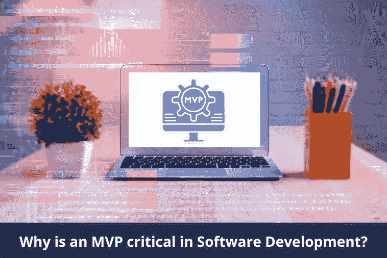

# 为什么 MVP 在软件开发中至关重要？

> 原文：<https://medium.com/nerd-for-tech/why-is-an-mvp-critical-in-software-development-fe3ec21b7c37?source=collection_archive---------2----------------------->

软件开发是一个复杂的过程。开发人员不会在一夜之间创建软件。这是一个涉及 MVP 软件、迭代、bug 修复和持续改进的过程。

然而，一个公司不能把所有的资源都投资在一个软件上。效果不好怎么办？市场不接受怎么办？

MVP 在软件开发中，也被称为最小可行产品，是必不可少的。它最小化了软件开发中的风险。

# 什么是最小可行产品(MVP)？

最小可行产品(MVP)是具有足够功能的产品，可以在市场上验证这个想法。MVP 满足了产品的基本功能。因此，它简化了客户对产品的验证。他们可以测试产品，评估功能，并确定产品是否适合市场。

本质上，MVP 是产品的第一个版本。MVP 功能包括用户测试和提供反馈的主要特性。

[MVP 应用开发](https://www.botreetechnologies.com/blog/why-companies-prefer-ruby-on-rails-software-development-for-prototyping/)决定产品的未来。它决定了最终应用程序的外观。

MVP 在软件开发最佳实践中起着主要作用。公司需要首先验证他们的想法。投资一个不起作用的产品是毫无意义的。因此，MVP 在这方面有利于流程。它帮助公司理解他们是否应该投资一个特别的 MVP 想法。

MVP 的一个很好的例子就是 Airbnb。业主用他们自己的公寓来验证这个想法。通过创建网站、发布房产照片和其他细节，他们找到了可以租赁公寓的付费客人。Airbnb MVP 功能就是这么测试的。

> *阅读更多:*[*Ruby on Rails 开发最适合打造 MVP 的 7 大理由！*](https://www.botreetechnologies.com/blog/why-ruby-on-rails-development-is-perfect-for-building-mvp/)

# 为什么 MVP 对软件开发很重要？

在推出最终产品之前，测试市场是否接受该产品是有意义的。获得用户反馈也有助于改进面向大众市场的产品。MVP 也将不确定性最小化。

以下几个原因显示了 MVP 开发流程的重要性——

1.  **更快的产品发布**

*   MVP 是该产品的第一个版本。它提供了竞争优势。该公司可以比其他任何公司更快地将产品投放市场。MVP 允许公司测试市场是否接受该产品。
*   更快的产品发布也意味着更快的产品改进。MVP 基本上提供了先发优势。它也为产品上市提供了更多的时间。所以在别人实验的时候，一个 MVP 脱颖而出。

**2。测试产品**

*   拥有软件开发行业的[MVP](https://www.botreetechnologies.com/blog/steps-to-define-software-development-process/)是一种保险。测试产品是否有效是很重要的。由于 MVP 有足够多的特性可供测试，公司可以很容易地收集用户反馈。
*   这也有助于公司节省资金。在对软件开发服务进行巨额投资之前，公司可以知道它是否值得投资。测试产品也提供了改进的关键领域。它告诉公司在最终产品中应该包含哪些特性。

**3。了解客户需求**

*   MVP 开发公司建议使用 MVP 或原型来更好地了解客户需求。由于用户提供了对产品的反馈，他们可以知道构建什么。
*   在某些情况下，当产品测试在一个小组中完成时，用户可以说出产品缺少了什么特性。这也可能成为产品的 USP。通过这种方式，公司可以了解用户真正想要的是什么。有些 MVP 完全没有用户喜欢的东西。这是公司改变整个产品以适应市场需求的时候。

**4。最小化错误**

*   软件开发项目中的 MVP 最小化了错误和不确定性。由于 MVP 是产品的第一个版本，它可以帮助识别 bug 和问题。识别它们有助于在最终版本中消除它们。
*   如今，公司遵循[敏捷方法](https://www.botreetechnologies.com/blog/agile-benefits-custom-software-development/)继续改进 MVP。MVP 成为第一个产品。所有的改进和迭代都会添加到下一个版本中，从这个意义上来说，在市场上推出有缺陷产品的风险是最小的。公司可以在发布每个迭代时保持无压力。

**5。预算友好型开发**

*   最后，采用 MVP 开发策略的最大好处之一是节省开发资金。公司不能投资一种市场不接受的产品。他们可以以较低的成本创建第一个版本，并测试其可行性。
*   建立一个 MVP 不需要花费太多的时间和成本。今天，大多数公司更喜欢通过雇佣能够以低成本完成工作的软件开发公司来创建 MVP。因此，它使整个过程的预算友好。

# 如何处理 MVP 开发过程

建立一个 MVP 最大的好处就是它没有太多的特性。目的是测试产品的核心特性并检查其可行性。因此，它的创建比最终产品要简单得多。

*   **研究市场**
*   公司需要首先研究市场，检查市场需要什么类型的产品。它将给出一个关于如何处理这个过程的好主意。
*   **识别特征**
*   下一步应该是确定要包含在 MVP 中的最重要的特性。这些是用户将测试并提供反馈的功能。
*   **分离特征**
*   确定哪些功能是绝对必要的，哪些功能只是附加的。测试客户需要的任何东西，并保留第二次测试的需求。
*   **渐进构建**
*   首先构建客户需要的功能。这些是最重要的特征。逐步建立客户想要的功能。

这种方法将帮助企业创建一个符合市场需求的 MVP。它更有可能成为适合市场的产品。

> *阅读更多:* [*Python:创业公司的完美 Web 框架选择*](https://www.botreetechnologies.com/blog/python-perfect-web-app-framework-choice-for-startups/)

# 结论

MVP 开发已经成为决定软件产品成功的关键。今天，没有一家公司会前进，除非他们有一个原型。这有助于他们节省时间、金钱和精力。MVP 有助于确定产品的生存能力，并确保公司是否应该开发该产品。因此，在软件开发中拥有一个 MVP 是有意义的。

*原载于 2022 年 8 月 30 日 https://froodl.com***。**