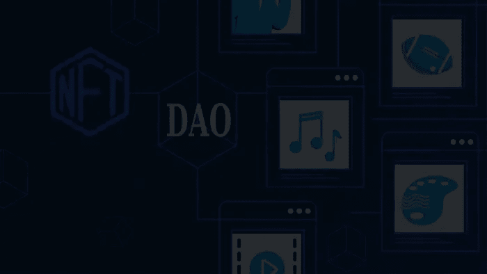

# 为什么 NFT 道市场平台对 Web3 有益？

> 原文：<https://medium.com/nerd-for-tech/why-is-an-nft-dao-marketplace-platform-beneficial-to-web3-be84c90ef162?source=collection_archive---------11----------------------->

在 2021 年的繁荣之后，不可替代令牌(NFT)在今天的 Web3 领域赢得了认可，其年度市场首次触及十亿美元市场。这种爆炸性销售背后有许多因素，许多人认为创作者、名人和品牌的涌入是主要原因。但是，人们不能忘记 NFT 市场的作用，它在 NFT 繁荣之前、期间和之后每天都促进了成千上万的交易。Web3 world 想要的一点是向 NFT 市场的活跃用户提供治理权，这可能是革命性的。这样的思路导致了 NFT 道市场平台的兴起。

NFT 道市场平台是包含分散自治组织的门户。Dao 是基于智能合约的协议，基于这些协议，平台可以运行。在这样的平台上，人们可以创建决定市场的智能合约，对这些协议的任何更改都将基于投票共识。随着承诺 P2P 交易的 NFT 市场平台卷入干预 P2P 交易的事件，社区参与 NFT 市场已经变得非常必要。Web3 认真对待去中心化，这类事件往往会玷污整个虚拟世界的声誉，反对者宣称 Web3 将是另一个“浮华趋势”。

然而，对于道市场平台，这种概念是脱离上下文的，因为社区成员决定平台的业务流程。他们可以决定交易费用、审查规则、安全成员、赌注机制和流动性政策的变化等。用户的投票权基于他们在 NFT 道市场平台上持有多少代币和 NFT 来帮助流动性池。赌注越多，给予治理令牌的比例越高，以及对赌注的奖励，这为 NFT 市场用户提供了参与感和社区归属感。

因此，我们可以得出这样的结论:[***【NFT】道市场平台 c***](https://bit.ly/3P8AA0d) 由于其让社区参与决策和运行平台的优势，对 Web3 是有益的。这减轻了企业主的一些压力，他们可以负责管理平台的技术方面。如果你想开发一个 NFT 道市场平台，有一些公司掌握这一过程。接近他们中的一个，创建一个新的商业平台，在 Web3 领域长期生存。