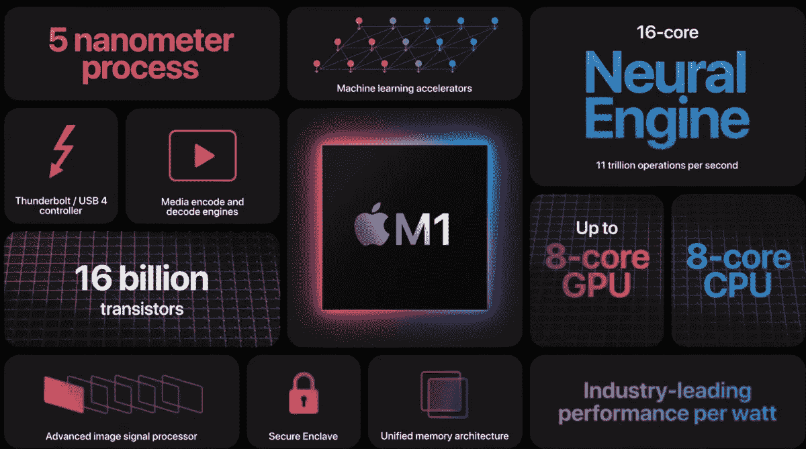
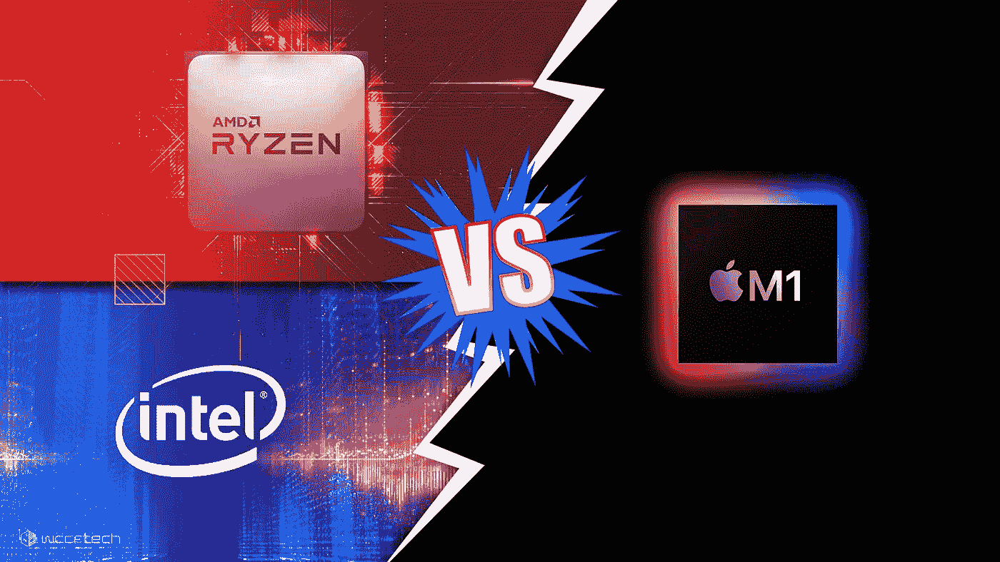
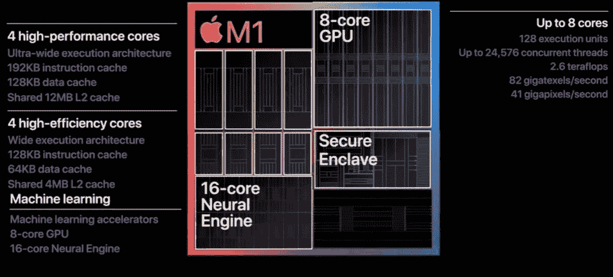

# 苹果的 M1 芯片为什么这么快？

> 原文：<https://medium.com/nerd-for-tech/why-is-apples-m1-chip-so-fast-82a03478f884?source=collection_archive---------16----------------------->

[https://www . zdnet . com/a/hub/I/r/2020/11/10/69ea 7759-3123-4b3f-8047-a3 ffc 367744 e/resize/1200 x auto/f 906 da 3 f 6 e F4 b 72 b 17 a 43 BC 454362 ad 3/apple-m1-overview . png](https://www.zdnet.com/a/hub/i/r/2020/11/10/69ea7759-3123-4b3f-8047-a3ffc367744e/resize/1200xauto/f906da3f6ef4b72b17a43bc454362ad3/apple-m1-overview.png)

过去，每一次 MacBook 发布都会带来扬声器、显示屏、键盘、触摸板的改进，以及英特尔的新 H 系列 45 瓦芯片组。但是每一代 MacBook 都有一个共同的问题，那就是散热。苹果公司提供的每一台笔记本电脑都存在散热问题，没有一台能够吸引那些想要进行一些设计或创意工作的观众，但却被英特尔的薄机箱和热运行 CPU 所拖累。苹果不得不自己承担所有的责任，尽管这是英特尔架构的错，而且每一代 CPU 都没有什么进步。由于 CPU 的供应，英特尔也对每一代新 MacBook 的延迟负责。

早在 2020 年，苹果决定将笔记本电脑和台式机系列转移到内部芯片，因为这样他们不仅可以根据硬件优化一切，还可以控制生态系统并维持产品的发布周期。苹果必须尽可能平稳地实现这一过渡，因此他们宣布了一个名为 Rosetta 2 的仿真层，该层编译了运行在英特尔 MacBook 上的所有 64 位应用程序，并在由 M1 驱动的 MacBook 上运行。

[https://cdn . wccftech . com/WP-content/uploads/2020/11/Intel-AMD-CPU-Vs-Apple-M1-feature . jpg](https://cdn.wccftech.com/wp-content/uploads/2020/11/Intel-AMD-CPU-Vs-Apple-M1-Feature.jpg)

因此，苹果宣布下一代 MacBooks 将运行在他们的定制芯片 M1 上。基于这种芯片推出的第一批产品是 MacBook Air 和 MacBook Pro 13，结果是革命性的。它们不仅运行起来更凉爽，而且仅用 15 瓦的 TDP，就能够在大多数任务中击败昂贵得多的 Mac Pro。

现在的问题是，苹果究竟是如何开发出比竞争对手英特尔和 AMD 更快更可靠的芯片的。其中一个答案是，它是基于 RISC(精简指令集计算机)的芯片，这意味着它只需要一次一层的任务，然后根据指令的要求进一步细分成不同的类别。英特尔和 AMD 的 CPU 使用类似多线程的过程来提高性能，这意味着它们可以处理一层以上的任务，并在不同的寄存器中同时处理它们，从而减少时间。但是，苹果的单核(单线程)性能比大多数其他 CPU 都快，因为它被设计成采用 8 位指令，而不是传统的 4 位指令。这几乎是大多数现代设计的两倍。这使得它仍然可以做大量的工作，即使以较低的时钟速度运行，这有助于节省电力。

[https://www . tech insights . com/sites/default/files/2020-12/Fig 1-Fig-A _ Apple-compilation-ann-1024 x463 . jpg](https://www.techinsights.com/sites/default/files/2020-12/Fig1-Fig-A_Apple-compilation-ann-1024x463.jpg)

其次，苹果 M1 被设计为 SOC(片上系统),这意味着所有的组件都可以在芯片组上本地使用。它还使用非常快速的 4266 MHz 统一内存架构，其中 CPU 和 GPU 可以同时访问内存，从而减少延迟并最大限度地提高性能。M1 也基于 TSMC 的 5 纳米架构，功耗极低，电池寿命更长。这就是当前一代 MacBooks 拥有非凡续航的原因。

这只是苹果做出令人印象深刻的处理器的明智决定之一。与英特尔和 AMD 等 x86 不同，苹果的产品是新的，有可能改变整个处理器市场。这不是魔术，这只是在正确的时间正确地使用技术。