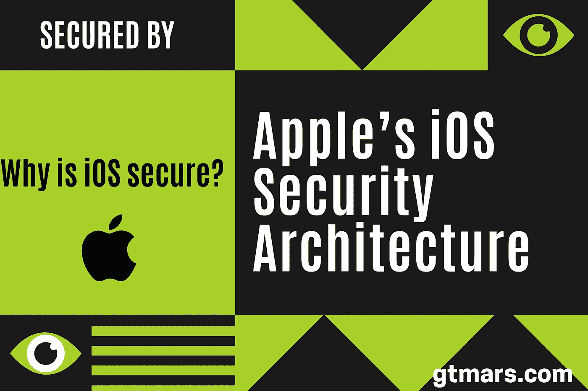
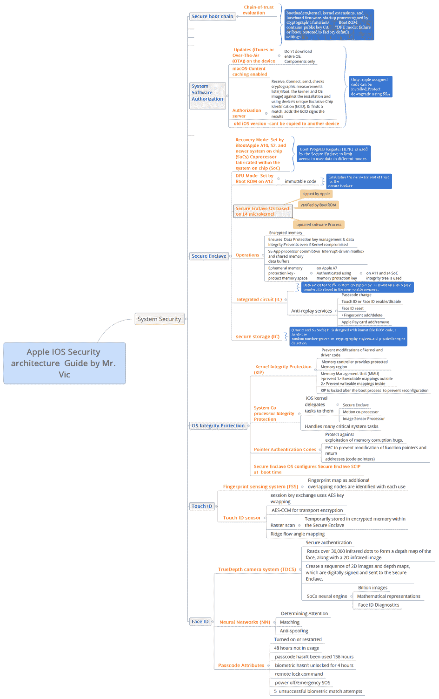
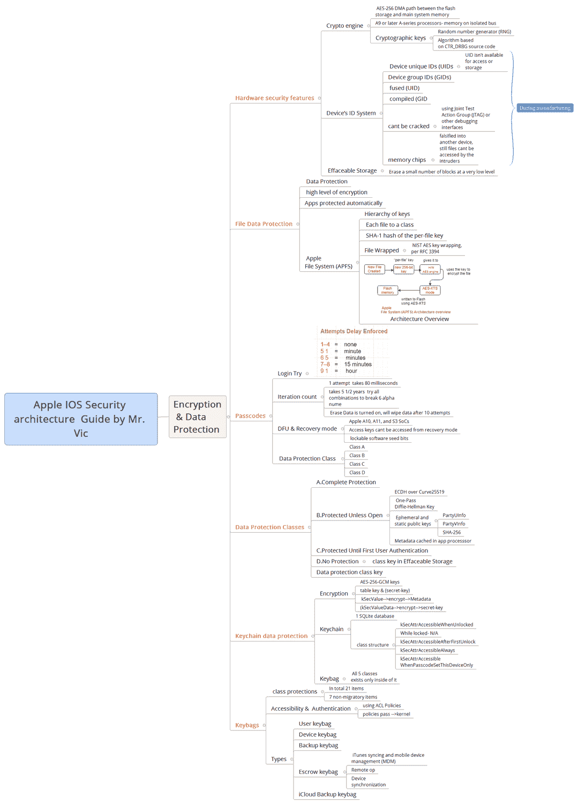
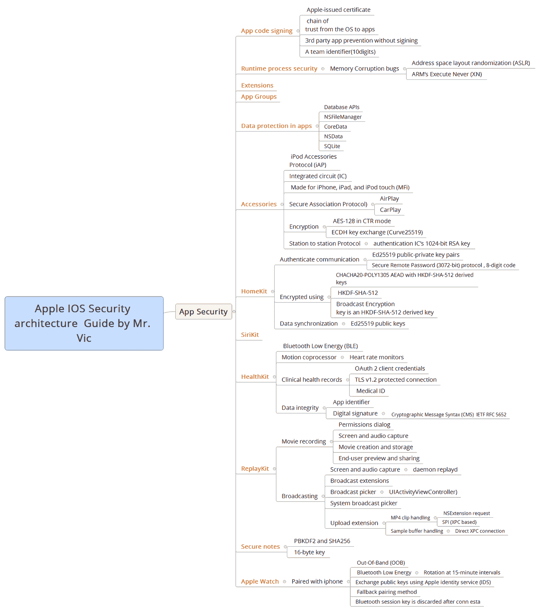
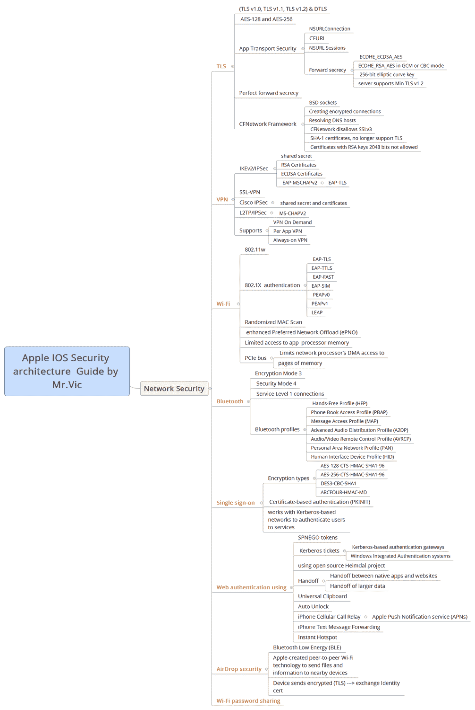
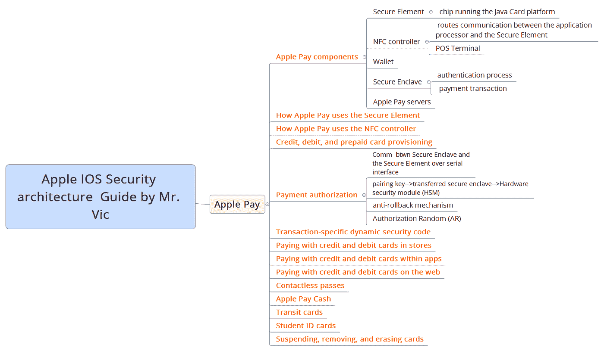
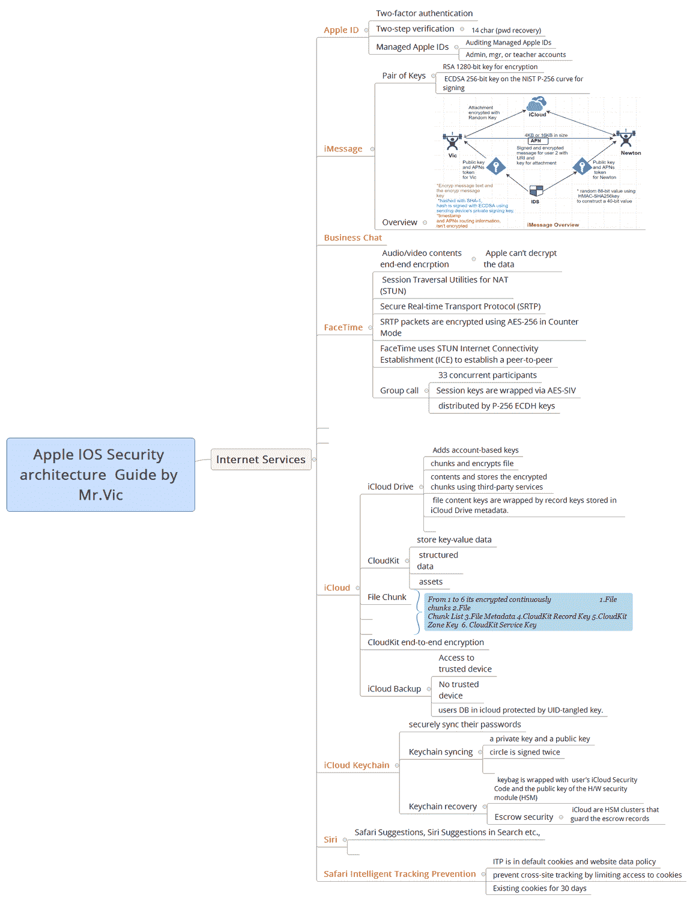

# 为什么 iOS 是安全的？为什么苹果的 iOS 安全架构比安卓架构好？

> 原文：<https://medium.com/nerd-for-tech/why-is-ios-secure-why-apples-ios-security-architecture-is-better-than-android-architecture-3bd73823a001?source=collection_archive---------3----------------------->

# Apple 平台安全性介绍:

> ★在本文中，我们将对 iOS 安全架构进行详细的研究，在这种程度上，我们不会对 Android 和 iOS 进行比较研究。个人和组织对移动设备的大量使用带来了许多与隐私相关的问题。因此，苹果建立了一个惊人的安全架构系统，以创建和支持世界上最好的移动平台。本文详细介绍了如何在 iOS 平台中实现安全技术和特性。它还将帮助单个组织将 iOS 平台安全技术和功能与他们自己的策略和程序相结合，以满足他们特定的安全需求。

安全是最先进的！

★Apple 开发并整合了最佳功能，这些功能可以加强移动安全平台并保护整个系统，以确保安全三要素的三大支柱(**机密性、完整性和可用性**)。在移动平台的每个方面，软件和硬件模块都是紧密耦合的。下面给出的架构中的许多功能在 iOS 中是默认启用的，以减少用户/管理任务。

本文详细地组织成以下几个方面。

> ✔ **系统安全:**
> 
> **✔Encryption 和数据保护:**
> 
> ✔ **App 安全:**
> 
> ✔ **网络安全:**
> 
> ✔ **苹果支付:**
> 
> ✔ **互联网服务:**
> 
> ✔ **用户密码管理:**
> 
> ✔ **装置控制:**
> 
> **✔Privacy 控件:**
> 
> ✔ **安全认证和项目:**

✔ **系统安全:**集成的安全软件和硬件，是 iPhone、iPad 和 iPod touch 的平台。

gtmars.com

**✔Encryption 和数据保护:**如果设备丢失或被盗，或者如果未经授权的人试图使用或修改用户数据，则保护用户数据的架构和设计。

✔ **应用安全:**使应用安全运行且不损害平台完整性的系统。

✔ **网络安全:**工业标准网络协议，为传输中的数据提供安全认证和加密。

✔ **Apple Pay:** 苹果实现安全支付。

✔ **互联网服务:**苹果基于网络的信息、同步和备份基础设施。

✔ **用户密码管理:**密码限制和从其他授权来源获取密码。

✔ **设备控制:**允许管理 iOS 设备、防止未授权使用以及在设备丢失或被盗时启用远程擦除的方法。

**✔Privacy 控制:**IOs 的功能，可用于控制对位置服务和用户数据的访问。

✔ **安全认证和计划:**有关 ISO 认证、加密验证、通用标准认证和机密(CSfC)商业解决方案的信息。

**注意:**这是一篇有用的论文，应该用于获取知识。

**结论:** Apple 提供了最佳的隐私和安全政策&技术，以确保其客户的数据完整性、安全性和可用性，并且在不久的将来，它将继续扩展，超出他们的想象。

> **别忘了查看这些文章的** *⬇️最好的小镇*😉
> 
> [***如何在浏览器上禁用你的谷歌搜索数据活动、广告个性化、搜索历史、搜索设置？***](/faun/how-to-disable-your-google-search-data-activity-ad-personalization-search-history-search-e713948cf1ae)
> 
> [***微软针对软件开发人员的 12 大安全软件开发生命周期(SSDL)实践&安全团队？***](/faun/microsofts-top-12-secure-software-development-lifecycle-ssdl-practices-for-software-developers-f54176667fb5)
> 
> [***如何永久关闭或禁用导致高 CPU 使用率的 Microsoft 兼容性遥测服务？***](/faun/how-can-i-permanently-turn-off-or-disable-the-microsoft-compatibility-telemetry-task-to-prevent-aa9f0a264295)
> 
> [***如何在您的组织中创建漏洞管理安全团队、角色&职责？***](/faun/how-to-create-a-vulnerability-management-team-work-flow-chart-process-roles-and-be3eb1bad0d3)
> 
> [***软件开发人员 14 大 OWASP 安全编码实践***](/faun/top-14-owasp-secure-coding-practices-for-software-developers-5daef14734eb)
> 
> [***国土安全部(DHS)如何收集、使用、保护美国公民、居民、B1/B2 游客的个人数据？***](https://gtmars.medium.com/how-the-department-of-homeland-security-dhs-collect-use-protect-the-pii-data-of-u-s-7776e99e2611)

—————**结尾** — — — —

生活是由你自己创造的——英国谚语

**解说:** *简单的话却如此真实。你的*态度*，你如何看待你的世界，将取决于你生活中的快乐和满足。而且，我们是控制我们态度的人。我们如何应对任何情况取决于我们自己。*

感谢阅读！祝你有愉快的一天！